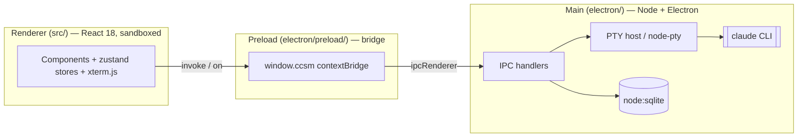

# AGENTS.md — Project orientation for CCSM

CCSM (Claude Code Session Manager) is an Electron + React + TypeScript desktop
app for running and managing many Claude Code (`claude` CLI) sessions in
parallel, grouped by task. It delegates 100% of agent execution to the user's
local `claude` binary and makes **zero** HTTP calls to Anthropic itself.

This file is the broad map: architecture, module layout, conventions. For the
condensed "don't break things" checklist see [`CLAUDE.md`](CLAUDE.md). For
user-facing product framing see [`README.md`](README.md).

## Hard constraints (read first)

- **npm only — never pnpm or yarn.** The build relies on
  `scripts/postinstall.mjs` (native rebuild via `@electron/rebuild`) and
  electron-builder, and the package manager decision was deliberate. Using a
  different manager breaks the native-module rebuild and packaging.
- **Node >= 22.** `package.json` declares `engines.node: ">=22.0.0"` and
  `.npmrc` sets `engine-strict=true`, so `npm install` hard-errors on older
  Node. (`scripts/postinstall.mjs` still carries an older Node-20 warning
  string; the authoritative gate is `engine-strict`.)
- **Native modules are rebuilt for Electron's ABI.** `node-pty` (the
  terminal backend) is rebuilt against Electron's ABI by the `postinstall`
  script. A mismatch shows up at runtime as cryptic "renderer window didn't
  appear" errors, not at install time. node-pty failure is non-fatal because
  it ships a prebuilt binary fallback (asserted by `scripts/after-pack.cjs`).
  The local DB uses Node's built-in `node:sqlite`, which needs no native
  rebuild.
- **Renderer must not import from `electron/`.** Frontend code under `src/`
  talks to the main process only through `window.ccsm` (typed in
  `src/global.d.ts`, exposed via `electron/preload/`). This is a convention
  (documented in `docs/mvp-design.md` §15), not eslint-enforced — keep it
  intact so a future remote daemon stays possible.

## Process architecture

Three Electron surfaces, TypeScript throughout:

- **Main process** (`electron/`) owns the window, the SQLite DB, the PTY host,
  notifications, the updater, and all IPC handlers. The PTY lives here so
  sessions stay alive across UI switches (switching is a buffer swap, not a
  respawn).
- **Preload** (`electron/preload/`) exposes a single typed `window.ccsm`
  surface to the renderer via contextBridge. Bridges are split by domain:
  `ccsmCore`, `ccsmPty`, `ccsmSession`, `ccsmSessionTitles`, `ccsmShell`,
  `ccsmNotify`.
- **Renderer** (`src/`) is React 18 bundled by webpack 5. It only knows about
  `window.ccsm`, never about Node or Electron APIs directly.

## Module map

### `src/` (renderer)
- `App.tsx`, `index.tsx`, `index.html` — entry + shell mount.
- `components/` — React UI. Notable: `Sidebar.tsx`, `TerminalPane.tsx`,
  `CommandPalette.tsx`, `SettingsDialog.tsx`, `ImportDialog.tsx`,
  `ClaudeMissingGuide.tsx`; plus subfolders `chrome/`, `cwd/`, `settings/`,
  `sidebar/`, `ui/`.
- `stores/` — zustand store (`store.ts`) composed from `slices/`
  (`groupsSlice`, `sessionCrudSlice`, `sessionRuntimeSlice`,
  `appearanceSlice`, `popoverSlice`, `installerSlice`,
  `sessionTitleBackfillSlice`), plus `persist.ts` and `drafts.ts`.
- `store/preferences.ts` — preference accessors (distinct from `stores/`).
- `terminal/` — xterm.js integration: `shellRegistry.ts` (warm terminal
  instances), `usePtyAttachShell.ts`, `useAtBottom.ts`, `paste.ts`.
- `i18n/` — i18next setup (`index.ts`, `useTranslation.ts`) and
  `locales/` (en + zh; locale strings are duplicated per language — adding a
  session field touches both, see DEBT #5).
- `shared/`, `lib/`, `utils/`, `agent/`, `app-effects/`, `styles/`,
  `types.ts`, and `*.d.ts` ambient declarations (`global.d.ts`, `pty.d.ts`,
  `session.d.ts`).

### `electron/` (main process)
- `main.ts` — process entry; `window/createWindow.ts` builds the BrowserWindow
  (also sets CSP via `onHeadersReceived`).
- `ipc/` — IPC handlers split by domain: `dbIpc`, `sessionIpc`, `systemIpc`,
  `utilityIpc`, `windowIpc`.
- `preload/` — contextBridge entry + `bridges/`.
- `ptyHost/` — PTY lifecycle (node-pty). `db.ts` / `db-validate.ts` —
  node:sqlite schema + validation.
- Supporting subsystems: `agent/`, `notify/`, `remote/`, `security/`,
  `sentry/`, `sessionTitles/`, `sessionWatcher/`, `tray/`, `updater.ts`,
  `import-scanner.ts`, `commands-loader.ts`, `badgeController.ts`,
  `memory.ts`, `i18n.ts`, `branding/`, `prefs/`, `lifecycle/`.

### `scripts/`
- `dev.mjs` — dev orchestrator (run via `npm run dev`).
- `postinstall.mjs` — native rebuild (see Hard constraints).
- `after-pack.cjs` — asserts a native PTY binding exists in the packaged app.
- `run-all-e2e.mjs` + `harness-e2e-*.mjs` — Playwright e2e harnesses
  (run via `npm run probe:e2e`, which builds first).
- `harness-ui.mjs` — UI harness for local verification.
- `dogfood-*.mjs` — bug-specific reproduction harnesses.
- `setup-aumid.ps1` — registers the Windows AUMID for dev-mode toast
  notifications.

### `docs/`
- `mvp-design.md` — frozen MVP scope (the import-boundary rule lives in §15).
- `design-system.md` — Tailwind v4 tokens.
- `status/STATUS.md` — pointer; current state lives in `git log` + `DEBT.md`.
- `reference/` — release, packaging, e2e-runner notes.
- See `docs/README.md` for the full index.

## Commands

Run from the repo root with npm:

| Command | What it does |
|---|---|
| `npm install` | Installs deps and rebuilds native modules for Electron's ABI (`postinstall`). |
| `npm run dev` | Launches webpack-dev-server + Electron together. |
| `npm run build` | Cleans `dist/`, compiles main via `tsc`, bundles renderer via webpack (production). |
| `npm run typecheck` | `tsc --noEmit` for both renderer and `tsconfig.electron.json`. |
| `npm run lint` | ESLint over `.ts/.tsx` with `--max-warnings 0` (warnings fail). |
| `npm test` | Vitest run (unit + integration). |
| `npm run coverage` | Vitest with v8 coverage. |
| `npm run probe:e2e` | Builds, then runs all Playwright e2e harnesses. |
| `npm run audit` / `audit:fix` | `npm audit` pinned to the official registry (works around the npmmirror registry). |
| `npm run make` / `make:win` / `make:mac` / `make:linux` | Build platform installers via electron-builder. |

## Conventions

- **Stack:** Electron (main + renderer), React 18, webpack 5, zustand state,
  xterm.js + node-pty terminal, node:sqlite DB, i18next (en/zh),
  Tailwind v4, electron-builder packaging, vitest + Playwright tests.
- **Tests** live in `__tests__/` folders and `tests/`. Prefer adding a test
  with any behavioural change.
- **Crash reporting** (Sentry) is off by default — no hardcoded DSN; opt in via
  the `SENTRY_DSN` env var.
- **Technical debt** is tracked in [`DEBT.md`](DEBT.md) — a prioritized,
  file:line-cited register. Read it before large refactors; update the row
  (don't delete) when you pay an item down.
- **Ownership:** single maintainer — see [`.github/CODEOWNERS`](.github/CODEOWNERS).
  `main` is the default branch; releases are cut from tagged commits.
- **Security policy:** [`SECURITY.md`](SECURITY.md). Contribution basics:
  [`CONTRIBUTING.md`](CONTRIBUTING.md).
