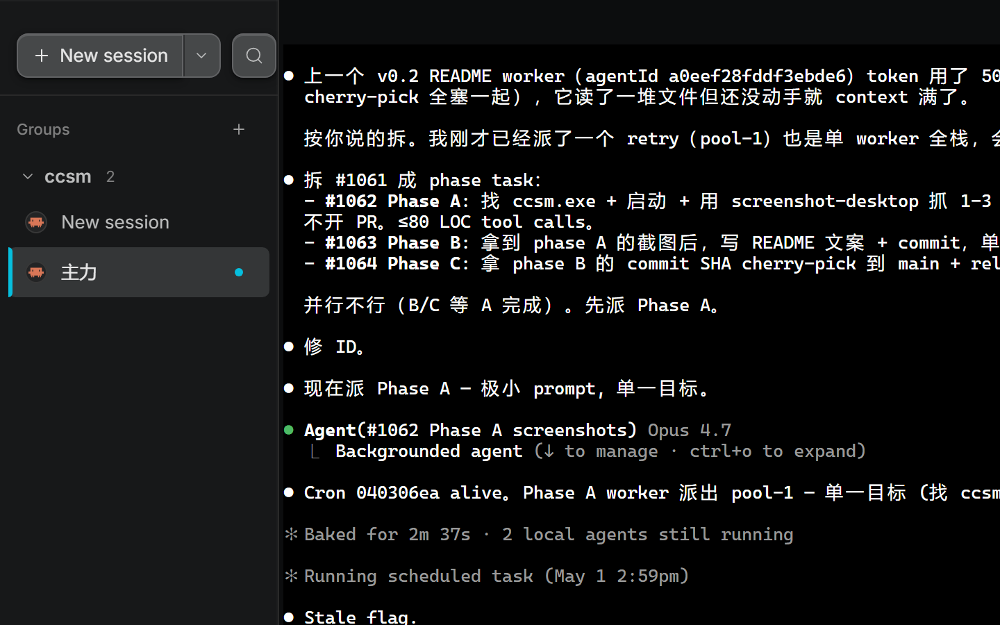

# ccsm

**Run multiple Claude Code sessions side by side, with the density of a CLI and the comfort of a desktop app.**

ccsm is a native desktop client for [Claude Code](https://docs.anthropic.com/claude/docs/claude-code). Group sessions by task instead of by repo, drive several agents in parallel, and stay in flow without tab-juggling terminals.

## Features

### Multi-session terminals
Every session is a real PTY in the main process via `node-pty` — the same Claude Code CLI you already use, just embedded. Switch between sessions instantly; output, scrollback, and ANSI color render exactly like your terminal.

### Groups, not folders
Organize sessions by task. Drag to reorder, archive when done, soft-delete with undo. Repo lives as metadata on each session — engineers think in tasks, ccsm follows.

### CLI-grade information density
Block rendering, monospace, collapsed tool calls, no fluff chrome. The right panel mirrors what you'd see in the terminal — no lossy summarization, no hidden state.

### Permission prompts as UI
When the agent asks to run a command or edit a file, you get a real prompt with **Allow**, **Allow always**, and **Deny** — no more squinting at terminal prompts mid-flow.

### Status bar that means something
Every session shows its working directory, model, permission mode (Plan / Default / Accept edits / Bypass / Auto), context meter, and a 6-tier effort chip. Click any of them to change it — no rerun, no restart.

### Two-state lifecycle
Sessions are either idle or waiting for you. A breathing amber dot tells you which sessions need attention; everything else fades into the background.

### Command palette
Hit `Ctrl+F` to jump anywhere — sessions, groups, settings, recent transcripts. Designed for keyboard-first operators.

### Import existing transcripts
Already have a history in `~/.claude/projects/`? ccsm reads it natively. No migration, no sync — your CLI sessions and ccsm sessions are the same sessions.

### Desktop notifications
Per-session muting, focus-aware suppression, and a single "agent is waiting" signal across all your active work. Set it once and stop polling.

### Auto-update
Ships via GitHub Releases with delta updates. New versions install in the background and prompt on next launch.

## Install

| Platform | Download |
|----------|----------|
| Windows | [ccsm-Setup-0.2.0.exe](https://github.com/Jiahui-Gu/ccsm/releases/download/v0.2.0/ccsm-Setup-0.2.0.exe) |
| Linux (deb) | [ccsm_0.2.0_amd64.deb](https://github.com/Jiahui-Gu/ccsm/releases/download/v0.2.0/ccsm_0.2.0_amd64.deb) |
| Linux (AppImage) | [ccsm-0.2.0.AppImage](https://github.com/Jiahui-Gu/ccsm/releases/download/v0.2.0/ccsm-0.2.0.AppImage) |
| Linux (rpm) | [ccsm-0.2.0.x86_64.rpm](https://github.com/Jiahui-Gu/ccsm/releases/download/v0.2.0/ccsm-0.2.0.x86_64.rpm) |

## How it works

ccsm spawns the official `claude` binary as a PTY in Electron's main process and renders its output in a React surface. It reads `CLAUDE_CONFIG_DIR` so your existing CLI configuration — skills, agents, MCP servers, permissions — works untouched. ccsm doesn't parse or rewrite your config; it just gives the CLI a better window.

## Roadmap

- **v0.3** — daemon split (sessions survive app restarts), in flight
- **v0.4** — web client and cross-device sync

## License

MIT &middot; [github.com/Jiahui-Gu/ccsm](https://github.com/Jiahui-Gu/ccsm)
