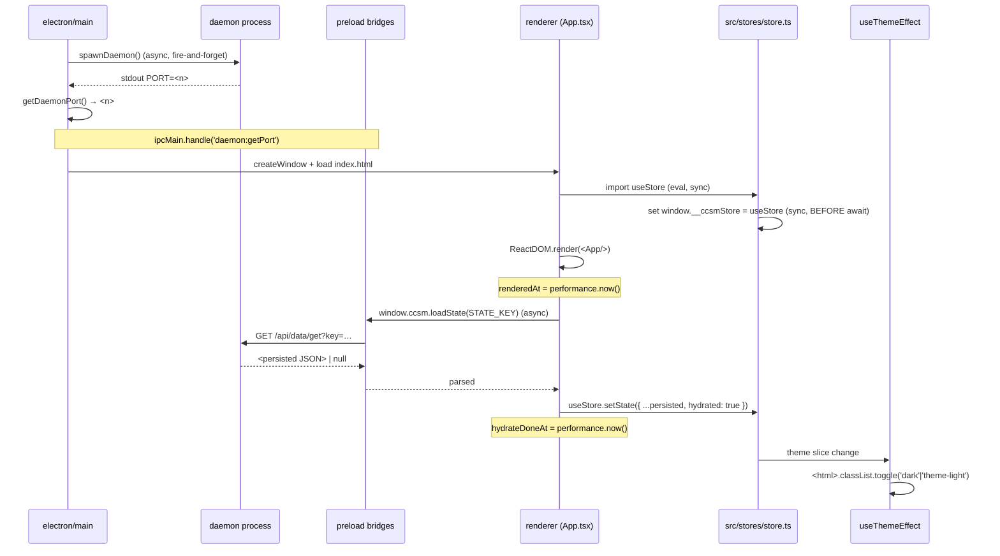

# 02 — Store and preload surface (renderer ↔ daemon contract)

This chapter is the canonical contract for the renderer-side surface
that harnesses (and the production renderer) read from. It owns the
fixes for [01-cutover-audit](./01-cutover-audit.md) HP-1, HP-2, HP-5,
HP-6, HP-7. Implementation owners read this AND [03-ptyhost-wiring](./03-ptyhost-wiring.md)
in tandem — the two together define the full renderer-side "what
exists and when" model.

## 1. Surface catalog (what lives on `window`)

Post-repair, the renderer MUST expose exactly the following symbols.
Symbols marked **production** are part of the product contract.
Symbols marked **e2e-debug** are intentionally exposed solely so
harnesses (and developer DevTools) can drive deterministic states; they
have NO product feature dependency and SHOULD NOT be removed in v0.3
even though they look "global state on window."

| Symbol                             | Bridge / Module                                         | Class      | Why exposed                                                                                                |
|------------------------------------|---------------------------------------------------------|------------|-------------------------------------------------------------------------------------------------------------|
| `window.ccsm`                      | `electron/preload/bridges/ccsmCore.ts`                  | production | The historical "core" preload surface — `loadState/saveState/openExternal/pickCwd/getDaemonPort` etc.       |
| `window.ccsm.loadState`            | `ccsmCore.ts → daemon HTTP /api/data/get`               | production | Read-side accessor for persisted UI state. Used by `src/stores/persist.ts:60-63` AND by 2 harness cases.    |
| `window.ccsm.saveState`            | `ccsmCore.ts → daemon HTTP /api/data/set`               | production | Write-side. Used by harness `tray` / `close-dialog-is-native` to seed prefs.                                |
| `window.ccsmPty`                   | `electron/preload/bridges/ccsmPty.ts`                   | production | All ten pty RPCs + 3 SSE event subscriptions (see [03-ptyhost-wiring](./03-ptyhost-wiring.md)).             |
| `window.ccsmNotify` (and peers)    | `electron/preload/bridges/ccsmNotify.ts` etc.           | production | wave-2-C — notify / badge / sessionWatcher event sinks; out of scope for this spec but listed for closure.  |
| `window.__ccsmI18n`                | `src/i18n/index.ts`                                     | e2e-debug  | i18n hot-swap during tests. KEEP.                                                                           |
| `window.__ccsmStore`               | `src/stores/store.ts:48`                                | e2e-debug  | Live zustand store. KEEP — needed by `seedStore`.                                                           |
| `window.__ccsmTerm`                | `src/terminal/xtermSingleton.ts`                        | e2e-debug  | Currently-attached xterm `Terminal` instance for the active sid. KEEP — needed by `waitForTerminalReady`.   |
| `window.__ccsmHydrationTrace`      | `src/stores/store.ts` ~line 60                          | e2e-debug  | `{ renderedAt, hydrateDoneAt }` timestamps for `startup-paints-before-hydrate`. KEEP.                       |
| `window.__ccsm584Skeleton`         | `src/components/SidebarSkeleton.tsx`                    | e2e-debug  | Set when sidebar skeleton renders (issue #584 audit). KEEP.                                                 |

**MUST**: every e2e-debug symbol MUST be set by the same module that
owns the underlying state, NOT by a separate "test-affordance" file —
to prevent the symbol drifting away from the live state during
refactor.
**Why**: this is the failure mode HP-1 hit during wave-2-A, where the
zustand creator moved but the `window` assignment was duplicated in a
stale path.

**MUST**: every production symbol's preload bridge MUST list which RPC
endpoint backs it in a doc-comment header, with the daemon path.
**Why**: lets future fixers grep `daemon/api/data.ts` ↔ `loadState`
without bisecting wave history.

**SHOULD NOT**: introduce new top-level `window.*` symbols in v0.3.
**Why deferred**: any new affordance is one more thing to keep in sync
with bridges; v0.4 hardening pass will rationalise.
**Why deferred (target)**: v0.4.

**Note**: daemon HTTP loopback-bind invariant (cross-ref
[ch03 §3](./03-ptyhost-wiring.md#3-daemon-port-readiness-hp-3)) — the
surface list above assumes daemon is only listening on `127.0.0.1`,
and renderer fetch base URL is constrained to loopback. Any widening
to `0.0.0.0` / `::` / non-loopback breaks the trust boundary this
catalog is designed against and is a P0 regression (see ch03 §3
"Loopback bind invariant" + ch05 §1 G9).

## 2. `window.__ccsmStore` exposure (HP-1)

### Failure mode being fixed

`scripts/probe-utils.mjs:356-366` waits for `window.__ccsmStore && document.querySelector('aside')`
with a 20s budget. Currently the budget elapses (S3 / S8). Two
candidate root causes; the design must address both.

#### Root cause A — module-evaluation order

If the renderer bundle now defers loading `src/stores/store.ts` behind
an async `loadPersisted()` chain, `window.__ccsmStore` never gets set
until persisted state is read, which itself depends on
`window.ccsm.loadState` (HP-2). HP-2 currently throws → HP-1 never
resolves. Cascade.

**Fix A**: the `window.__ccsmStore = useStore` assignment MUST run at
module evaluation, NOT inside an async hydrate callback. The `useStore`
zustand instance MUST be creatable WITHOUT awaiting persisted state.

```ts
// src/stores/store.ts — required shape
import { create } from 'zustand';
import { initialState } from './initialState';

export const useStore = create(/* slices over initialState */);

// Pin for harness/devtools BEFORE any await.
if (typeof window !== 'undefined') {
  (window as unknown as { __ccsmStore?: typeof useStore }).__ccsmStore = useStore;
}
```

**Why**: if `window.__ccsmStore` is gated on hydration, the harness's
seed-then-read flow becomes a chicken/egg with HP-2. Detaching it
removes the dependency.

#### Root cause B — duplicate-store regression

If wave-2-A introduced a `useStore` re-export under a different module
path, two separate zustand instances may now exist; `__ccsmStore` may
point at the wrong one.

**Fix B**: there MUST be exactly one `useStore` symbol exported from
exactly one path (`src/stores/store.ts`). Any sibling re-export MUST
re-export the SAME identifier (`export { useStore } from './store'`).
The fixer CHAPTER 02 implementer MUST `grep -RIn "create<.*Store" src/`
and assert exactly one zustand `create(...)` call for the app store.

**Why**: a duplicate store is the silent-failure mode where harness
seeds state into instance-A and the renderer reads from instance-B —
no error, just a frozen UI.

### Acceptance signal

`scripts/probe-utils.mjs:357` `waitForFunction` resolves within 5s on
a fresh launch (not the 20s upper bound).

## 3. `window.ccsm.loadState` (HP-2)

### Failure mode being fixed

`window.ccsm.loadState is not a function` (S4) — meaning the symbol
exists, but `loadState` is missing OR `window.ccsm` itself is the
wrong object.

### Required preload-bridge shape

```ts
// electron/preload/bridges/ccsmCore.ts — REQUIRED public surface
const ccsm = {
  loadState: (key: string): Promise<string | null> =>
    rpcGet(`/api/data/get?key=${encodeURIComponent(key)}`),
  saveState: (key: string, value: string): Promise<void> =>
    rpcPost(`/api/data/set`, { key, value }),
  // … other historical fields, unchanged …
} as const;

contextBridge.exposeInMainWorld('ccsm', ccsm);
```

**MUST**: `loadState` is exposed as `Promise<string | null>` (not
`Promise<unknown>` or `Promise<JSON>`) — the renderer's
`src/stores/persist.ts:60-66` parses the raw string itself. Changing
the shape breaks persist.
**Why**: persist contract has been stable across waves; the renderer
test in `tests/stores/persist.test.ts` (if present) pins it.

**MUST**: `loadState` MUST resolve `null` (not throw) when the key
isn't set — the persist code path treats `null` as "no persisted
state, use defaults."

**SHOULD**: keep `saveState`'s value as `string` (the persist code
JSON.stringifies before calling).

### Daemon-side wiring

The HTTP route `/api/data/get` and `/api/data/set` already live in
`daemon/api/data.ts` (per wave-2-A). The fixer MUST verify those routes
return the wire shape above, and add UT in `daemon/api/__tests__/data.test.ts`
covering: `get(missing) → null`, `get(set value) → that value`,
`set(empty key) → 400 bad_request`.

### Migration policy

There are NO `window.ccsm.loadState` callers outside
`src/stores/persist.ts` and `scripts/harness-ui.mjs:312-316,1132-1170`.
Once the bridge re-exports `loadState`, both callers work unchanged. No
rename is in scope.

**Why deferred (rename)**: the symbol predates v0.3. Renaming it
requires touching persist + harness + DevTools muscle memory; pure
churn for this release.
**Target**: v0.4 hardening.

## 4. Hydration ordering (HP-5, HP-6)

### Required mount sequence



### Invariants

1. **I-1**: `window.__ccsmStore` MUST exist by the time React's first
   render commits (`renderedAt`). The harness pin lives in store
   module, evaluated synchronously at first import.
2. **I-2**: `renderedAt < hydrateDoneAt` MUST hold for every cold load.
   `startup-paints-before-hydrate` (`harness-ui.mjs:1135-1380`) asserts
   this; design must NOT change to "block render until hydrate."
3. **I-3**: theme classes (`html.dark` / `html.theme-light`) MUST be
   applied at LEAST once before any test snapshot. Two sub-rules:
   - **I-3a**: at first paint, the initial-state `theme` value (default
     `'system'`) MUST resolve to either `dark` or `theme-light` —
     never neither. Audit the `resolveEffectiveTheme` for the
     `theme === 'system'` ∧ `osPrefersDark === undefined` case.
   - **I-3b**: when persisted hydrate sets `theme` to a different value,
     `useThemeEffect`'s deps array MUST observe the change. Currently
     `[theme]` — fine, AS LONG AS the value identity actually changes.
     If hydrate sets the same value, no re-apply runs (it's React
     correct, not a bug); ensure `apply()` is called once on initial
     mount regardless.

### Concrete fix for HP-5 (theme-toggle)

`useThemeEffect` already calls `apply()` on first run; the symptom S6
(`themeClassDark:false themeClassLight:false`) implies `apply()` ran
but `effective` was something other than `'dark' | 'light'`. Audit
`resolveEffectiveTheme` for a third return value (e.g. `'system'`) that
slips through; if found, fix to project to one of `'dark'|'light'`
with `osPrefersDark` as the tiebreak.

The fixer MUST add a unit test in `tests/app-effects/useThemeEffect.test.tsx`
covering all 6 input combinations
(`{light,dark,system} × {osPrefersDark:true,false}`), each asserting
exactly one of `dark`/`theme-light` is set, and `data-theme` reflects
the same.

**Why**: catches the regression at unit-test-tier so e2e isn't the
only signal.

### Concrete fix for HP-6 (hydration trace)

Once HP-2 is fixed, the `loadState` override at `harness-ui.mjs:1165`
works again, the slow-loadState window opens, the
MutationObserver in the case observes the sidebar skeleton, and the
case passes. No design change needed beyond verification.

## 5. Initial state safety

The store's initial state (before hydrate) MUST satisfy every `selector`
the renderer reads on first paint without runtime error. This is a
pre-existing property; wave-2 cutover MUST NOT have removed any field
from initial state. If audit finds a removed field used by App.tsx,
restore it.

A canonical "initial-state coverage" unit test SHOULD exist in
`tests/stores/initialState.test.ts`; if it doesn't, add it as part of
the fix:

```ts
// tests/stores/initialState.test.ts
import { useStore } from '../../src/stores/store';

it('initial state contains every field App.tsx reads on first paint', () => {
  const s = useStore.getState();
  expect(s.theme).toBeDefined();
  expect(s.fontSizePx).toBeDefined();
  expect(s.groups).toBeInstanceOf(Array);
  expect(s.sessions).toBeInstanceOf(Array);
  expect(s.activeId).toBeDefined();
  expect(s.hydrated).toBe(false);  // important — hydrated only flips true post-loadPersisted
  // …
});
```

**Why**: this is the cheapest defense against "wave-2 dropped a field"
regressions.

## 6. Out-of-scope (with reasons)

- **Replacing zustand with a different store**: not blocking; v0.4+.
- **Renaming `window.__ccsmStore` etc.**: not blocking; renames cascade
  through harnesses and DevTools workflows. Target v0.4 hardening.
- **Moving persist out of `window.ccsm`**: ditto.
- **Lazy-loading any preload bridge**: the wave-2 substrate already
  installs all five bridges synchronously at preload time; no need
  to disturb that.
