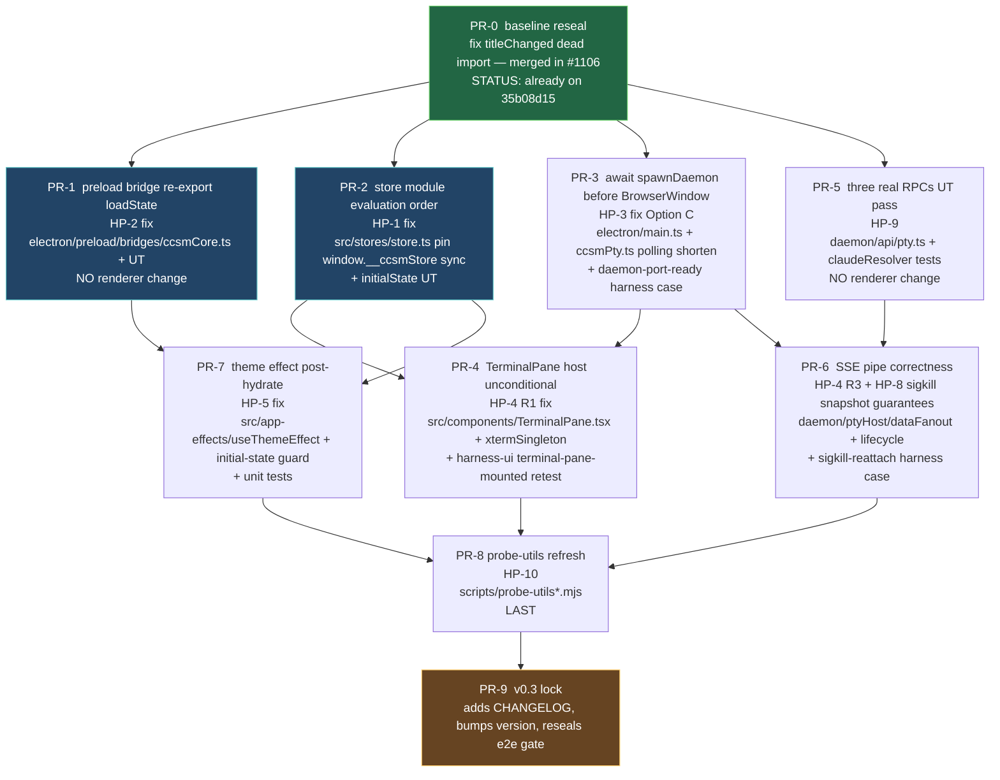

# 05 — Release slicing & DAG (PR order, blockers, gates)

This chapter converts the design from chapters 01-04 into a directed
acyclic graph of PRs, with explicit `blockedBy` edges, a recommended
dispatch order, and the merge gate that locks v0.3.

## 1. Top-level v0.3 e2e iron rules (recap, gate-form)

The merge of THIS spec's terminal PR (the gate of the gates) is
permitted iff ALL of the following hold:

| #  | Gate                                                                                                  | Tooling                                  |
|----|-------------------------------------------------------------------------------------------------------|------------------------------------------|
| G1 | `npm run lint` is green on the merged branch                                                          | local + CI `.github/workflows/ci.yml`    |
| G2 | `npm run typecheck` is green                                                                          | local + CI                               |
| G3 | `npm run build` is green (electron + daemon + renderer bundles emitted)                                | local + CI                               |
| G4 | `npm test -- --run` is green (Vitest unit + UT)                                                       | local + CI                               |
| G5 | `harness-real-cli` Set A subset is green for two consecutive runs                                     | `.github/workflows/e2e.yml` job          |
| G6 | `harness-ui` Set A subset is green for two consecutive runs                                           | `.github/workflows/e2e.yml` job          |
| G7 | `harness-dnd` Set A subset is green for two consecutive runs                                          | `.github/workflows/e2e.yml` job          |
| G8 | NO new `it.skip / xtest / xit / harness skip flag` introduced relative to `35b08d15`                  | grep diff in PR body                     |
| G9 | NO transport regression (no preload bridge reverted to IPC for a wave-2 endpoint)                     | grep diff for `ipcRenderer.invoke`       |
| G10| sigkill-reattach harness case (NEW per chapter 04 §4) is green                                        | `harness-real-cli` Set A                 |

## 2. PR DAG

Legend:
- **green** (PR-0): already landed on `35b08d15` baseline.
- **cyan-blue** (PR-1, PR-2, PR-3): immediately dispatchable in parallel
  (no inter-PR dependencies; each touches a disjoint file set).
- **default**: dispatch after blockers clear.
- **orange** (PR-9): final gate; merger only.

## 3. PR contracts

### PR-1 — preload re-export `loadState` (HP-2)

- **Files touched**: `electron/preload/bridges/ccsmCore.ts`,
  `daemon/api/data.ts` (verify only), `daemon/api/__tests__/data.test.ts`
  (extend).
- **Renderer files touched**: ZERO.
- **Acceptance**: harness `tray` and `close-dialog-is-native` cases
  pass on a `npm run test:e2e:ui` re-run; UT covers
  `get(missing) → null`, `get(set) → value`, `set(empty key) → 400`.
- **Risk**: low — pure preload+daemon edit.
- **blockedBy**: none (depends only on PR-0 baseline).
- **Subject seed for extractor**: `[T1.0] preload re-export window.ccsm.loadState (wire to /api/data/get)`

### PR-2 — store module-eval order (HP-1)

- **Files touched**: `src/stores/store.ts`,
  `tests/stores/initialState.test.ts` (new).
- **Acceptance**: `seedStore` `waitForFunction` resolves in <5s on a
  fresh launch; UT asserts every initial-state field used in
  `App.tsx`'s first paint exists.
- **Risk**: low — moves an assignment line; new test file.
- **blockedBy**: none.
- **Subject seed**: `[T1.0] pin window.__ccsmStore at module eval (HP-1)`

### PR-3 — await spawnDaemon before BrowserWindow (HP-3, Option C)

- **Files touched**: `electron/main.ts`,
  `electron/preload/bridges/ccsmPty.ts`,
  `electron/__tests__/main-startup.test.ts` (new, light coverage).
- **Acceptance**: harness `attach-replay-from-headless-buffer` no
  longer reports `daemon port unavailable after 5s`; new
  `daemon-port-ready-before-render` harness case is green.
- **Risk**: low-medium — changes app launch sequencing; verify
  packaged-app smoke too.
- **blockedBy**: none.
- **Subject seed**: `[T1.0] await spawnDaemon before BrowserWindow (HP-3 Option C)`

### PR-4 — TerminalPane host unconditional (HP-4 R1)

- **Files touched**: `src/components/TerminalPane.tsx`,
  `src/terminal/xtermSingleton.ts`,
  `tests/terminal/TerminalPane.test.tsx` (extend).
- **Acceptance**: `terminal-pane-mounted` harness case passes; the
  Retry-state path renders inside the host element, not in lieu of it.
- **Risk**: medium — touches the most-watched UI surface.
- **blockedBy**: PR-2 (needs reliable `__ccsmStore` for tests),
  PR-3 (needs daemon port deterministic).
- **Subject seed**: `[T1.1] TerminalPane host renders unconditionally (HP-4 R1)`

### PR-5 — three real RPCs (HP-9)

- **Files touched**: `daemon/api/pty.ts`,
  `daemon/ptyHost/index.ts`, `daemon/ptyHost/claudeResolver.ts`,
  `daemon/api/__tests__/pty.test.ts` (new), existing UTs extended.
- **Renderer files touched**: ZERO.
- **Acceptance**: input/resize/checkClaudeAvailable each have UTs
  covering happy path + error tokens (`no_such_sid`, `bad_request`,
  `available:false reason:<token>`).
- **Risk**: low — daemon-only; unit-tested.
- **blockedBy**: none.
- **Subject seed**: `[T1.0] three real RPCs (input/resize/checkClaudeAvailable) UT + Connect-roundtrip (HP-9)`

### PR-6 — SSE pipe correctness + sigkill-reattach (HP-4 R3, HP-8)

- **Files touched**: `daemon/ptyHost/dataFanout.ts`,
  `daemon/ptyHost/lifecycle.ts`, `daemon/api/pty.ts` (SSE
  multiplexer hardening), `daemon/ptyHost/__tests__/dataFanout.test.ts`,
  `daemon/ptyHost/__tests__/lifecycle.test.ts` (extend),
  `scripts/harness-real-cli.mjs` (NEW `sigkill-reattach` case).
- **Acceptance**: NEW `sigkill-reattach` harness case green; UTs
  cover guarantees G-1 / G-2 / G-3 / G-4 from chapter 03 §2.
- **Risk**: medium — daemon lifecycle edits; covered by UTs.
- **blockedBy**: PR-3 (port handshake), PR-5 (real RPCs landed).
- **Subject seed**: `[T1.1] SSE event pipe + sigkill-reattach snapshot replay (HP-4 R3, HP-8)`

### PR-7 — theme effect post-hydrate (HP-5)

- **Files touched**: `src/app-effects/useThemeEffect.ts`,
  `src/stores/slices/appearanceSlice.ts` (`resolveEffectiveTheme`),
  `tests/app-effects/useThemeEffect.test.tsx` (new).
- **Acceptance**: `theme-toggle` harness case green; new unit test
  asserts every `{theme} × {osPrefersDark}` combination produces
  exactly one of `dark` / `theme-light`.
- **Risk**: low.
- **blockedBy**: PR-1 (`loadState` available so persisted theme
  hydrates), PR-2 (`__ccsmStore` reliable so `setTheme` reads back).
- **Subject seed**: `[T1.1] resolve theme always to dark|light + initial-state guard (HP-5)`

### PR-8 — probe-utils refresh (HP-10)

- **Files touched**: `scripts/probe-utils.mjs`,
  `scripts/probe-utils-real-cli.mjs`,
  `scripts/probe-helpers/harness-runner.mjs`,
  `scripts/probe-helpers/reset-between-cases.mjs`.
- **Acceptance**: timeouts tightened per chapter 04 §2; harness
  Set A cases all green TWO CONSECUTIVE runs in CI.
- **Risk**: low — diagnostic layer only; no product code touched.
- **blockedBy**: PR-4, PR-6, PR-7 (the under-test surface must be
  correct before tightening probes).
- **Subject seed**: `[T1.2] probe-utils refresh post-cutover (HP-10)`

### PR-9 — v0.3 e2e gate lock

- **Files touched**: `CHANGELOG.md`,
  `package.json` version bump (only if v0.3 ships from this branch),
  `.github/workflows/e2e.yml` (verify two-consecutive-runs gate).
- **Acceptance**: gates G1-G10 from §1 all met on the merged branch.
- **Risk**: clerical.
- **blockedBy**: PR-8.
- **Subject seed**: `[T2.0] v0.3 e2e gate lock + CHANGELOG`

## 4. Set B regressions tracking

If during the repair any Set B case (informational bench) regresses:

- log in `docs/superpowers/specs/2026-05-06-v0.3-e2e-cutover-chapters/setB-regression-log.md`
  (created by reviewer or fixer round).
- if the regression is attributable to wave-2 cutover residue not
  caught by chapters 01-04, escalate as a P1 finding to the spec
  reviewers.
- otherwise, file a follow-up task labelled `[v0.4][setB-regression]`.

## 5. Dispatch order recommendation (for manager)

Wave 1 (parallel, no inter-deps): PR-1, PR-2, PR-3, PR-5
Wave 2 (after wave 1 lands): PR-4, PR-6, PR-7
Wave 3 (after wave 2): PR-8
Wave 4 (terminal): PR-9

Estimated calendar: with parallel dispatch and 1-day per-PR review
turn-around, v0.3 e2e green is reachable in 4-5 working days from
spec-merge.

## 6. Out-of-scope (deferred)

- v0.3.1 follow-up if any Set A case proves flaky (>1 retry needed) —
  separate spec.
- v0.4 web frontend wire-up — separate spec already drafted.
- Daemon process supervision (auto-restart on crash) — v0.4 reliability
  spec.
- Refactoring the harness directive vocabulary
  (`requiresClaudeBin / windowsOnly / darwinOnly / skipLaunch` →
  unified `gate` field) — out of scope; non-blocking improvement.

## 7. Risks & open questions for reviewers

- **Risk-1**: PR-3 (Option C `await spawnDaemon`) lengthens
  cold-launch by daemon-boot time. If the developer's primary box
  shows a >500ms regression, fall back to Option B (pre-resolved
  cache). Reviewer R3 (reliability) MUST confirm regression budget.
- **Risk-2**: PR-2 may collide with PR-7 if the `appearanceSlice` is
  re-organised. Manager SHOULD merge PR-2 first then rebase PR-7.
- **Risk-3**: PR-6 sigkill-reattach UT may surface a daemon supervision
  bug (e.g., daemon doesn't release the snapshot until child fully
  exits). If so, scope creep into v0.3 — escalate.
- **Open question Q1** (lifted from chapter 01): exact source of the
  "88 .skip" figure. R5 reviewer to reconcile.
