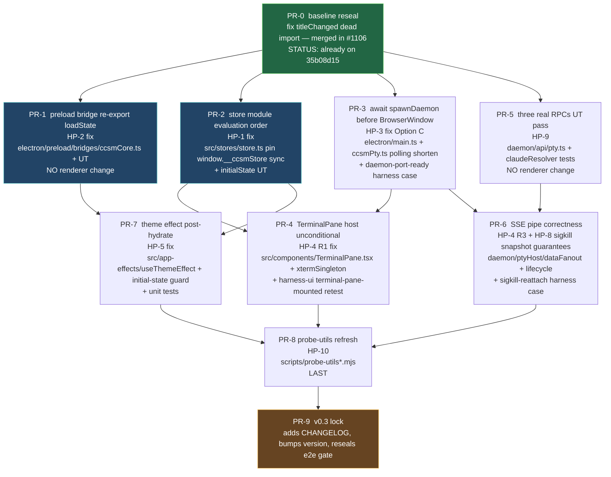

# 05 — Release slicing & DAG (PR order, blockers, gates)

This chapter converts the design from chapters 01-04 into a directed
acyclic graph of PRs, with explicit `blockedBy` edges, a recommended
dispatch order, and the merge gate that locks v0.3.

## 1. Top-level v0.3 e2e iron rules (recap, gate-form)

The merge of THIS spec's terminal PR (the gate of the gates) is
permitted iff ALL of the following hold:

| #  | Gate                                                                                                  | Tooling                                  |
|----|-------------------------------------------------------------------------------------------------------|------------------------------------------|
| G1 | `npm run lint` is green on the merged branch                                                          | local + CI `.github/workflows/ci.yml`    |
| G2 | `npm run typecheck` is green                                                                          | local + CI                               |
| G3 | `npm run build` is green (electron + daemon + renderer bundles emitted)                                | local + CI                               |
| G4 | `npm test -- --run` is green (Vitest unit + UT)                                                       | local + CI                               |
| G5 | `harness-real-cli` Set A subset is green for **two consecutive runs in the same CI workflow invocation** (i.e., the e2e job is configured to run twice and both passes are required — NOT two separate PR-trigger runs, NOT two consecutive merges)                                     | `.github/workflows/e2e.yml` job (matrix re-run × 2; both green)          |
| G6 | `harness-ui` Set A subset is green for **two consecutive runs in the same CI workflow invocation** (same definition as G5)                                           | `.github/workflows/e2e.yml` job (matrix re-run × 2; both green)                               |
| G7 | `harness-dnd` Set A subset is green for **two consecutive runs in the same CI workflow invocation** (same definition as G5)                                          | `.github/workflows/e2e.yml` job (matrix re-run × 2; both green)                               |
| G8 | Vitest skip total = 0 (`it.skip / test.skip / describe.skip / xit / xdescribe` in `tests/ src/ daemon/ electron/`); harness skip-flag count (`skipLaunch / requiresClaudeBin / windowsOnly / darwinOnly / linuxOnly` set true on a case) ≤ ch04 §1.1 baseline (currently 1: `cap-skip-launch-bundle-shape` KEEP) | `grep -rEn "(it\|test\|describe)\.skip\(\|\bxit\b\|\bxdescribe\b" tests/ src/ daemon/ electron/` returns 0; harness flag count diff'd against [04-probe-and-harness-update](./04-probe-and-harness-update.md) §1.1 |
| G9 | NO transport regression (no preload bridge reverted to IPC for a wave-2 endpoint) AND no daemon HTTP listen widening (cross-ref [ch03 §3](./03-ptyhost-wiring.md#loopback-bind-invariant) + [ch02 §1](./02-store-and-preload-surface.md#1-surface-catalog-what-lives-on-window) footer) | grep diff for `ipcRenderer.invoke`; AND `grep -rEn "createServer\|\.listen\(.*0\.0\.0\.0\|\.listen\(.*'::" daemon/ src/ electron/` MUST return 0 lines outside test fixtures |
| G10| sigkill-reattach v0.2 baseline maintained green: the v0.2 already-shipping `attach-replay-from-headless-buffer` Set A case stays green (smoke test only). v0.3 does NOT lock the NEW `sigkill-reattach` harness case (Set B informational per chapter 04 §3) or any new reliability semantics (TTL / cap / cwd / eviction) as a release gate — those gates live in v0.4 per [03-ptyhost-wiring](./03-ptyhost-wiring.md) §7 (F-4 / F-6). | `harness-real-cli` Set A `attach-replay-from-headless-buffer` green |
| G11| Daemon stderr capture across a full Set A run shows ZERO `error`-level records in the `[ccsmd] <ISO> <level> <category>: ...` stream (per [ch03 §6](./03-ptyhost-wiring.md#daemon-stderr-structured-logs) format and [ch04 §2](./04-probe-and-harness-update.md#daemon-stderr-capture) capture path). A non-zero count blocks merge regardless of test colour — daemon-internal errors during a "green" run indicate a silently swallowed regression. | `grep -cE '\] [0-9T:.\-]+Z error ' tmp/e2e-logs/<run-id>/*.electron.log` MUST return 0 (summed across all Set A case logs) |

## 2. PR DAG

Legend:
- **green** (PR-0): already landed on `35b08d15` baseline.
- **cyan-blue** (PR-1, PR-2, PR-3): immediately dispatchable in parallel
  (no inter-PR dependencies; each touches a disjoint file set).
- **default**: dispatch after blockers clear.
- **orange** (PR-9): final gate; merger only.

## 3. PR contracts

> **Path-existence note (R5 ground-truth at HEAD `5d0c5375`)**: where a
> "Files touched" entry indicates a `__tests__/` subdirectory or a test
> file under `tests/components/` etc. that does NOT yet exist, the PR
> creates the directory implicitly. The `(NEW)` / `(NEW directory + file)`
> annotations below are explicit; verify against `ls daemon/api/__tests__/`
> (does not exist), `ls electron/__tests__/` (verified), `ls
> tests/components/TerminalPane.test.tsx` (does not exist), `ls
> tests/stores/{store-eval-order,initialState,single-instance,persist}.test.ts`
> (none exist) before opening the PR.

### §3.0 Symptom-to-PR closure map (R5 testability — closes the loop from ch01)

Chapter 01 §"Symptom catalog" enumerates 9 symptoms; this map names
which PR(s) close each, plus the verification lever (harness case
and/or UT). The lever column is the same as chapter 01 §"Symptom
catalog" 5th column (R5 P1-1) viewed from the PR side — both must
remain consistent.

| Symptom | Closing PR(s)              | Verification (lever)                                                                                                  |
|---------|----------------------------|------------------------------------------------------------------------------------------------------------------------|
| S1      | PR-3 + PR-4 + PR-5         | harness `new-session-chat` + `daemon-port-ready-before-render` (NEW); UT `daemon/api/__tests__/pty.test.ts` (NEW dir+file); UT `daemon/ptyHost/__tests__/lifecycle.test.ts` |
| S2      | PR-3 + PR-6                | harness `attach-replay-from-headless-buffer` + `daemon-port-ready-before-render` (NEW); UT `electron/__tests__/daemon-spawner.test.ts` (NEW) |
| S3      | PR-2                       | harness `rename` + UT `tests/stores/store-eval-order.test.ts` (NEW) + UT `tests/stores/initialState.test.ts` (NEW) + UT `tests/stores/single-instance.test.ts` (NEW) |
| S4      | PR-1                       | harness `tray`, `close-dialog-is-native` + harness `loadstate-roundtrip` (NEW per ch04 §4) + UT `daemon/api/__tests__/data.test.ts` (NEW dir+file) |
| S5      | PR-3 + PR-4                | harness `terminal-pane-mounted` + UT `tests/components/TerminalPane.test.tsx` (NEW) — three cases per ch03 §1 |
| S6      | PR-7                       | harness `theme-toggle` + UT `tests/app-effects/useThemeEffect.test.tsx` (EXTEND existing — file exists at HEAD `5d0c5375`) |
| S7      | PR-1 + PR-2 + PR-7         | harness `titlebar`, `startup-paints-before-hydrate`; UT `tests/stores/persist.test.ts` (NEW per ch02 §3) for `loadState` failure-path |
| S8      | PR-2 (via S3 chain)        | harness `dnd` (chained on S3 fix; same UT levers as S3 apply) |
| S9      | PR-8                       | (no dedicated harness — diagnostic layer; covered by other Sn green after probe-utils refresh) |

**MUST**: each PR's "Acceptance" subsection below must list its
contribution to closing the symptoms in the column above. A PR that
claims to close a symptom but does NOT carry its corresponding lever
(harness case or UT) is incomplete.

### PR-1 — preload re-export `loadState` (HP-2)

- **Files touched**: `electron/preload/bridges/ccsmCore.ts`,
  `daemon/api/data.ts` (verify only),
  `daemon/api/__tests__/data.test.ts` **(NEW directory + file** — the
  `daemon/api/__tests__/` subdir does not exist at HEAD `5d0c5375`;
  PR-1 creates it implicitly).
- **Renderer files touched**: ZERO.
- **Acceptance**: harness `tray` and `close-dialog-is-native` cases
  pass on a `npm run test:e2e:ui` re-run; UT covers
  `get(missing) → null`, `get(set) → value`, `set(empty key) → 400`.
- **Risk**: low — pure preload+daemon edit.
- **blockedBy**: none (depends only on PR-0 baseline).
- **Subject seed for extractor**: `[T1.0] preload re-export window.ccsm.loadState (wire to /api/data/get)`

### PR-2 — store module-eval order (HP-1)

- **Files touched**: `src/stores/store.ts`,
  `src/App.tsx` (production-event emit, see Acceptance),
  `tests/stores/initialState.test.ts` **(NEW)**,
  `tests/stores/store-eval-order.test.ts` **(NEW)** per ch01 HP-1 verdict + ch02 §4 I-1 lever,
  `tests/stores/single-instance.test.ts` **(NEW)** per ch02 §2 Fix-B lever.
- **Acceptance**: `seedStore` `waitForFunction` resolves in <5s on a
  fresh launch; UT asserts every initial-state field used in
  `App.tsx`'s first paint exists; `store-eval-order` UT asserts
  `(globalThis as any).__ccsmStore === useStore` synchronously after
  `await import('src/stores/store')`; `single-instance` UT asserts
  exactly one zustand `create<...>()` call across `src/stores/**/*.ts`.
- **Acceptance (production-event emit, R5 P1-4 cross-PR responsibility)**:
  App.tsx MUST fire `window.dispatchEvent(new Event('ccsm:app-shell-ready'))`
  at end of its first useEffect (after first commit). The probe in
  PR-8 consumes this via `waitForEvent` per ch04 §2.0; without the
  emit landing in PR-2, PR-8's probe degrades silently to polling.
  Verify in `tests/AppShell.test.tsx` (extend if exists, else add a
  light test asserting the event fires once on mount).
- **Risk**: low — moves an assignment line; new test file.
- **blockedBy**: none.
- **Subject seed**: `[T1.0] pin window.__ccsmStore at module eval (HP-1)`

### PR-3 — await spawnDaemon before BrowserWindow (HP-3, Option C)

- **Files touched**: `electron/main.ts`,
  `electron/preload/bridges/ccsmPty.ts` (poll shorten + new
  `__ccsmDaemonPortLoadIterations` debug counter per ch03 §3 / ch04 §4),
  `electron/__tests__/daemon-spawner.test.ts` **(NEW** — `electron/__tests__/`
  exists at HEAD `5d0c5375` but the `daemon-spawner.test.ts` file does
  not; PR-3 creates it).
- **Acceptance**: harness `attach-replay-from-headless-buffer` no
  longer reports `daemon port unavailable after 5s`; new
  `daemon-port-ready-before-render` harness case is green (assertion
  per ch04 §4: first RPC ≤500ms wall-clock + `__ccsmDaemonPortLoadIterations === 0`).
- **Acceptance (UT — `electron/__tests__/daemon-spawner.test.ts` per ch03 §3 R5 P0-2)**:
  the NEW UT MUST cover exactly four cases (mock `child_process.spawn`
  via `vi.mock`, use `vi.useFakeTimers()` for the timeout case):
  (1) PORT-line happy path resolves to `{ port, pid }`;
  (2) malformed PORT line (non-numeric, privileged-range, out-of-range)
     rejects with `code: 'malformed_port'`;
  (3) stdout-EOF before PORT line rejects with `code:
     'child_exit_before_port'` or `'stdout_eof'`;
  (4) **10s startup timeout rejects with `code: 'startup_timeout'`** —
     this is the load-bearing test for the Option C contract (a hung
     daemon must not silently hang Electron startup).
- **Acceptance (cold-launch budget)**: PR body MUST include a measured
  `p50`/`p95` cold-launch click-to-window delta vs `35b08d15` for each
  of Win / macOS / Linux (table per chapter 03 §3 "Cold-spawn budget
  (measured)"). Any platform showing **>500ms p95 regression**
  automatically triggers fallback to Option B (pre-resolved port cache);
  manager does NOT re-deliberate. PR-3 cannot land with an unfilled
  table or with the >500ms threshold breached on Option C.
- **Risk**: low-medium — changes app launch sequencing; verify
  packaged-app smoke too.
- **blockedBy**: none.
- **Subject seed**: `[T1.0] await spawnDaemon before BrowserWindow (HP-3 Option C)`

### PR-4 — TerminalPane host unconditional (HP-4 R1)

- **Files touched**: `src/components/TerminalPane.tsx`,
  `src/terminal/xtermSingleton.ts`,
  `tests/components/TerminalPane.test.tsx` **(NEW** — file does NOT
  exist at HEAD `5d0c5375`; verified `ls tests/components/` and `ls
  tests/terminal/`. The conventional path matches `src/components/TerminalPane.tsx`).
- **Acceptance (UT — three cases per ch03 §1 R5 P0-1)**: the NEW UT
  MUST cover exactly three cases via React Testing Library, each
  asserting `getByTestId('terminal-host')` resolves and the host
  carries the expected `data-sid`:
  (1) `claudeAvailable: false` — Retry button is a CHILD of the host
     element (not in lieu of it);
  (2) `claudeAvailable: true, exitKind: 'crashed'` — crashed-state
     restart child is INSIDE host;
  (3) `claudeAvailable: true, kind: 'idle'` — xterm container child is
     INSIDE host.
- **Acceptance (harness)**: `terminal-pane-mounted` harness case
  passes; the Retry-state path **preserves v0.2 DOM topology** (cite
  `git show 35b08d15^:src/components/TerminalPane.tsx` baseline line
  numbers in PR body). Only stable `data-testid` attributes (e.g.
  `data-testid='terminal-host'`) may be added to whichever element
  v0.2 already mounts; harness selector adapts to v0.2 shape, not the
  reverse. Any new DOM node or any change to the claude-missing branch
  topology requires explicit user/product approval recorded in the PR.
- **Acceptance (production-event emit, R5 P1-4 cross-PR responsibility)**:
  TerminalPane MUST fire
  `window.dispatchEvent(new CustomEvent('ccsm:terminal-host-mounted',
  { detail: { sid } }))` in its `useEffect([sid])` once the host
  element is in DOM. xtermSingleton MUST fire
  `window.dispatchEvent(new CustomEvent('ccsm:term-attached',
  { detail: { sid } }))` post-`term.open(hostEl)`. PR-8 consumes both
  via `waitForEvent` per ch04 §2.0; without the emits landing in PR-4,
  PR-8's `waitForTerminalReady` degrades silently to polling. Verify
  in the NEW UT (assert each event fires once via `addEventListener` spy).
- **Risk**: medium — touches the most-watched UI surface.
- **blockedBy**: PR-2 (needs reliable `__ccsmStore` for tests),
  PR-3 (needs daemon port deterministic).
- **Subject seed**: `[T1.1] TerminalPane host renders unconditionally (HP-4 R1)`

### PR-5 — three real RPCs (HP-9)

- **Files touched**: `daemon/api/pty.ts`,
  `daemon/ptyHost/index.ts`, `daemon/ptyHost/claudeResolver.ts`,
  `daemon/api/__tests__/pty.test.ts` **(NEW; also creates the
  `daemon/api/__tests__/` directory if PR-1 has not landed first**),
  existing UTs extended.
- **Renderer files touched**: ZERO.
- **Acceptance**: input/resize/checkClaudeAvailable each have UTs
  covering happy path + error tokens (`no_such_sid`, `bad_request`,
  `available:false reason:<token>`).
- **Risk**: low — daemon-only; unit-tested.
- **blockedBy**: none.
- **Subject seed**: `[T1.0] three real RPCs (input/resize/checkClaudeAvailable) UT + Connect-roundtrip (HP-9)`

### PR-6 — SSE pipe correctness + sigkill-reattach (HP-4 R3, HP-8)

- **Files touched**: `daemon/ptyHost/dataFanout.ts`,
  `daemon/ptyHost/lifecycle.ts`, `daemon/api/pty.ts` (SSE
  multiplexer hardening), `daemon/ptyHost/__tests__/dataFanout.test.ts`,
  `daemon/ptyHost/__tests__/lifecycle.test.ts` (extend),
  `scripts/harness-real-cli.mjs` (NEW `sigkill-reattach` case in **Set B
  informational** per chapter 04 §3 / §4).
- **Acceptance (v0.3, R1 strict — manager decision round 1)**:
  - **(a) v0.2 baseline restoration**: the v0.2 already-shipping
    `attach-replay-from-headless-buffer` Set A case is green again on
    the post-cutover daemon-port substrate (HP-3 prereq), exercising
    daemon's existing v0.2 snapshot path unchanged. UTs cover SSE
    guarantees G-1 / G-2 / G-3 / G-4 from chapter 03 §2 (these are
    multi-subscriber correctness, NOT new sigkill semantics).
  - **(b) NEW `sigkill-reattach` harness case** is added to
    `scripts/harness-real-cli.mjs` and runs as **Set B informational**
    in v0.3 — its result MUST NOT block PR-6 merge or v0.3 release.
    No new TTL / cap / cwd / eviction assertions in v0.3.
- **v0.4 follow-up (NOT in this PR)**: G-1..G-4 of the new sigkill
  reliability strategy (snapshot TTL pin, buffer cap, ring-buffer
  truncation, cwd-mismatch policy, dedup, 4 boundary UTs, Set A
  promotion, G10 release-gate lock) are deferred per
  [03-ptyhost-wiring](./03-ptyhost-wiring.md) §7 F-1..F-6. Placeholder
  v0.4 PR index: `<v0.4-reliability-PR-TBD>` (sigkill hardening),
  `<v0.4-e2e-PR-TBD>` (Set A promotion), `<v0.4-release-slicing-PR-TBD>`
  (G10 gate lock).
- **Risk**: medium — daemon lifecycle edits; covered by UTs.
- **blockedBy**: PR-3 (port handshake), PR-5 (real RPCs landed).
- **Subject seed**: `[T1.1] SSE event pipe + sigkill-reattach v0.2 baseline restoration (HP-4 R3, HP-8)`

### PR-7 — theme effect post-hydrate (HP-5)

- **Files touched**: `src/app-effects/useThemeEffect.ts`,
  `src/stores/slices/appearanceSlice.ts` (`resolveEffectiveTheme`),
  `tests/app-effects/useThemeEffect.test.tsx` (new).
- **Acceptance**: `theme-toggle` harness case green; new unit test
  asserts every `{theme} × {osPrefersDark}` combination produces
  exactly one of `dark` / `theme-light`.
- **Risk**: low.
- **blockedBy**: PR-1 (`loadState` available so persisted theme
  hydrates), PR-2 (`__ccsmStore` reliable so `setTheme` reads back).
- **Subject seed**: `[T1.1] resolve theme always to dark|light + initial-state guard (HP-5)`

### PR-8 — probe-utils refresh (HP-10)

- **Files touched**: `scripts/probe-utils.mjs`,
  `scripts/probe-utils-real-cli.mjs`,
  `scripts/probe-helpers/harness-runner.mjs`,
  `scripts/probe-helpers/reset-between-cases.mjs`.
- **Acceptance**: timeouts tightened per chapter 04 §2; harness
  Set A cases all green TWO CONSECUTIVE runs in CI (per G5/G6/G7
  definition: same workflow invocation, both green).
- **Acceptance (waitForEvent migration, R5 P1-4 cross-PR consumer)**:
  PR-8 MUST replace `waitForFunction` polls with `waitForEvent` calls
  for the three production-emit events landed by PR-2 / PR-4
  (`ccsm:app-shell-ready` in `seedStore` step, `ccsm:terminal-host-mounted`
  + `ccsm:term-attached` in `waitForTerminalReady`). The signal-vs-poll
  table in ch04 §2.0 is the contract; any probe step that cannot use a
  signal MUST document the reason in a code comment per ch04 §2.0
  fallback rule. `waitForTerminalReady` MUST return the structured
  `{ host, term, buffer, sid, cols, rows }` shape per ch01 HP-4
  verdict so callers assert each flag independently.
- **Acceptance (reset-between-cases runtime invariant per ch04 §2)**:
  `reset-between-cases.mjs` MUST assert `beforeRef === afterRef` on
  the `__ccsmStore` reference per case per ch04 §2 — runtime guard for
  the duplicate-store regression (HP-1).
- **Risk**: low — diagnostic layer only; no product code touched.
- **blockedBy**: PR-4, PR-6, PR-7 (the under-test surface must be
  correct before tightening probes).
- **Subject seed**: `[T1.2] probe-utils refresh post-cutover (HP-10)`

### PR-9 — v0.3 e2e gate lock

- **Files touched**: `CHANGELOG.md`,
  `package.json` version bump (only if v0.3 ships from this branch),
  `.github/workflows/e2e.yml` (verify two-consecutive-runs gate).
- **Acceptance**: gates G1-G10 from §1 all met on the merged branch.
- **Risk**: clerical.
- **blockedBy**: PR-8.
- **Subject seed**: `[T2.0] v0.3 e2e gate lock + CHANGELOG`

## 4. Set B regressions tracking

If during the repair any Set B case (informational bench) regresses:

- log in `docs/superpowers/specs/2026-05-06-v0.3-e2e-cutover-chapters/setB-regression-log.md`
  (created by reviewer or fixer round).
- if the regression is attributable to wave-2 cutover residue not
  caught by chapters 01-04, escalate as a P1 finding to the spec
  reviewers.
- otherwise, file a follow-up task labelled `[v0.4][setB-regression]`.

## 5. Dispatch order recommendation (for manager)

Wave 1 (parallel, no inter-deps): PR-1, PR-2, PR-3, PR-5
Wave 2 (after wave 1 lands): PR-4, PR-6, PR-7
Wave 3 (after wave 2): PR-8
Wave 4 (terminal): PR-9

**R3 cross-cut note (CF-6 reliability hardening)**: the v0.3 R3
cross-cut hardening — daemon spawn-failure path (PR-3), port-collision
single-retry counter (PR-3), SSE reconnect dedup contract (PR-6 per
[ch03 §2 G-5](./03-ptyhost-wiring.md#required-guarantees)), and probe
timeout DOM/hydration-trace dumps (PR-8 per [ch04 §2](./04-probe-and-harness-update.md#scriptsprobe-utils-real-climjs))
— rides each PR's existing wave slot and does NOT shift the dispatch
order above. Sigkill snapshot TTL pin / per-sid buffer cap / 4
boundary UTs are explicitly **NOT** part of this cross-cut: they are
deferred to v0.4 per CF-3 manager decision and tracked in
[ch03 §7](./03-ptyhost-wiring.md#7-out-of-scope-deferred) (F-1 / F-2 / F-5).

Estimated calendar: with parallel dispatch and 1-day per-PR review
turn-around, v0.3 e2e green is reachable in 4-5 working days from
spec-merge.

## 6. Out-of-scope (deferred)

- v0.3.1 follow-up if any Set A case proves flaky (>1 retry needed) —
  separate spec.
- v0.4 web frontend wire-up — separate spec already drafted.
- Daemon process supervision (auto-restart on crash) — v0.4 reliability
  spec.
- Refactoring the harness directive vocabulary
  (`requiresClaudeBin / windowsOnly / darwinOnly / skipLaunch` →
  unified `gate` field) — out of scope; non-blocking improvement.

## 7. Risks & open questions for reviewers

- **Risk-1**: PR-3 (Option C `await spawnDaemon`) lengthens
  cold-launch by daemon-boot time. The **enforcement point** is the
  PR-3 acceptance bullet (above): PR body MUST carry a measured
  `p50`/`p95` cold-launch click-to-window delta vs `35b08d15` for
  Win / macOS / Linux. **Any platform showing >500ms p95 regression
  automatically triggers fallback to Option B (pre-resolved port
  cache).** This is a deterministic gate, NOT a manager deliberation;
  the budget number and rollback path are pinned in chapter 03 §3
  "Cold-spawn budget (measured)" so the reviewer of PR-3 can mechanically
  reject the PR without re-opening the design.
- **Risk-2**: PR-2 may collide with PR-7 if the `appearanceSlice` is
  re-organised. Manager SHOULD merge PR-2 first then rebase PR-7.
- **Risk-3**: PR-6 sigkill-reattach UT may surface a daemon supervision
  bug (e.g., daemon doesn't release the snapshot until child fully
  exits). If so, scope creep into v0.3 — escalate.
- **Open question Q1** (lifted from chapter 01): exact source of the
  "88 .skip" figure. R5 reviewer to reconcile.
