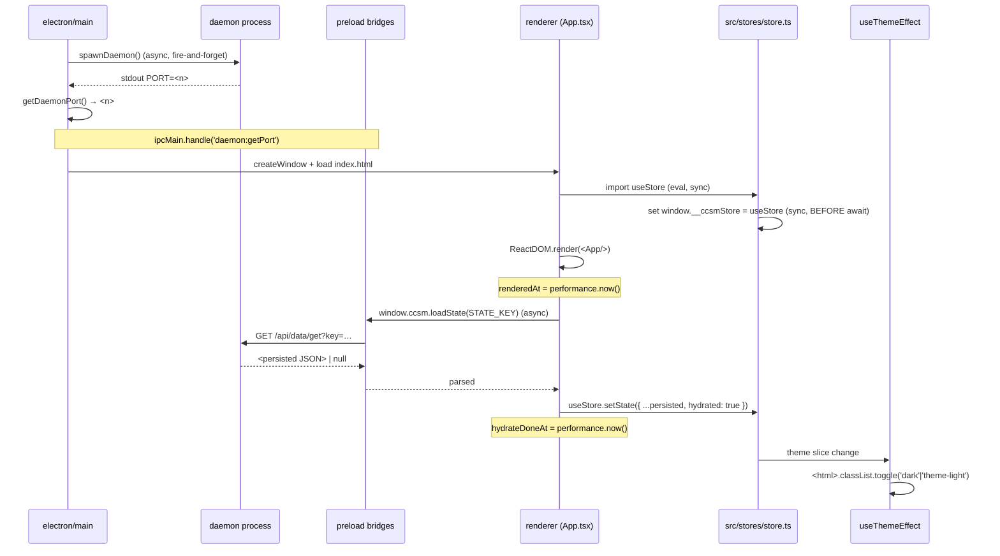
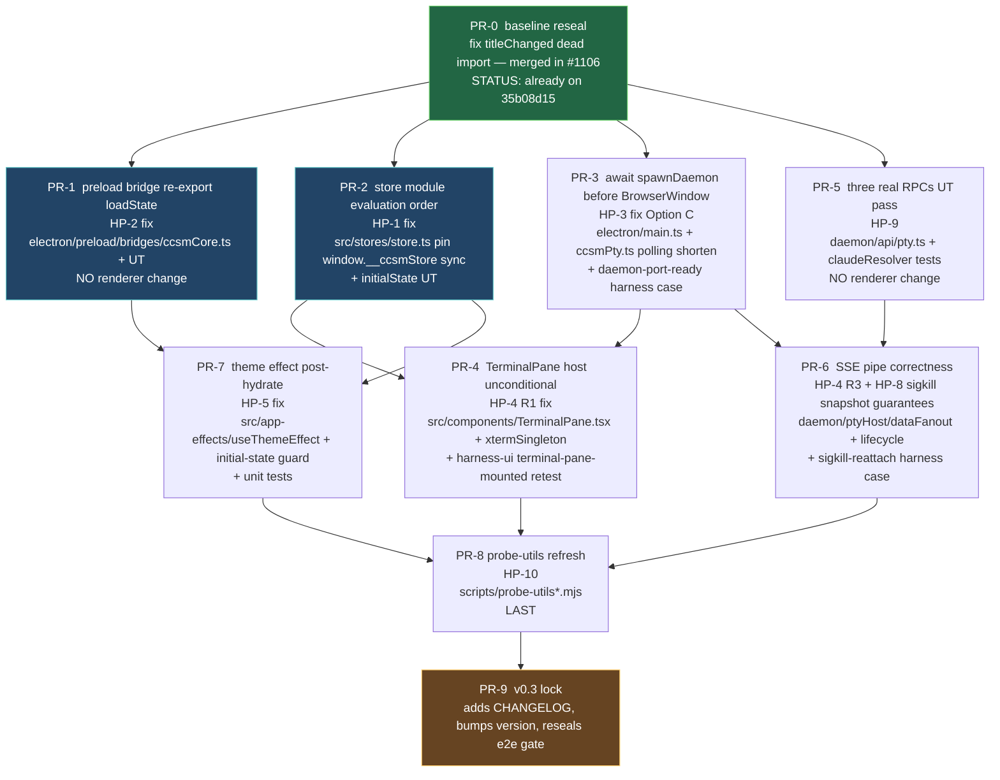

# v0.3 E2E Cutover Repair Plan

- **Status**: spec locked (stage-4 CLEAN, 0 P0/0 P1; P2 deferred)
- **Base**: `working`
- **Date**: 2026-05-06
- **Topic ID**: #592
- **Wave-2 relation**: post-W2 cleanup; assumes daemon split shipped

## Table of contents

- [0. Overview](#0-overview)
  - [0.1 Why this spec exists](#01-why-this-spec-exists)
  - [0.2 Scope](#02-scope)
  - [0.3 Iron rules (carried from manager dispatch)](#03-iron-rules-carried-from-manager-dispatch)
  - [0.4 Relationship to v0.3 wave-2](#04-relationship-to-v03-wave-2)
  - [0.5 Non-goals](#05-non-goals)
  - [0.6 Quality bar / acceptance criteria](#06-quality-bar-acceptance-criteria)
  - [0.7 Document conventions](#07-document-conventions)
  - [0.8 Reader map](#08-reader-map)
- [1. Cutover audit](#1-cutover-audit)
  - [1.1 Symptom catalog (cited evidence)](#11-symptom-catalog-cited-evidence)
  - [1.2 Hot-path inventory](#12-hot-path-inventory)
  - [1.3 Cross-cutting hypotheses](#13-cross-cutting-hypotheses)
  - [1.4 Open audit questions (lifted to reviewers)](#14-open-audit-questions-lifted-to-reviewers)
- [2. Store and preload surface](#2-store-and-preload-surface)
  - [2.1 Surface catalog (what lives on `window`)](#21-surface-catalog-what-lives-on-window)
  - [2.2 `window.__ccsmStore` exposure (HP-1)](#22-windowccsmstore-exposure-hp-1)
  - [2.3 `window.ccsm.loadState` (HP-2)](#23-windowccsmloadstate-hp-2)
  - [2.4 Hydration ordering (HP-5, HP-6)](#24-hydration-ordering-hp-5-hp-6)
  - [2.5 Initial state safety](#25-initial-state-safety)
  - [2.6 Out-of-scope (with reasons)](#26-out-of-scope-with-reasons)
- [3. ptyHost wiring](#3-ptyhost-wiring)
  - [3.1 The three readiness flags (HP-4)](#31-the-three-readiness-flags-hp-4)
  - [3.2 SSE event delivery](#32-sse-event-delivery)
  - [3.3 Daemon-port readiness (HP-3)](#33-daemon-port-readiness-hp-3)
  - [3.4 sigkill-reattach (HP-8)](#34-sigkill-reattach-hp-8)
  - [3.5 Three real RPCs (HP-9)](#35-three-real-rpcs-hp-9)
  - [3.6 Error surface conventions](#36-error-surface-conventions)
  - [3.7 Out-of-scope (deferred)](#37-out-of-scope-deferred)
- [4. Probe and harness update](#4-probe-and-harness-update)
  - [4.1 Skip inventory & reconciliation](#41-skip-inventory-reconciliation)
  - [4.2 probe-utils refresh](#42-probe-utils-refresh)
  - [4.3 Set A vs Set B (dogfood)](#43-set-a-vs-set-b-dogfood)
  - [4.4 New harness cases required by spec](#44-new-harness-cases-required-by-spec)
  - [4.5 Out-of-scope (deferred)](#45-out-of-scope-deferred)
  - [4.6 Acceptance signal for §4](#46-acceptance-signal-for-4)
- [5. Release slicing and DAG](#5-release-slicing-and-dag)
  - [5.1 Top-level v0.3 e2e iron rules (recap, gate-form)](#51-top-level-v03-e2e-iron-rules-recap-gate-form)
  - [5.2 PR DAG](#52-pr-dag)
  - [5.3 PR contracts](#53-pr-contracts)
  - [5.4 Set B regressions tracking](#54-set-b-regressions-tracking)
  - [5.5 Dispatch order recommendation (for manager)](#55-dispatch-order-recommendation-for-manager)
  - [5.6 Out-of-scope (deferred)](#56-out-of-scope-deferred)
  - [5.7 Risks & open questions for reviewers](#57-risks-open-questions-for-reviewers)

## 0. Overview

**Spec ID**: `2026-05-06-v0.3-e2e-cutover`
**Base HEAD**: `35b08d15` (origin/working, includes #1106)
**Author stage**: stage-1 / spec-pipeline (this commit)
**Driver task**: Task #592

### 0.1 Why this spec exists

The v0.3 wave-2 cutover (PRs #1100–#1105) physically moved `db / import /
prefs / sessionTitles / sentry / ptyHost / sessionWatcher / notify / badge`
out of Electron main and into a standalone daemon process, and replaced
the previous `ipcRenderer.invoke(...)` channels with loopback HTTP +
SSE through `electron/preload/bridges/*.ts`. After that landed:

- `lint / typecheck / build / unit` are green on `35b08d15` (PR #1106
  repaired the only unit-side dead import — `daemon/sessionWatcher/__tests__/titleChanged.test.ts`).
- All three e2e harnesses (`harness-real-cli`, `harness-ui`, `harness-dnd`)
  are red. dev-574 captured a full local CI baseline in `/tmp/t574-e2e.log`.

Concretely the e2e red stems from at least four hot-path regressions
that wave-2 cutover left half-wired (full audit in
§0.1):

1. `window.__ccsmStore` exposure / hydration ordering — `seedStore` waitForFunction
   timeouts in 5+ harness-ui cases, the dnd case, and several real-cli paths.
2. `window.ccsm.loadState` no longer present on the new preload surface
   for `tray` / `close-dialog-is-native` (`window.ccsm.loadState is not a function`).
3. ptyHost SSE wiring incomplete — `waitForTerminalReady` reports
   `{host:false,term:false,buffer:false}` for >60s on cold sessions, and
   `attach-replay-from-headless-buffer` hits
   `ccsmPty: daemon port unavailable after 5s` (preload bridge code at
   `electron/preload/bridges/ccsmPty.ts:49`).
4. Theme application on first paint — `theme-toggle` reads
   `themeClassDark:false themeClassLight:false` (root <html> classes never
   applied), `titlebar` and `startup-paints-before-hydrate` time out
   waiting on store-driven hydration.

Beyond those, a non-trivial slice of the harness probe utilities
(`scripts/probe-utils.mjs`, `scripts/probe-utils-real-cli.mjs`,
`scripts/probe-helpers/*.mjs`) was not refreshed during wave-2-D
cleanup. They still assume the pre-cutover renderer surface in places.

This spec defines the **minimum-blast-radius** repair plan to take all
three e2e harnesses back to green WITHOUT regressing the green
lint/typecheck/build/unit baseline and WITHOUT introducing any new
`.skip` directives.

### 0.2 Scope

**In scope**:

- Re-establishing the renderer surface contract used by the harnesses
  (`window.__ccsmStore`, `window.ccsm.loadState`, `window.__ccsmTerm`,
  hydration-trace) on top of the new preload bridges.
- Completing the `daemon-port → preload bridge` boot sequence so cold
  e2e launches don't time out at 5s.
- Auditing every wave-2 hot path against the failing harness symptoms,
  emitting a per-path FIX/KEEP/REVERT verdict.
- Refreshing probe-utils so harnesses can drive the post-cutover
  surface without local hacks.
- Producing a per-harness-case verdict policy (KEEP / DELETE / FIX /
  MARK) for any future case marked with a runner gate flag
  (`requiresClaudeBin / windowsOnly / darwinOnly / linuxOnly /
  skipLaunch`). Ground-truth at `35b08d15` / `5d0c5375`: **0 Vitest
  `.skip` directives, 1 `skipLaunch:true` case**
  (`cap-skip-launch-bundle-shape`, capability demo of the runner
  itself; KEEP). The dev-574 "~88" figure was a count of runner
  gate-evaluations across the case×flag matrix in
  `scripts/probe-helpers/harness-runner.mjs`, NOT actual skipped
  tests; v0.3 treats §3.1 ("zero e2e skip") as a forward guard against
  introducing new skips during repair, not a triage backlog. Canonical
  baseline lives in §4.1.1.
- A release-slicing plan plus DAG so manager can dispatch fixers
  in parallel without merge collisions.

**Out of scope** (deferred to v0.4 unless the audit promotes them):

- The web frontend (v0.4 — there is no renderer surface there yet).
- Replacing loopback HTTP+SSE with a different transport (we keep the
  wave-2 daemon transport — the v0.3 iron rule per
  §5.1).
- Any change to product features. v0.3 is a refactor; if the audit
  surfaces an apparent feature change as a side-effect of cutover, it
  is treated as a bug to fix back to pre-cutover behaviour.

**Why deferred**: v0.3 ships when the daemon split is provably
non-feature-impacting. New transports / surfaces / features compound
risk and are scheduled for v0.4+ design once v0.3 is locked
(`spec/2026-04-30-v0.4-web-frontend-design.md`).

### 0.3 Iron rules (carried from manager dispatch)

These constrain every fix proposed in chapters 02–05.

1. **Zero e2e skip**. Adding `it.skip / xtest / harness skip flags` to
   silence a red case is a P0 finding regardless of test difficulty.
2. **Skip-first repair path (option b)**. The known-green baseline
   (lint/typecheck/build/unit) MUST stay green for the entire repair.
   No fixer is allowed to "drive-by refactor" non-e2e code.
3. **Dogfood discipline** — `Set A` (CI gate, must be green to merge)
   and `Set B` (informational bench). The repair targets Set A
   absolute-green; Set B regressions that surface during repair are
   logged in §5.4 but do not block.
4. **sigkill-reattach is a v0.3 must-fix — scope = v0.2 baseline restoration only**.
   The reattach-from-snapshot path is currently exercised only via
   `attach-replay-from-headless-buffer` which is broken at the daemon-port
   boundary; once the boundary is fixed, the v0.2 daemon-port already-shipping
   attach-replay path MUST be restored to green. v0.3 scope = "restore the
   attach-replay code path that v0.2 already shipped on the daemon-port
   substrate; buffer replay is served by daemon's existing v0.2 snapshot
   behaviour (unchanged)." v0.3 does NOT introduce new product semantics on
   this path. Explicit **v0.4 defer list** for sigkill-reattach (NOT v0.3
   work; see §3.7):
   - 60s snapshot TTL pin + buffer-cap (1MB/sid) + ring-buffer eviction.
   - cwd-mismatch → discard snapshot policy.
   - NEW `sigkill-reattach` harness case in Set A (v0.3 keeps it Set B
     informational; promotion to Set A is a v0.4 candidate).
   - Release gate `G10` lock on sigkill-reattach being green.
   Why this split: v0.3 is a refactor (per §3.2 / §0.3 rule "no product
   feature change"); pinning new TTL / cwd / cap semantics or making
   sigkill-reattach a release-blocker = NEW product rules and would inflate
   v0.3 scope. R1 strict-preservation派 (manager decision, round 1)
   prevails — v0.3 ships when the v0.2 attach-replay path is green again,
   not when new reliability semantics are pinned.
5. **Three RPCs (`SendInput / Resize / CheckClaudeAvailable`) must be
   real implementations + UT + Connect-roundtrip** — no stubs, no
   "always-ok" returns. They are the smallest set the renderer cannot
   live without.
6. **No transport regression**. Every fix is implemented on the
   wave-2 daemon HTTP/SSE pipe. Reverting any single bridge to IPC is
   a P0 finding.
7. **Daemon liveness contract**. The daemon process is a hard
   dependency of the renderer; v0.3 pins the failure semantics so
   every fixer codes against the same contract:
   - On `spawnDaemon` rejection in `electron/main.ts` (boot path),
     electron MUST hard-exit with a non-zero code AND emit a
     structured stderr line in the format owned by
     §3.6 (CF-6 stderr
     contract). No silent fallback, no IPC retry.
   - On daemon process exit AFTER window creation (mid-session),
     electron MUST surface a renderer toast via the existing zustand
     error slice AND disable the pty / data RPC surfaces until the
     user restarts the app. The renderer MUST NOT auto-retry the
     daemon connection.
   - **Auto-restart on crash is deferred to v0.4** (see
     §3.7); v0.3 ships with
     fail-loud + restart-by-user semantics only.
   Why: §3.3 makes `spawnDaemon` awaited and §3.6
   pins the stderr format; without this iron rule the boot-failure
   and mid-session-exit code paths would be implemented inconsistently
   across PR-3 / PR-6 fixers.

### 0.4 Relationship to v0.3 wave-2

This spec is "wave-2 cutover follow-on". It does NOT redo wave-2; it
finishes the seam wave-2 left half-cut.

Concretely it inherits these wave-2 commits as the substrate to repair on:

| commit     | wave-2 sub-PR | what it landed                                                  |
|------------|---------------|------------------------------------------------------------------|
| `badbf48d` | wave1-A #1097 | daemon http server skeleton                                     |
| `7588192a` | wave1-C #1098 | renderer fetch shim (`window.ccsm` over HTTP)                   |
| `f0738856` | wave1-B #1099 | electron spawns daemon + delete business ipc registers          |
| `f9c99ab5` | wave2-prep    | auto-registry daemon/api + 5-bridge preload skeleton            |
| `5e132743` | wave2-prep-v2 | startup auto-registry for `daemon/main.ts`                      |
| `4ff7c00d` | wave2-A #1104 | db / import / prefs / sessionTitles / sentry mv to daemon       |
| `b2300c28` | wave2-B #1103 | ptyHost mv to daemon + SSE pty events + real `ccsmPty` shim     |
| `e263ddd7` | wave2-C #1102 | sessionWatcher / notify-producer / badge mv + SSE bridges       |
| `2d8a193d` | wave2-D #1105 | delete `__legacy_to_delete__` + ipcGuards cleanup               |
| `35b08d15` | post-wave2    | repair dead import in `titleChanged.test.ts` (#1106)            |

Reverting any of these is OUT OF SCOPE; this spec stacks on top.

### 0.5 Non-goals

| Non-goal                                                          | Why deferred                                          | Target version |
|-------------------------------------------------------------------|-------------------------------------------------------|----------------|
| Rewriting harness-runner to a Vitest-managed runner               | Orthogonal infrastructure work; harness-runner has no known defect blocking repair | v0.4+ |
| Replacing harness `requiresClaudeBin / skipLaunch` directives with a single mechanism | Same — refactor opportunity, not a v0.3 release blocker | v0.4+ |
| Bench parity with Set A on Set B (full Linux/macOS coverage)      | CI cost; Set A defines release gate                   | v0.4+ |
| Migrating preload bridges off `contextBridge.exposeInMainWorld`   | Wave-2 substrate; out of scope per §0.3 rule 6          | post-v0.3 |
| Renaming `__ccsmStore` to a non-debug-affordance                  | Production-side renderer-test affordance; touched by harnesses, can rename in v0.4 hardening | v0.4 |

**Why deferred**: each item is either pure improvement (no failing
case attached) or would expand wave-2 substrate edits; either way it
delays v0.3 release for non-blocking reasons.

### 0.6 Quality bar / acceptance criteria

The spec is "done" when:

1. §0.1 lists every wave-2 hot
   path and assigns FIX / KEEP / REVERT (REVERT only with
   manager-explicit override).
2. §0.2
   defines the post-cutover renderer surface used by the harnesses,
   including hydration ordering, and the migration policy from
   `window.ccsm.loadState` legacy callers.
3. §0.3 defines when each of
   `host / term / buffer` flips true and the daemon-port readiness
   contract that prevents the 5s timeout.
4. §0.4
   classifies every harness case (KEEP / DELETE / FIX / MARK) and
   defines the probe-utils refresh.
5. §0.5
   provides the PR DAG, blockers, and the gate criteria
   (`e2e 3 harness all green` ∧ `lint/typecheck/build/unit still green`).
6. **Daemon stderr is structured and captured.** Daemon-side and
   electron-main-side error output MUST follow the structured-stderr
   format pinned in §3.6
   (CF-6: `[ccsmd] <ISO-8601> <level> <category>: ...`), and the
   harness runner MUST capture both electron-main and daemon streams
   to per-case files so any v0.3 CI flake (Risk-1 in
   §5.4)
   is post-mortem-debuggable without re-running. Why: a single
   un-attributable flake otherwise costs hours of bisection.

The downstream **implementation** is "done" only when the e2e CI gate
hits absolute-green for two consecutive runs on a fresh worktree. That
gate lives in `.github/workflows/e2e.yml` and is not modified here.

### 0.7 Document conventions

- All chapters use ATX (`#`) headings, max depth `####`.
- Code-fence language tag mandatory (`ts`, `tsx`, `bash`, `mermaid`).
- Cross-chapter links are relative: `./NN-name.md`.
- "MUST / SHOULD / MAY" used per RFC 2119 — every architectural
  decision is followed by a one-line `Why:` justification.
- Every `Non-goal:` / `Deferred:` carries a `Why deferred:` and a
  target version.
- File / symbol references use absolute repo-root paths (e.g.
  `electron/preload/bridges/ccsmPty.ts:49`).

### 0.8 Reader map

If you're a reviewer:

- **Feature-preservation** angle → chapters 01, 02, 03 (any silent
  feature drift gets caught here).
- **Reliability / observability** → chapters 03, 04 (ptyhost wiring,
  probe-utils — all the failure surfaces).
- **Testability** → chapters 04, 05 (case-by-case verdict + slicing).
- **Naming / consistency** → §2 (preload surface naming) and
  §4 (probe / harness naming convergence).

## 1. Cutover audit

This chapter enumerates every hot path the wave-2 cutover touched, the
observed e2e symptom (linked to `/tmp/t574-e2e.log` evidence), and the
verdict (FIX / KEEP / REVERT). It is the single source of truth for
which chunks of the renderer/preload/daemon seam need work in v0.3.

The audit is organised by **renderer-side surface seen by harnesses**,
not by daemon submodule, because the failing signal we have is
harness-observed.

> Cross-cutting reminder: REVERT is reserved for "wave-2 made a
> deliberate API decision that turned out to be wrong"; it requires
> manager-explicit approval. Default verdict on regressions is FIX
> (forward).

### 1.1 Symptom catalog (cited evidence)

Each row below maps an observed harness failure to a hypothesis. They
are the dependent variables the audit MUST explain.

| #  | Source                | Observed string                                                                                                          | Affected cases (from log)                                                                                                                                              | Regression-test lever (post-fix)                                                                                                              |
|----|-----------------------|--------------------------------------------------------------------------------------------------------------------------|------------------------------------------------------------------------------------------------------------------------------------------------------------------------|------------------------------------------------------------------------------------------------------------------------------------------------|
| S1 | harness-real-cli      | `waitForTerminalReady: terminal not ready for sid=… within 60000ms (last: {"host":false,"term":false,"buffer":false})`   | `new-session-chat`, `alt-screen-fits-visible-viewport`, `session-rename-writes-jsonl`, `session-title-syncs-from-jsonl` (5+ total)                                     | harness `new-session-chat` + `daemon-port-ready-before-render` (NEW); UT `daemon/ptyHost/__tests__/lifecycle.test.ts` for spawn happy path; UT `daemon/api/__tests__/pty.test.ts` (NEW dir+file) for `input` / `resize` / `checkClaudeAvailable` |
| S2 | harness-real-cli      | `attach-replay-from-headless-buffer: ccsmPty: daemon port unavailable after 5s`                                          | `attach-replay-from-headless-buffer`                                                                                                                                   | harness `attach-replay-from-headless-buffer` + `daemon-port-ready-before-render` (NEW); UT `electron/__tests__/daemon-spawner.test.ts` (NEW) for ready-signal + 10s timeout |
| S3 | harness-ui            | `seedStore … waitForFunction Timeout` (`window.__ccsmStore` never appears)                                               | 5+ cases incl. `rename`, `sidebar-long-name-truncates`, `move-to-group-excludes-own-group`, `terminal-pane-mounted` precondition                                       | harness `rename` + UT `tests/stores/store-eval-order.test.ts` (NEW) for sync `__ccsmStore` pin + UT `tests/stores/initialState.test.ts` (NEW) for initial-state shape |
| S4 | harness-ui            | `window.ccsm.loadState is not a function`                                                                                | `tray`, `close-dialog-is-native`                                                                                                                                       | harness `tray` + harness `loadstate-roundtrip` (NEW per §4.4) + UT `daemon/api/__tests__/data.test.ts` (NEW dir+file) for `loadState` round-trip |
| S5 | harness-ui            | `terminal host did not mount within 8s — App→TerminalPane wiring broken or pty attach failed`                            | `terminal-pane-mounted`                                                                                                                                                | harness `terminal-pane-mounted` + UT `tests/components/TerminalPane.test.tsx` (NEW) for unconditional host render (3 cases) |
| S6 | harness-ui            | `themeClassDark:false themeClassLight:false`                                                                             | `theme-toggle`                                                                                                                                                         | harness `theme-toggle` + UT `tests/app-effects/useThemeEffect.test.tsx` (EXTEND existing) covering all 6 `{theme} × {osPrefersDark}` combinations |
| S7 | harness-ui            | `waitForFunction Timeout 10000ms`                                                                                        | `titlebar`, `startup-paints-before-hydrate`                                                                                                                            | harness `startup-paints-before-hydrate` + harness `titlebar` (no UT — hydration-ordering is integration-only); UT `tests/stores/persist.test.ts` (NEW per §2.3) for `loadState` failure-path |
| S8 | harness-dnd           | same `seedStore` timeout as S3                                                                                            | `dnd`                                                                                                                                                                  | harness `dnd` (chained on S3 fix; same UT levers apply)                                                                                       |
| S9 | scripts/probe-*.mjs   | local-only assumptions (no failure string yet, dev-574 narrative)                                                         | latent — surfaces as harness flake during repair                                                                                                                       | covered by other Sn after probe-utils refresh (PR-8) — no dedicated lever (latent only)                                                       |

### 1.2 Hot-path inventory

For each wave-2 hot path, the audit records:

- **What it owns** (one line)
- **Where it lives now** (post-cutover paths)
- **Symptoms attributed** (S# from catalog above)
- **Verdict**: FIX (default) / KEEP (no change required) / REVERT (only with explicit manager approval)
- **Owner chapter** (where the fix is designed)

#### 1.2.1 HP-1 — `window.__ccsmStore` exposure

- **Owns**: a renderer-side debug affordance that pins the live zustand
  `useStore` onto `window` so harnesses can `setState({...})` and
  `getState()` against the actual store the running app reads from.
- **Now lives**: `src/stores/store.ts:48`
  ```ts
  if (typeof window !== 'undefined') {
    (window as unknown as { __ccsmStore?: typeof useStore }).__ccsmStore = useStore;
  }
  ```
- **Symptoms attributed**: S3, S7, S8 (and S5 transitively — `terminal-pane-mounted` `seedStore`s before its real assertion).
- **Hypothesis**: the assignment runs at module evaluation time, but
  wave-2 cutover changed the bundle so that `src/stores/store.ts` is
  no longer the first store-module loaded — the renderer now waits
  on async `loadPersisted()` before any `useStore` import resolves.
  The `__ccsmStore` binding therefore appears AFTER the harness has
  already started polling. Confirm by inspecting the post-cutover
  bundle order in §2.
- **Verdict**: **FIX**.
- **MUST UT (R5 testability lever)**: a Vitest UT in `tests/stores/store-eval-order.test.ts` (NEW) MUST assert `(globalThis as any).__ccsmStore === useStore` synchronously after `await import('src/stores/store')` resolves, and that no awaited callback runs between module evaluation and the assignment. The UT cost is ~10 lines × ~100ms; it is the cheapest tier of guard against an eval-order regression and MUST land alongside the production fix (§2.2 Fix-A code block already shows the right shape — lift to UT). Harness `seedStore` resolving in <5s is acceptance, not regression-test substitute.
- **Owner chapter**: §2.2.

#### 1.2.2 HP-2 — `window.ccsm.loadState` legacy surface

- **Owns**: the renderer's read-side preference accessor, used by
  `tray` and `close-dialog-is-native` cases (and by
  `startup-paints-before-hydrate` to inject the slow-loadState delay).
- **Now lives**: `src/stores/persist.ts:60-63` calls `window.ccsm.loadState(STATE_KEY)`. The
  preload bridge that historically exposed `ccsm.loadState` is `electron/preload/bridges/ccsmCore.ts`
  (and its peers), but post wave-2-A the implementation moved to
  `daemon/api/data.ts` over HTTP.
- **Symptoms attributed**: S4, contributes to S7 (`startup-paints-before-hydrate`).
- **Hypothesis**: wave-2-A renamed/relocated the renderer-facing
  `loadState` shim during the data-API mv and the preload-side function
  was either dropped from the main-world export or moved to a sibling
  bridge with a different name. Audit MUST locate the post-cutover
  callsite, confirm whether `window.ccsm.loadState` is exposed at all,
  and if not, define the migration in §2.3.
- **Verdict**: **FIX** (re-expose under the same name; downstream
  callers — incl. `harness-ui:1132,1165` startup case — assume that
  surface).
- **Owner chapter**: §2.3.

#### 1.2.3 HP-3 — daemon port readiness for preload bridges

- **Owns**: the boot-time handshake that lets every preload bridge
  resolve `http://127.0.0.1:<port>` before issuing the first RPC.
- **Now lives**:
  - `electron/daemon-spawner.ts:49` (`spawnDaemon` → resolves with port via stdout `PORT=<n>`).
  - `electron/main.ts:171` calls `spawnDaemon().catch(...)` (fire-and-forget — no `await`).
  - `electron/main.ts:208` exposes `ipcMain.handle('daemon:getPort', () => getDaemonPort())`.
  - `electron/preload/bridges/ccsmPty.ts:35-50` polls 50× × 100ms = 5s wall, then throws.
- **Symptoms attributed**: S2 (and contributes to S1 — without a port,
  `pty:spawn` cannot start, so `host` never mounts).
- **Hypothesis**: cold electron launches under e2e take longer than 5s
  to (a) reach `app.whenReady`, (b) fork the daemon node child,
  (c) bind the loopback socket, (d) print the `PORT=` line. The
  preload bridge's 5s budget — which starts the moment the FIRST RPC
  fires — can elapse before main has even called `spawnDaemon`. Audit
  must confirm by adding a startup trace and tightening the readiness
  contract.
- **Verdict**: **FIX** (extend boundary, change contract, OR move the
  wait off the per-RPC critical path — design choice in
  §3.3).
- **Owner chapter**: §3.3.
- **Open Q5 (blocks PR-3 dispatch)**: §3.3 picks Option C
  (`await spawnDaemon` before `BrowserWindow`), which moves daemon-boot
  latency onto the user-visible "click → window" path. Before PR-3 is
  dispatched, a measured `p50`/`p95` cold-spawn latency table covering
  Win / macOS / Linux MUST be appended to §3.3 (or a sibling
  measurement note linked from it), with the `35b08d15` baseline as the
  comparison anchor. Budget: ≤500ms regression vs `35b08d15` at p95;
  >500ms triggers automatic fallback to Option B (pre-resolved port
  cache) per §5.7 Risk-1, NOT manager re-deliberation.
  PR-3 MUST NOT be opened for review until the table exists.

#### 1.2.4 HP-4 — `host / term / buffer` readiness flags

- **Owns**: the three booleans `waitForTerminalReady`
  (`scripts/probe-utils-real-cli.mjs:85-113`) polls to determine the
  TerminalPane has mounted, the xterm `term` exists on
  `window.__ccsmTerm`, and `term.buffer.active` is non-null.
- **Now lives**: TerminalPane host element selector
  `[data-testid="terminal-host"][data-sid="<sid>"]`; xterm singleton at
  `src/terminal/xtermSingleton.ts`; pty attach at
  `src/terminal/usePtyAttach.ts` (wired to `window.ccsmPty.onData/onExit`).
- **Symptoms attributed**: S1, S5.
- **Hypothesis**: at least three independent root causes are bundled
  in S1; the audit must separate them:
  - **R1**: `host` never mounts → TerminalPane render gated on
    `claudeAvailable` is stuck because `checkClaudeAvailable` RPC times
    out (HP-3 chained).
  - **R2**: `host` mounts, `term` never appears → `xtermSingleton`
    instantiation fails because preload `ccsmPty.spawn` rejects (HP-3
    chained, or `daemon/api/pty.ts` error).
  - **R3**: `host`+`term` ok, `buffer` never appears → SSE event stream
    `event: pty:data` not emitting; `daemon/api/pty.ts:74-` SSE
    multiplexer either not flushing or not subscribed to the right sid.
- **Verdict**: **FIX** (three independent fixes on the same surface).
  **R5 testability MUST (3-flag verifiability)**: a single composite
  `waitForTerminalReady → true` signal is INSUFFICIENT to confirm all
  three sub-causes are repaired. §3.1 MUST expose `host`,
  `term`, `buffer` as three independent assertions, and
  §4.2
  `waitForTerminalReady` MUST return a structured shape
  `{ host: boolean, term: boolean, buffer: boolean, sid: string,
    cols: number, rows: number }` (not a single boolean). Probe
  callers MUST assert each flag independently so a regression that
  re-introduces R1 or R2 or R3 alone is observable; otherwise two
  latent sub-bugs can hide behind one green signal — the exact failure
  mode that bit during wave-2-A.
  **R1 audit pre-step (MUST)**: before changing the host / term / buffer
  three-flag timing in any PR, fixer MUST `git show 35b08d15^:` on
  `src/components/TerminalPane.tsx`, `src/terminal/xtermSingleton.ts`,
  and `src/terminal/usePtyAttach.ts` and record the v0.2 baseline line
  numbers governing each flag's producer + ordering in the PR body.
  Any deviation from v0.2 ordering or DOM topology requires explicit
  user/product approval; absent approval, preserve v0.2 semantics and
  only adapt the harness selectors.
- **Owner chapter**: §3.1, §2.

#### 1.2.5 HP-5 — Theme application on first paint

- **Owns**: setting `<html>.dark` / `<html>.theme-light` / `<html>[data-theme]`
  to match the user's persisted theme choice before first paint.
- **Now lives**: `src/app-effects/useThemeEffect.ts:11-29` — a `useEffect`
  on `App.tsx:100` that runs after mount.
- **Symptoms attributed**: S6.
- **Hypothesis**: the theme value comes from
  `useStore((s) => s.theme)`. Post-cutover hydration is async (waits on
  `window.ccsm.loadState`); during the first render `theme` falls back
  to its initial-state value, the effect runs once with that fallback,
  then `loadPersisted()` resolves and `setState` fires — but the test
  case captured the snapshot before either happened. Two independent
  bugs may exist: (a) initial state's "neither dark nor light" vacuum,
  (b) post-hydrate theme change not retriggering the effect because
  the slice's `theme` field name changed in wave-2-A (verify).
- **Verdict**: **FIX**.
- **Owner chapter**: §2.4 (hydration ordering) + a small fix in §3 is NOT applicable here.

#### 1.2.6 HP-6 — Hydration trace (`window.__ccsmHydrationTrace`)

- **Owns**: per-load `renderedAt` / `hydrateDoneAt` timestamps used by
  `startup-paints-before-hydrate` to assert React mounted before
  persisted-state load resolved.
- **Now lives**: `src/stores/store.ts` (lines 37-65 referenced earlier;
  trace pinned for harness use).
- **Symptoms attributed**: S7 (partial — also covers HP-2 path).
- **Hypothesis**: the trace object exists, but the `loadStateWrapped`
  injection at `harness-ui.mjs:1165` overrides `window.ccsm.loadState`
  before reload. If HP-2 has dropped that surface entirely, the
  override is no-op and the entire test premise collapses. Once HP-2 is
  fixed, this case auto-recovers; otherwise no.
- **Verdict**: **FIX-DEPENDENT** (no separate change; verify after HP-2 lands).
- **Owner chapter**: §2.3 + §4.3.

#### 1.2.7 HP-7 — Preload bridge surface naming

- **Owns**: which symbols live on `window.ccsm`, `window.ccsmPty`,
  `window.ccsmCore`, `window.__ccsmI18n`, `window.__ccsmStore`,
  `window.__ccsmTerm`, `window.__ccsmHydrationTrace`,
  `window.__ccsm584Skeleton`.
- **Now lives**: `electron/preload/bridges/*.ts` (5-bridge skeleton
  established in `f9c99ab5` wave2-prep).
- **Symptoms attributed**: contributes to S3, S4, S6, S7.
- **Verdict**: **FIX** (catalog + canonicalise; many symbols are
  legitimately E2E-only debug affordances and stay; one or two may
  have moved between bridges and need re-export).
- **Owner chapter**: §2.1.

#### 1.2.8 HP-8 — sigkill-reattach correctness

- **Owns**: after `pty:exit{ signal: 'SIGKILL' }`, the renderer must be
  able to re-attach to the same sid and replay the buffer snapshot
  recorded by daemon's `getBufferSnapshot`.
- **Now lives**: `daemon/ptyHost/lifecycle.ts`, `daemon/ptyHost/dataFanout.ts`,
  preload `ccsmPty.attach + getBufferSnapshot` (`electron/preload/bridges/ccsmPty.ts:229,243`).
- **Symptoms attributed**: latent — only one harness case
  (`attach-replay-from-headless-buffer`) covers this and it currently
  errors out at the daemon-port boundary (S2). Once HP-3 is fixed,
  whether this path actually works end-to-end is an unknown.
- **Verdict**: **FIX (scope-split, R1 strict)**.
  - **(a) v0.3 must-fix** = restore the v0.2 daemon-port already-shipping
    attach-replay path. Concretely: once HP-3 unblocks the daemon-port
    boundary, the renderer's reattach-after-pty:exit flow MUST behave as
    it did at `35b08d15^` — buffer replay is served by daemon's existing
    v0.2 snapshot path (unchanged), no new product rules introduced.
  - **(b) v0.4 defer** = NEW reliability semantics that did not exist in
    v0.2 — explicitly: 60s snapshot TTL pin, cwd-mismatch → discard
    snapshot policy, new `sigkill-reattach` harness case promotion into
    Set A (v0.3 keeps Set B informational), and §5 G10 release
    gate lock on this case being green. See
    §3.7 for the full defer
    list and §0.3.4 for the iron-rule wording.
  - Rationale: v0.3 is a refactor (§0.2 "Out of scope: any
    change to product features"). Pinning new TTL / cwd / cap semantics
    or making sigkill-reattach a release-blocker = NEW product rules
    and inflates v0.3 scope. Manager decision (round 1): R1
    strict-preservation派 prevails.
- **Owner chapter**: §3.4.

#### 1.2.9 HP-9 — Three RPCs (`SendInput / Resize / CheckClaudeAvailable`)

- **Owns**: the smallest set of pty RPCs the renderer cannot live without.
- **Now lives**:
  - `daemon/api/pty.ts` `input` / `resize` / `checkClaudeAvailable`.
  - preload bridge `electron/preload/bridges/ccsmPty.ts:236-242`.
- **Symptoms attributed**: chained into S1 (R1), implicitly into S5.
- **Verdict**: **FIX** — manager iron rule says these MUST be real
  implementations + UT + Connect-roundtrip in v0.3. §3 must
  itemise what "real" means per RPC and the UT contract.
- **Owner chapter**: §3.5.

#### 1.2.10 HP-10 — `probe-utils.mjs` / `probe-utils-real-cli.mjs` / `probe-helpers/*.mjs`

- **Owns**: shared driver code every harness imports
  (`seedStore`, `seedSession`, `appWindow`, `waitForTerminalReady`,
  `waitForXtermBuffer`, `dismissFirstRunModals`, etc.).
- **Now lives**: `scripts/probe-utils.mjs`, `scripts/probe-utils-real-cli.mjs`,
  `scripts/probe-helpers/{harness-runner,reset-between-cases}.mjs`.
- **Symptoms attributed**: S9 (latent), and amplifies S3 / S5 because
  e.g. `seedStore` immediately `throw new Error('__ccsmStore missing on
  window …')` once its 20s timeout elapses (`scripts/probe-utils.mjs:362-365`).
- **Verdict**: **FIX** — refresh waitFor predicates, remove pre-cutover
  shortcuts, and align selector strategy with the new TerminalPane
  / hydration story (§4).
- **Owner chapter**: §4.1, §2.

#### 1.2.11 HP-11 — `daemon/api/index.ts` auto-registry

- **Owns**: requires every `daemon/api/*.js` sibling at boot, invoking
  the default export as `(router) => void`. Establishes the routing
  table.
- **Now lives**: `daemon/api/index.ts` plus `daemon/startup/index.ts`.
- **Symptoms attributed**: none directly observed.
- **Verdict**: **KEEP** — out of scope; wave-2 substrate.

#### 1.2.12 HP-12 — `electron/lifecycle/appLifecycle.ts` daemon shutdown

- **Owns**: `app.on('before-quit')` triggers `killDaemon()` (SIGTERM).
- **Symptoms attributed**: none directly observed; relevant to test
  isolation (a leaked daemon would corrupt the next case's port
  resolution).
- **Verdict**: **KEEP** unless the audit during repair shows leaked
  daemon processes between cases — in which case promote to FIX in
  §4.4.
  If/when leak detected: §4.2 reset-between-cases hook is the
  planned mechanism (deferred to v0.4 unless v0.3 incident triggers
  promotion).

#### 1.2.13 HP-13 — `__legacy_to_delete__` removal (#1105)

- **Owns**: dead-code removal of pre-wave-2 IPC registrars.
- **Verdict**: **KEEP** — no functional surface left to repair.

### 1.3 Cross-cutting hypotheses

- The hydration-ordering thread (HP-1, HP-2, HP-5, HP-6) is the
  highest-leverage repair. Fixing it likely closes S3 / S4 / S6 / S7
  (and S5 transitively). Manager should slice this as the FIRST PR.
- The daemon-port-readiness thread (HP-3) is the second highest. It
  closes S2 cleanly and is a precondition for any wiring work on
  S1 (HP-4 / HP-9).
- `probe-utils` refresh (HP-10) MUST be the LAST in-scope change,
  because it's the diagnostic layer; if it shifts before the under-test
  surface is correct, we lose the failing-case signal.

### 1.4 Open audit questions (lifted to reviewers)

- **Q1**: Is `__ccsmStore` legitimately gone post-cutover, or is the
  binding present but installed too late? Reviewer to verify by
  inspecting the bundled order of `src/stores/store.ts` vs the
  hydration call site.
- **Q2**: Was `window.ccsm.loadState` deliberately removed, or accidentally?
  Reviewer to git-blame `electron/preload/bridges/ccsmCore.ts` and the
  wave-2-A diff for `loadState`.
- **Q3**: For `requiresClaudeBin: true` cases — should they FAIL when
  the binary is missing locally, or remain skip-on-absent? v0.3 iron
  rule says zero skip; pragmatically these need a Set B fallback (§4.4).
- **Q4** [**RESOLVED — R5**]: dev-574's "88 .skip" count — what's the exact source line set?
  Author found 0 Vitest skip directives in `tests/`, and only 1
  `skipLaunch:true` in `harness-ui.mjs`. Reviewer to reconcile —
  manager prompt cited 88; §4.1 must produce the canonical
  count.

  **R5 ground-truth answer (canonical, see §4.1.1)**:
  at `35b08d15` / `5d0c5375` the count is **0 Vitest
  `it.skip / test.skip / describe.skip / xit / xdescribe` directives**
  in `tests/ src/ daemon/ electron/`, **0 occurrences** of any of
  `requiresClaudeBin / windowsOnly / darwinOnly / linuxOnly /
  skipLaunch` in `tests/`, and **1 `skipLaunch:true` case** in
  `scripts/harness-ui.mjs:1624` (`cap-skip-launch-bundle-shape`,
  capability demo of the runner mechanism; KEEP). dev-574's "88" was a
  case×capability-flag evaluation count inside
  `scripts/probe-helpers/harness-runner.mjs`, NOT actual skipped
  tests.

## 2. Store and preload surface

This chapter is the canonical contract for the renderer-side surface
that harnesses (and the production renderer) read from. It owns the
fixes for §2.1 HP-1, HP-2, HP-5,
HP-6, HP-7. Implementation owners read this AND §2.3
in tandem — the two together define the full renderer-side "what
exists and when" model.

### 2.1 Surface catalog (what lives on `window`)

Post-repair, the renderer MUST expose exactly the following symbols.
Symbols marked **production** are part of the product contract.
Symbols marked **e2e-debug** are intentionally exposed solely so
harnesses (and developer DevTools) can drive deterministic states; they
have NO product feature dependency and SHOULD NOT be removed in v0.3
even though they look "global state on window."

| Symbol                             | Bridge / Module                                         | Class      | Why exposed                                                                                                |
|------------------------------------|---------------------------------------------------------|------------|-------------------------------------------------------------------------------------------------------------|
| `window.ccsm`                      | `electron/preload/bridges/ccsmCore.ts`                  | production | The historical "core" preload surface — `loadState/saveState/openExternal/pickCwd/getDaemonPort` etc.       |
| `window.ccsm.loadState`            | `ccsmCore.ts → daemon HTTP /api/data/get`               | production | Read-side accessor for persisted UI state. Used by `src/stores/persist.ts:60-63` AND by 2 harness cases.    |
| `window.ccsm.saveState`            | `ccsmCore.ts → daemon HTTP /api/data/set`               | production | Write-side. Used by harness `tray` / `close-dialog-is-native` to seed prefs.                                |
| `window.ccsmPty`                   | `electron/preload/bridges/ccsmPty.ts`                   | production | All ten pty RPCs + 3 SSE event subscriptions (see §2.3).             |
| `window.ccsmNotify` (and peers)    | `electron/preload/bridges/ccsmNotify.ts` etc.           | production | wave-2-C — notify / badge / sessionWatcher event sinks; out of scope for this spec but listed for closure.  |
| `window.__ccsmI18n`                | `src/i18n/index.ts`                                     | e2e-debug  | i18n hot-swap during tests. KEEP.                                                                           |
| `window.__ccsmStore`               | `src/stores/store.ts:48`                                | e2e-debug  | Live zustand store. KEEP — needed by `seedStore`.                                                           |
| `window.__ccsmTerm`                | `src/terminal/xtermSingleton.ts`                        | e2e-debug  | Currently-attached xterm `Terminal` instance for the active sid. KEEP — needed by `waitForTerminalReady`.   |
| `window.__ccsmHydrationTrace`      | `src/stores/store.ts` ~line 60                          | e2e-debug  | `{ renderedAt, hydrateDoneAt }` timestamps for `startup-paints-before-hydrate`. KEEP.                       |
| `window.__ccsm584Skeleton`         | `src/components/SidebarSkeleton.tsx`                    | e2e-debug  | Set when sidebar skeleton renders (issue #584 audit). KEEP.                                                 |

**MUST**: every e2e-debug symbol MUST be set by the same module that
owns the underlying state, NOT by a separate "test-affordance" file —
to prevent the symbol drifting away from the live state during
refactor.
**Why**: this is the failure mode HP-1 hit during wave-2-A, where the
zustand creator moved but the `window` assignment was duplicated in a
stale path.

**MUST**: every production symbol's preload bridge MUST list which RPC
endpoint backs it in a doc-comment header, with the daemon path.
**Why**: lets future fixers grep `daemon/api/data.ts` ↔ `loadState`
without bisecting wave history.

**SHOULD NOT**: introduce new top-level `window.*` symbols in v0.3.
**Why deferred**: any new affordance is one more thing to keep in sync
with bridges; v0.4 hardening pass will rationalise.
**Why deferred (target)**: v0.4.

**Note**: daemon HTTP loopback-bind invariant (cross-ref
§2.3) — the
surface list above assumes daemon is only listening on `127.0.0.1`,
and renderer fetch base URL is constrained to loopback. Any widening
to `0.0.0.0` / `::` / non-loopback breaks the trust boundary this
catalog is designed against and is a P0 regression (see §3.3
"Loopback bind invariant" + §5.1 G9).

### 2.2 `window.__ccsmStore` exposure (HP-1)

#### 2.2.1 Failure mode being fixed

`scripts/probe-utils.mjs:356-366` waits for `window.__ccsmStore && document.querySelector('aside')`
with a 20s budget. Currently the budget elapses (S3 / S8). Two
candidate root causes; the design must address both.

##### Root cause A — module-evaluation order

If the renderer bundle now defers loading `src/stores/store.ts` behind
an async `loadPersisted()` chain, `window.__ccsmStore` never gets set
until persisted state is read, which itself depends on
`window.ccsm.loadState` (HP-2). HP-2 currently throws → HP-1 never
resolves. Cascade.

**Fix A**: the `window.__ccsmStore = useStore` assignment MUST run at
module evaluation, NOT inside an async hydrate callback. The `useStore`
zustand instance MUST be creatable WITHOUT awaiting persisted state.

```ts
// src/stores/store.ts — required shape
import { create } from 'zustand';
import { initialState } from './initialState';

export const useStore = create(/* slices over initialState */);

// Pin for harness/devtools BEFORE any await.
if (typeof window !== 'undefined') {
  (window as unknown as { __ccsmStore?: typeof useStore }).__ccsmStore = useStore;
}
```

**Why**: if `window.__ccsmStore` is gated on hydration, the harness's
seed-then-read flow becomes a chicken/egg with HP-2. Detaching it
removes the dependency.

##### Root cause B — duplicate-store regression

If wave-2-A introduced a `useStore` re-export under a different module
path, two separate zustand instances may now exist; `__ccsmStore` may
point at the wrong one.

**Fix B**: there MUST be exactly one `useStore` symbol exported from
exactly one path (`src/stores/store.ts`). Any sibling re-export MUST
re-export the SAME identifier (`export { useStore } from './store'`).
A one-time grep at PR-2 land time is INSUFFICIENT — a future fixer
adding a second `create<...>()` call must be caught at CI tier.
**MUST UT (R5 testability lever)**: add `tests/stores/single-instance.test.ts`
(NEW) — a Vitest test that globs `src/stores/**/*.ts`, scans for
`\bcreate\s*<[^>]*>\s*\(` (zustand creator pattern), and asserts the
match count equals exactly 1. CI catches the regression; manual
review never has to remember.

**Why**: a duplicate store is the silent-failure mode where harness
seeds state into instance-A and the renderer reads from instance-B —
no error, just a frozen UI.

#### 2.2.2 Acceptance signal

`scripts/probe-utils.mjs:357` `waitForFunction` resolves within 5s on
a fresh launch (not the 20s upper bound).

### 2.3 `window.ccsm.loadState` (HP-2)

#### 2.3.1 Failure mode being fixed

`window.ccsm.loadState is not a function` (S4) — meaning the symbol
exists, but `loadState` is missing OR `window.ccsm` itself is the
wrong object.

#### 2.3.2 Required preload-bridge shape

```ts
// electron/preload/bridges/ccsmCore.ts — REQUIRED public surface
const ccsm = {
  loadState: (key: string): Promise<string | null> =>
    rpcGet(`/api/data/get?key=${encodeURIComponent(key)}`),
  saveState: (key: string, value: string): Promise<void> =>
    rpcPost(`/api/data/set`, { key, value }),
  // … other historical fields, unchanged …
} as const;

contextBridge.exposeInMainWorld('ccsm', ccsm);
```

**MUST**: `loadState` is exposed as `Promise<string | null>` (not
`Promise<unknown>` or `Promise<JSON>`) — the renderer's
`src/stores/persist.ts:60-66` parses the raw string itself. Changing
the shape breaks persist.
**Why**: persist contract has been stable across waves; the renderer
test in `tests/stores/persist.test.ts` (if present) pins it.
**v0.2 baseline-cite (R1 guard)**: this signature MUST preserve the
v0.2 type exactly. The fixer MUST verify with
`git show 35b08d15^:electron/preload/bridges/ccsmCore.ts` (or the
equivalent v0.2 path) that v0.2's `loadState` already returns
`Promise<string | null>`; if v0.2 was `Promise<unknown>` (or any
wider shape), keep that wider type and add a runtime assertion in
`tests/stores/persist.test.ts` (NEW, see UT MUST below) instead of
narrowing — narrowing the public preload surface in v0.3 is
out-of-scope feature drift.

**MUST**: `loadState` MUST resolve `null` (not throw) when the key
isn't set — the persist code path treats `null` as "no persisted
state, use defaults."
**v0.2 baseline-cite (R1 guard)**: this MUST preserves v0.2
missing-key semantics. The fixer MUST verify with
`git show 35b08d15^:src/stores/persist.ts` AND
`git show 35b08d15^:electron/preload/bridges/ccsmCore.ts` (or the
equivalent v0.2 paths) that v0.2 already resolves `null` (rather
than throwing) on the missing-key path; if v0.2 actually threw,
preserve the throw and route the error-slice toast at the persist
caller instead. CF-5 has landed the failure-path `null + toast`
contract above on the same v0.2 short-circuit grounding (v0.2
treats missing-key and transport failure as the same "no persisted
state" branch); F-02 only adds this v0.2 baseline-cite guard so
future fixers cannot silently invert the resolve/throw decision
without re-running `git show`.

**MUST (failure path)**: `loadState` MUST resolve `null` (NOT reject) on
ANY of the following daemon-side or transport failure modes, treating
them as equivalent to the missing-key case:

- HTTP 5xx response from `/api/data/get` (daemon error / mid-boot
  crash; see §3.7 daemon-liveness contract — v0.3 does NOT
  auto-restart, so a one-shot 5xx is the expected mid-session symptom).
- `fetch` rejection (network / IPC bridge unavailable).
- JSON parse error on the response body (corrupt persisted blob).

In all three cases the bridge MUST:

1. Resolve `null` so `persist.ts` falls through to defaults and React
   tree mount completes (NEVER block hydrate).
2. Emit ONE toast via the zustand error slice (`useStore.getState().errors.push({...})`
   or equivalent) with a short, user-readable reason (e.g. `"Failed to
   load saved state, using defaults"`); the toast is fire-and-forget,
   independent of the resolve.
3. Pin `__ccsmHydrationTrace.loadStateError` to a short string tag
   (`"http_5xx"` / `"fetch_reject"` / `"parse_error"`) for probe dump.

**Why**: under daemon mid-boot crash (§3.7) `loadState` would
otherwise reject; if `persist.ts` re-throws, React tree never finishes
mount, harness sees `__ccsmStore` set but no `hydrated:true` and reports
a confusing 20s timeout. Resolving `null` keeps the missing-key path
identical and surfaces the failure non-blockingly.

**MUST (UT)**: add `tests/stores/persist.test.ts` (NEW) covering three
cases — (a) HTTP 5xx, (b) `fetch` reject (network error), (c) JSON
parse error — each MUST assert (i) `loadState` resolves to `null`, (ii)
exactly one toast was emitted on the error slice, (iii) `persist.ts`
returned without throwing.

**SHOULD**: keep `saveState`'s value as `string` (the persist code
JSON.stringifies before calling).

#### 2.3.3 Daemon-side wiring

The HTTP route `/api/data/get` and `/api/data/set` already live in
`daemon/api/data.ts` (per wave-2-A). The fixer MUST verify those routes
return the wire shape above, and add UT in `daemon/api/__tests__/data.test.ts`
(**NEW directory + file** — the `daemon/api/__tests__/` subdir does not
yet exist at HEAD; the PR creates it implicitly) covering:

- `get(missing) → null`
- `get(set value) → that value`
- `set(empty key) → 400 bad_request`
- **Encoded keys**: `get`/`set` with key containing `&` / `?` / `#` /
  `%` (URL-special characters that MUST round-trip via
  `encodeURIComponent`) succeeds; the persisted value is byte-equal to
  the input.
- **Unicode keys**: `get`/`set` with key `'theme.zh-CN'` round-trips
  identically.
- **Large values**: `set` with value > 100 KiB succeeds (or rejects
  with a typed `value_too_large` token if a cap is introduced — v0.3
  preserves v0.2 acceptance unless an explicit cap is RFC'd).

#### 2.3.4 Migration policy

There are NO `window.ccsm.loadState` callers outside
`src/stores/persist.ts` and `scripts/harness-ui.mjs:312-316,1132-1170`.
Once the bridge re-exports `loadState`, both callers work unchanged. No
rename is in scope.

**Why deferred (rename)**: the symbol predates v0.3. Renaming it
requires touching persist + harness + DevTools muscle memory; pure
churn for this release.
**Target**: v0.4 hardening.

### 2.4 Hydration ordering (HP-5, HP-6)

#### 2.4.1 Required mount sequence



#### 2.4.2 Invariants

1. **I-1**: `window.__ccsmStore` MUST exist by the time React's first
   render commits (`renderedAt`). The harness pin lives in store
   module, evaluated synchronously at first import.
2. **I-2**: `renderedAt < hydrateDoneAt` MUST hold for every cold load.
   `startup-paints-before-hydrate` (`harness-ui.mjs:1135-1380`) asserts
   this; design must NOT change to "block render until hydrate."
3. **I-3**: theme classes (`html.dark` / `html.theme-light`) MUST be
   applied at LEAST once before any test snapshot. Two sub-rules:
   - **I-3a**: at first paint, the initial-state `theme` value (default
     `'system'`) MUST resolve to either `dark` or `theme-light` —
     never neither. **Tiebreak (manager-pinned)**: when `theme === 'system'`
     and `window.matchMedia` is unavailable (test runner stub returns
     undefined / non-callable, or `matchMedia('(prefers-color-scheme: dark)').matches`
     short-circuits to `false`), `resolveEffectiveTheme` MUST return
     `light`. This matches v0.2 short-circuit semantics, verified at
     `35b08d15:src/stores/slices/appearanceSlice.ts:resolveEffectiveTheme`
     (v0.2 uses `osPrefersDark: boolean`, no undefined three-state path
     — when `matchMedia` is unavailable the boolean short-circuits to
     `false` → effective theme = `light`). v0.3 MUST preserve this
     boolean short-circuit behaviour and MUST NOT introduce an
     `osPrefersDark === undefined` three-state branch.
   - **I-3b**: when persisted hydrate sets `theme` to a different value,
     `useThemeEffect`'s deps array MUST observe the change. Currently
     `[theme]` — fine, AS LONG AS the value identity actually changes.
     If hydrate sets the same value, no re-apply runs (it's React
     correct, not a bug); ensure `apply()` is called once on initial
     mount regardless.
4. **I-5**: cold paint MUST issue **exactly one** `window.ccsm.loadState(STATE_KEY)`
   call. The mermaid diagram above pins the singular call as a contract,
   not just current behaviour. **MUST UT (R5 testability lever)**: the
   regression test for I-5 lives in `tests/stores/persist.test.ts`
   (NEW per §2.3 above) — extend it with a case that mocks
   `window.ccsm.loadState` as a `vi.fn()` spy, runs the cold-paint
   hydration through `persist.ts`, and asserts `spy.mock.calls.length === 1`.
   Why: a future fixer adding a second `loadState` (e.g. a sibling-key
   read) on the cold path doubles the renderer ↔ daemon round-trip and
   regresses the cold-launch budget; a UT pins "one" cheaply.

#### 2.4.3 `__ccsmHydrationTrace` shape (extended)

To let probe-utils (§4.2 `waitForTerminalReady` timeout dump)
bisect WHICH async step in the hydration sequence stalled, the trace
object MUST carry the following fields. Each field is pinned by the
module that owns the corresponding step (sync, on entry/exit). Missing
fields = the step never started.

| Field                  | Type                  | Pinned by                      | When                                              |
|------------------------|-----------------------|--------------------------------|---------------------------------------------------|
| `renderedAt`           | `number` (ms)         | `src/stores/store.ts` / App.tsx | React's first render commit                       |
| `loadStateStartedAt`   | `number` (ms)         | `src/stores/persist.ts`        | immediately before `await window.ccsm.loadState`  |
| `loadStateResolvedAt`  | `number` (ms)         | `src/stores/persist.ts`        | after `loadState` resolves (null OR value)        |
| `loadStateError`       | `string \| undefined` | `electron/preload/bridges/ccsmCore.ts` | one of `"http_5xx" \| "fetch_reject" \| "parse_error"` on failure path; `undefined` on success |
| `setStateStartedAt`    | `number` (ms)         | `src/stores/persist.ts`        | immediately before `useStore.setState({...persisted, hydrated: true})` |
| `setStateCompletedAt`  | `number` (ms)         | `src/stores/persist.ts`        | immediately after the setState call returns       |
| `hydrateDoneAt`        | `number` (ms)         | `src/stores/persist.ts`        | after the hydrate effect's final commit (already in v0.2) |

**Why**: when the hydrate path hangs, the DOM is empty and the only
existing signal is "`hydrateDoneAt` never set". Splitting the window
into `loadStateStartedAt → loadStateResolvedAt → setStateStartedAt →
setStateCompletedAt` lets a probe dump (§4.2) tell at-a-glance
whether the daemon round-trip stalled, the slice reducer threw, or
React's commit phase blocked.

#### 2.4.4 Concrete fix for HP-5 (theme-toggle)

`useThemeEffect` already calls `apply()` on first run; the symptom S6
(`themeClassDark:false themeClassLight:false`) implies `apply()` ran
but `effective` was something other than `'dark' | 'light'`. Audit
`resolveEffectiveTheme` for a third return value (e.g. `'system'`) that
slips through; if found, fix to project to one of `'dark'|'light'`
with `osPrefersDark` as the tiebreak.

The fixer MUST extend the existing `tests/app-effects/useThemeEffect.test.tsx`
(EXTEND — file already exists; verified at HEAD `5d0c5375`)
covering all 6 input combinations
(`{light,dark,system} × {osPrefersDark:true,false}`), each asserting
exactly one of `dark`/`theme-light` is set, and `data-theme` reflects
the same.

**Why**: catches the regression at unit-test-tier so e2e isn't the
only signal.

#### 2.4.5 Concrete fix for HP-6 (hydration trace)

Once HP-2 is fixed, the `loadState` override at `harness-ui.mjs:1165`
works again, the slow-loadState window opens, the
MutationObserver in the case observes the sidebar skeleton, and the
case passes. No design change needed beyond verification.

#### 2.4.6 Required UT levers (R5 testability map for §2.4 invariants)

Each invariant in §2.4 above has the following UT-tier guard. The map
makes "NEW vs EXTEND" status explicit so the fixer does not
mis-classify (verified at HEAD `5d0c5375`):

| Invariant | UT file | NEW / EXTEND | Asserts |
|-----------|---------|--------------|---------|
| I-1 (`__ccsmStore` exists by first render commit) | `tests/stores/store-eval-order.test.ts` | **NEW** | After `await import('src/stores/store')`, `(globalThis as any).__ccsmStore === useStore` synchronously; assignment runs before any awaited callback. |
| I-2 (`renderedAt < hydrateDoneAt`) | (no UT — pure timing; covered by harness `startup-paints-before-hydrate`) | — | Integration-only. |
| I-3a (theme always projects to `dark` or `theme-light`) | `tests/app-effects/useThemeEffect.test.tsx` | **EXTEND** (file exists at HEAD `5d0c5375`) | All 6 of `{light, dark, system} × {osPrefersDark: true, false}` produce exactly one of `<html>.dark` / `<html>.theme-light`; never neither, never both; `data-theme` attribute matches. |
| I-3b (theme re-applies on persisted hydrate) | `tests/app-effects/useThemeEffect.test.tsx` | **EXTEND** (same file as I-3a) | When persisted hydrate sets a different `theme` value, `useThemeEffect` re-applies; when same value, `apply()` ran at least once on initial mount. |
| I-5 (exactly one cold-paint `loadState` call) | `tests/stores/persist.test.ts` | **NEW** (per §2.3 above) | Spy on `window.ccsm.loadState`, run cold-paint hydration through `persist.ts`, assert `spy.mock.calls.length === 1`. |
| §2.5 initial-state coverage | `tests/stores/initialState.test.ts` | **NEW** | Every field used in App.tsx first paint exists; `hydrated === false` pre-loadPersisted; top-level keys snapshot pinned. |

**MUST**: each UT in the table above MUST land in the SAME PR as its
corresponding production fix — landing the fix without the UT
silently re-creates the regression-without-guard pattern that
§1.1 identifies as the root cause of S3 / S5
recurrence post wave-2-A.

### 2.5 Initial state safety

The store's initial state (before hydrate) MUST satisfy every `selector`
the renderer reads on first paint without runtime error. This is a
pre-existing property; wave-2 cutover MUST NOT have removed any field
from initial state. If audit finds a removed field used by App.tsx,
restore it.

A canonical "initial-state coverage" unit test SHOULD exist in
`tests/stores/initialState.test.ts`; if it doesn't, add it as part of
the fix:

```ts
// tests/stores/initialState.test.ts
import { useStore } from '../../src/stores/store';

it('initial state contains every field App.tsx reads on first paint', () => {
  const s = useStore.getState();
  expect(s.theme).toBeDefined();
  expect(s.fontSizePx).toBeDefined();
  expect(s.groups).toBeInstanceOf(Array);
  expect(s.sessions).toBeInstanceOf(Array);
  expect(s.activeId).toBeDefined();
  expect(s.hydrated).toBe(false);  // important — hydrated only flips true post-loadPersisted
  // …
});
```

**Why**: this is the cheapest defense against "wave-2 dropped a field"
regressions.

### 2.6 Out-of-scope (with reasons)

- **Replacing zustand with a different store**: not blocking; v0.4+.
- **Renaming `window.__ccsmStore` etc.**: not blocking; renames cascade
  through harnesses and DevTools workflows. Target v0.4 hardening.
- **Moving persist out of `window.ccsm`**: ditto.
- **Lazy-loading any preload bridge**: the wave-2 substrate already
  installs all five bridges synchronously at preload time; no need
  to disturb that.

## 3. ptyHost wiring

This chapter owns the fixes for §3.1
HP-3, HP-4, HP-8, HP-9. The core narrative is "the SSE pipe + daemon-port
handshake + three real RPCs that wave-2-B intended to ship are all
half-wired; this chapter pins down the contract for each, plus the
cold-start sequence so `waitForTerminalReady` actually flips
`{host:true, term:true, buffer:true}` deterministically."

### 3.1 The three readiness flags (HP-4)

`scripts/probe-utils-real-cli.mjs:85-113` polls the renderer:

```js
const host  = !!document.querySelector(`[data-testid="terminal-host"][data-sid="${sid}"]`);
const term  = !!window.__ccsmTerm;
const buffer = !!(window.__ccsmTerm && window.__ccsmTerm.buffer && window.__ccsmTerm.buffer.active);
```

We define exactly what produces each flag and what gates can stop it.

#### 3.1.1 `host` — TerminalPane host element exists

- **Producer**: `src/components/TerminalPane.tsx` renders a host
  `<div data-testid="terminal-host" data-sid={sid} />` UNCONDITIONALLY
  once the active session id matches `sid`.
- **R1 baseline-cite (MUST, before any code change)**: fixer / PR
  author MUST first run `git show 35b08d15^:src/components/TerminalPane.tsx`
  to record v0.2's claude-missing branch (independent error screen vs
  inline Retry inside host). The v0.2 DOM topology is the baseline; any
  new code path MUST cite v0.2 baseline line numbers in the PR body.
  Diverging from v0.2 DOM topology requires explicit user/product
  approval recorded in the PR; absent approval, preserve v0.2 shape
  and only expose a stable `data-testid` on whichever element actually
  mounts (harness selector adapts, not UI).
- **Required gate change** (conditional on baseline above): if v0.2
  already renders the host unconditionally with an inline error child,
  there MUST NOT be a "claudeAvailable === true" conditional render
  around the host element; the pane MAY render an error-state child
  (Retry button) inside the host when claude is missing, but the host
  element with `data-testid` MUST be present. If v0.2 swaps host for
  an independent error screen, preserve that and add a stable
  `data-testid` on the error screen instead — do NOT collapse it into
  host.
- **Why**: the harness uses host presence as the "did App→TerminalPane
  wiring fire" signal; gating it on a downstream RPC (HP-9) couples
  S5 to S1 unnecessarily.

#### 3.1.2 `term` — xterm `Terminal` instance pinned

- **Producer**: `src/terminal/xtermSingleton.ts` creates the `Terminal`
  in a `useEffect([sid])` and assigns `window.__ccsmTerm = term`.
- **Required**: assignment fires once the term is open() onto the host
  DOM, BEFORE the first attach RPC. Pinning order:
  1. `new Terminal(...)`
  2. `term.open(hostEl)`
  3. `window.__ccsmTerm = term`
  4. `window.ccsmPty.attach(sid)` (RPC; may fail or take time)
- **Why**: `__ccsmTerm` is the harness's signal that the singleton has
  been instantiated for the current sid; deferring it past the attach
  RPC means `term:false` whenever HP-3 / HP-9 is slow.

#### 3.1.3 `buffer` — `term.buffer.active` non-null

- **Producer**: xterm's `term.buffer.active` becomes non-null synchronously
  after `term.open()`. This MUST be true the moment `term` is true; if
  it isn't, the xterm singleton was created without `open(host)` —
  treat as a host-mount race and fix in TerminalPane.
- **Required**: there MUST be no code path that exposes `__ccsmTerm`
  before `open()` is called.

#### 3.1.4 Acceptance (chained)

`waitForTerminalReady(sid, 60000)` resolves true within ~5s on a cold
launch when:

- daemon port is bound (HP-3 fixed)
- `pty:spawn` RPC succeeds (HP-9 fixed)
- TerminalPane mounts the host unconditionally (this section §3.1)
- xterm singleton pins `__ccsmTerm` after `open()` (this section §3.1)

#### 3.1.5 MUST UT — TerminalPane unconditional host (R5 testability lever)

`tests/components/TerminalPane.test.tsx` (**NEW** — file does NOT exist
at HEAD `5d0c5375`; verified `ls tests/components/` and `ls
tests/terminal/`. The conventional path matches `src/components/TerminalPane.tsx`,
NOT `tests/terminal/`.) MUST land in the same PR as the production fix
to §3.1, with React Testing Library, covering exactly these three cases:

1. **`claudeAvailable: false`** — render `<TerminalPane sid="s1" />`
   with store state `{ claudeAvailable: false }`. Assert
   `getByTestId('terminal-host')` resolves; the host element carries
   `data-sid="s1"`. The Retry button (claude-missing affordance) is a
   CHILD of the host element (`getByTestId('terminal-host').contains(retryBtn)`),
   NOT in lieu of it. Cite v0.2 baseline at `35b08d15^` per §3.1
   "R1 baseline-cite (MUST)" — if v0.2 swaps host for a separate error
   screen, mirror that DOM topology and assert the stable `data-testid`
   on whichever element v0.2 actually mounts.
2. **`claudeAvailable: true, exitKind: 'crashed'`** — same; the
   crashed-state Retry / restart child is INSIDE host. `getByTestId('terminal-host')`
   never throws.
3. **`claudeAvailable: true, kind: 'idle'`** — same; the xterm
   container child is INSIDE host. `getByTestId('terminal-host')` never
   throws.

**Why MUST**: the unconditional-host property is the single
most-easily-regressed property in the entire spec. Any future React
change to TerminalPane that adds an early `if (!claudeAvailable) return null`
silently re-introduces S5 (§1.1). The harness
`terminal-pane-mounted` case is a 60s+ signal on CI; the UT above is a
~100ms signal on every commit. Both are required; the harness is
acceptance, the UT is regression test.

### 3.2 SSE event delivery

`electron/preload/bridges/ccsmPty.ts:84-146` opens an `EventSource`
per sid. Daemon side at `daemon/api/pty.ts` listens via
`registerSubscriber` and pushes `pty:data` / `pty:exit` / `pty:ack`.

#### 3.2.1 Required guarantees

1. **G-1**: A `pty:data` event MUST be delivered to the renderer for
   any data emitted by the pty AFTER the SSE socket is established for
   that sid. (No drop on subscribe.)
2. **G-2**: A late subscriber (subscribes AFTER pty has already produced
   data) MUST be served the buffer snapshot via the `attach` RPC, NOT
   via the SSE backlog. SSE is "live tail only."
3. **G-3**: `pty:exit` MUST fire exactly once per pty lifetime,
   regardless of subscriber count.
4. **G-4**: SSE auto-reconnect (the EventSource default) MUST NOT
   replay events the renderer already received. Daemon SHOULD treat
   reconnection as "open new tail; renderer is responsible for catching
   up via attach if it cares."
5. **G-5 (reconnect dedup contract)**: every `pty:data` event MUST
   carry a monotonically-increasing `seq: number` (per-sid, never
   reused, never decreasing across reconnects). The `attach` RPC
   response MUST be `{ snapshot, snapshotLastSeq }` where
   `snapshotLastSeq` is the `seq` of the LAST `pty:data` event that
   was already incorporated into `snapshot`. On reconnect the
   renderer MUST filter incoming `pty:data` events with
   `seq <= snapshotLastSeq` (drop them — they are already in the
   painted snapshot). User input issued during the SSE reconnect
   window MUST be queued in renderer (cap **64 KiB**); on overflow
   the bridge MUST surface `daemon_unavailable` to the caller and
   drop the queued bytes — silent truncation is forbidden. Once the
   new EventSource is `open`, the queue MUST be flushed in arrival
   order via the existing `input` RPC before any new keystrokes are
   forwarded.

#### 3.2.2 Concrete v0.3 fixes

- **G-2** is the mechanism that makes `attach-replay-from-headless-buffer`
  work. The fixer MUST verify `daemon/ptyHost/dataFanout.ts` retains
  the buffer snapshot (`getBufferSnapshot` exists per `daemon/api/pty.ts`),
  and that `ccsmPty.attach` calls `getBufferSnapshot` server-side
  before opening the SSE channel — OR returns the snapshot in the
  attach response so renderer can paint then subscribe.
- **G-3** is currently lossy under the wave-2 SSE multiplexer (tear-down
  on `pty:exit` is correct at preload bridge but the daemon must
  guarantee single-emission across N subscribers — see `daemon/api/pty.ts`
  `closeSseClients`-equivalent path).

#### 3.2.3 UT requirement

`daemon/ptyHost/__tests__/dataFanout.test.ts` already exists. The
fixer MUST add (or extend) cases:

- subscribe AFTER pty wrote data → attach response carries snapshot
  (≠ live tail).
- two subscribers per sid → both receive every `pty:data`; `pty:exit`
  fires for both exactly once.
- subscriber unsubscribes mid-stream → other subscriber unaffected.
- subscriber close + reconnect (per G-5) → the new EventSource
  receives ONLY events with `seq > snapshotLastSeq`; the renderer
  MUST observe zero replay of pre-close events. UT asserts the
  filtered event set equals the post-reconnect emission set
  exactly (no replay, no drop of post-reconnect events). Queued
  input issued during the reconnect window MUST be observed by the
  pty fake exactly once after the new EventSource opens, in
  arrival order.

**Why**: these are the exact properties HP-8 sigkill-reattach depends on.

#### 3.2.4 Latency / throughput targets — deferred (v0.4)

producer→paint p99 latency target 与 per-sid sustained throughput target
(Set B drain probe `pty-sse-burst-drain`) 在 v0.3 不写硬指标, 仅保证 §3.2
G-1..G-5 的 correctness 契约 + G-5 64 KiB queue cap 的反压信号。defer
到 v0.4 reliability spec, 见 §3.7 F-7。

### 3.3 Daemon-port readiness (HP-3)

#### 3.3.1 Failure mode being fixed

`electron/preload/bridges/ccsmPty.ts:35-50` has a 5s budget polling
`ipcMain.invoke('daemon:getPort')` at 100ms intervals. Cold electron
launches under e2e routinely exceed 5s before main has spawned the
daemon, bound the port, parsed the `PORT=<n>` line.

#### 3.3.2 Required contract

The 5s budget MUST be replaced — Option C below makes the daemon port
available BEFORE the renderer runs, so the per-RPC poll becomes a
fallback (≤10 iterations, surfaces as typed error if exhausted) rather
than the primary readiness mechanism. The ready-signal + timeout +
error-handling contract for `spawnDaemon()` itself is the load-bearing
piece and is pinned below; it is intentionally listed BEFORE the Option
A/B/C choice so the decision section is self-contained.

##### `spawnDaemon()` ready signal (MUST, R5 testability)

`spawnDaemon()` resolves iff ALL of the following hold:

1. Daemon child process spawned successfully (no `ENOENT` / `EACCES` /
   spawn-syscall failure).
2. Daemon stdout emitted exactly one line matching the regex
   `^PORT=(\d+)$` (anchored, single capture). Stdout lines NOT matching
   this regex MUST be ignored (forwarded to electron stderr per §3.6
   logging) but MUST NOT resolve the promise.
3. The parsed port number is in the inclusive range `[1024, 65535]`
   (ephemeral / user range; daemon never binds to privileged
   `[1, 1023]`).

Resolves to `{ port: <n>, pid: <n> }`. Rejects with a typed `Error`
(`code` ∈ `'spawn_failed' | 'malformed_port' | 'stdout_eof' |
'child_exit_before_port' | 'startup_timeout'`) on any of: spawn
failure, stdout EOF before PORT line, malformed PORT line, daemon
child exit before PORT line, startup timeout (next subsection).

**Why pinned**: a future refactor that resolves `spawnDaemon` on
`child.spawn()` returning (process started but port not bound) silently
collapses Option C's invariant. Pinning the regex + range as the
contract makes the regression catchable at UT tier.

##### 10s startup timeout (MUST, R5 testability)

`spawnDaemon()` MUST reject with `code: 'startup_timeout'` if no
matching `PORT=` line arrives within **10 seconds** of `child_process.spawn()`
returning. The timer starts at spawn-call return, not at
`child.on('spawn')` (some platforms delay the `spawn` event under
load); the goal is wall-clock-bounded user-visible startup.

The 10s value is a hard upper bound for any reasonable cold spawn on
the supported platforms (Win / macOS / Linux). If a future platform
proves to need >10s, the value is a per-platform spec edit, not a
silent extension.

##### Spawn-failure error handling (MUST)

Caller (`electron/main.ts`) MUST handle `spawnDaemon()` rejection by:

1. Surfacing a **fatal native Electron error dialog** (`dialog.showErrorBox`)
   with the rejection `code` + the daemon's last stderr line (truncated
   to 500 chars).
2. Calling `app.exit(<non-zero>)` — clean exit, no `process.exit` mid-event-loop.
3. **NOT** retrying `spawnDaemon` (that retry is owned by §3.3 "Spawn
   failure path" below and applies to the port-collision case ONLY).
4. **NOT** proceeding into `createWindow()`. A daemon-less window
   violates the Option C contract and is worse for the user than no
   window.

Auto-restart loops are explicitly v0.4 reliability scope (see §3.7 +
§0.3.7).

##### MUST UT — `electron/__tests__/daemon-spawner.test.ts` (R5 testability)

`electron/__tests__/daemon-spawner.test.ts` (**NEW** — file does NOT
exist at HEAD `5d0c5375`; verified `ls electron/__tests__/`. Mock the
child process via `vi.mock('node:child_process', ...)` stubbing
`spawn`.) MUST cover exactly these four cases:

1. **PORT-line happy path** — child stdout emits `"PORT=12345\n"`;
   `spawnDaemon()` resolves to `{ port: 12345, pid }` within fake-time
   <10s.
2. **Malformed PORT line rejects** — child stdout emits `"PORT=abc\n"`
   or `"PORT=80\n"` (privileged range) or `"PORT=99999\n"` (out of
   range); `spawnDaemon()` rejects with `code: 'malformed_port'`.
3. **stdout-EOF rejects** — child stdout closes without PORT line
   (e.g. daemon binary prints nothing then exits); `spawnDaemon()`
   rejects with `code: 'child_exit_before_port'` or `'stdout_eof'`.
4. **10s timeout rejects** — child stdout never emits; advance fake
   timers to 10s + 1ms; `spawnDaemon()` rejects with `code: 'startup_timeout'`.

Each case asserts the rejection is a typed `Error` with the expected
`code`, NOT a generic string error. Use `vi.useFakeTimers()` for the
timeout case.

##### Cold-spawn budget (measured)

Option C makes "renderer cannot run before daemon is ready" the contract,
which means daemon-boot latency lands on the user-visible "click →
window" path. The choice is conditional on that latency staying within
budget.

- **Baseline**: `35b08d15` cold-launch click-to-window time, measured on
  the developer's primary box for each platform (Win / macOS / Linux).
- **Budget**: post-Option-C cold-launch p95 MUST NOT regress more than
  **500ms** vs the `35b08d15` baseline on any of the three platforms.
- **Measurement**: PR-3 MUST attach a `p50`/`p95` table (Win / macOS /
  Linux, baseline vs Option-C) to the PR body. Until that table exists
  the value below stays as a placeholder:

  | platform | baseline p95 | Option-C p95 | delta |
  |----------|--------------|--------------|-------|
  | Windows  | `<TBD by PR-3>` | `<TBD by PR-3>` | `<TBD by PR-3>` |
  | macOS    | `<TBD by PR-3>` | `<TBD by PR-3>` | `<TBD by PR-3>` |
  | Linux    | `<TBD by PR-3>` | `<TBD by PR-3>` | `<TBD by PR-3>` |

- **Trigger**: a delta >500ms on any platform forces the fallback to
  **Option B** (pre-resolved port cache via `daemon:portReady` IPC
  event) per §5.7 Risk-1 — this is automatic, NOT a manager
  judgement call. The fallback path is pre-designed below; Option B
  becomes the shipped solution and Option C is documented as
  "considered, exceeded budget."

##### Implementation choice

There are three viable shapes; pick exactly ONE and document the
choice:

###### Option A — extend the bridge poll budget to 30s

Cheapest. Change `for (let i = 0; i < 50; i += 1)` to `for (let i = 0;
i < 300; i += 1)` and update the error message. Still polls.

**Pros**: 1-line change, no protocol change, no other bridge update.
**Cons**: still busy-polls; first RPC after cold start now incurs full
boot latency on its critical path.

###### Option B — pre-resolve port in `ccsmPty` module init

The bridge subscribes to a `daemon:portReady` `ipcRenderer.on` event
during preload init. Main fires the event once `spawnDaemon().then(...)`
resolves. The bridge caches the port immediately; first RPC has zero
boot wait.

**Pros**: zero per-RPC overhead; matches "preload sets up everything
synchronously" model.
**Cons**: requires `electron/main.ts:171` to register a `BrowserWindow.webContents.send('daemon:portReady', port)` AFTER window creation.
Extra IPC channel.

###### Option C — `await spawnDaemon()` in main BEFORE creating the BrowserWindow

`electron/main.ts:171` currently fire-and-forgets. Switching to
`await spawnDaemon()` before `createWindow()` means by the time the
renderer JavaScript runs, the port is already exposed via the existing
`ipcMain.handle('daemon:getPort')` and the bridge's first poll wins
on iteration 0.

**Pros**: cleanest contract — "renderer cannot run before daemon is
ready"; no new IPC channel; one-line fix in `electron/main.ts`.
**Cons**: cold app launch is now sequenced (window appears later).
Acceptable iff the budget above holds; if not, Option B auto-wins.

##### Decision

**MUST adopt Option C** (await spawnDaemon before BrowserWindow),
**conditional** on the measured cold-spawn budget above
(≤500ms p95 regression vs `35b08d15` on Win / macOS / Linux).
**Why**: it's the only option that simultaneously makes the contract
explicit ("daemon ready iff window exists"), removes the per-RPC
critical-path penalty, and requires zero changes downstream.

The 5s `for (let i = 0; i < 50; i += 1)` poll in
`electron/preload/bridges/ccsmPty.ts:41` MUST stay (fallback path —
`getDaemonPort()` could theoretically return null on extreme bad luck
between the await and the first RPC) but MAY be shortened to 10
iterations. The error message MUST include "this should never happen
post-spawnDaemon-await" so a future regression is debuggable.

##### Spawn failure path

If `spawnDaemon()` rejects (port bind failure, daemon binary missing,
permission denied, malformed `PORT=<n>` line, 10s startup-timeout —
see §3.3 ready-signal contract owned by CF-7), main MUST:

1. **Catch** the rejection at the top-level `await` site in
   `electron/main.ts`. No unhandled-rejection.
2. **Retry exactly once** with `port=0` (ask the OS to assign any free
   loopback port) before surfacing failure. The single retry covers the
   common "developer left a previous daemon bound on a fixed port"
   collision; it does NOT cover deeper failures.
3. If the retry also rejects: show a **native Electron error dialog**
   (`dialog.showErrorBox`) with the daemon's last stderr line (truncated
   to 500 chars) and exit the app with a **non-zero exit code**.
4. **No automatic restart loop.** Auto-restart is explicitly v0.4
   reliability scope (see §3.7 + §0.3.7 — owned by F-00).
5. **No silent fallback** to "open the window without a daemon." The
   contract is "daemon ready iff window exists"; a daemon-less window
   is worse than no window for the user.

##### Race after await

Even with Option C's `await spawnDaemon()`, there is a window between
the await resolving and the first preload RPC firing where
`getDaemonPort()` could theoretically return null (e.g., the in-memory
port reference is cleared by a separate `before-quit` racing the
bootstrap). The fixer MUST either:

- **Prove the race cannot occur** by inspecting `electron/main.ts` and
  showing that no path between `await spawnDaemon()` resolving and
  `createWindow()` returning can clear the port, AND that `before-quit`
  is not registered until after `createWindow()` returns; OR
- **Pin the worst-case window** in the spec (e.g., "≤1 event-loop tick
  between `await spawnDaemon()` resolving and `createWindow()` returning,
  no other handler can preempt") AND keep the ≤10-iteration bridge poll
  as the explicit guard for that window.

The retained 10-iteration poll (above) is the implementation guard;
this section is the contract that makes it explicit.

#### 3.3.3 Renderer error surface

If the bridge ever does throw "daemon port unavailable", the renderer
MUST surface a user-visible error (not a silent retry-loop). Existing
zustand error slice handles this; verify the toast appears in
`window.ccsmPty.spawn` failures.

#### 3.3.4 Loopback bind invariant

**MUST**: the daemon HTTP server MUST bind `127.0.0.1` only; binding
to `0.0.0.0` / `::` / 任何非 loopback 接口 = P0 regression. Daemon
当前无 auth, loopback 是唯一 trust boundary。任何放宽必须独立 RFC +
user/product approval (例如 v0.4 web-frontend prep 等场景), 不允许
spec 默认带入。Gate enforcement: see
§3.5;
surface implication: see
§3.2
footer note.

### 3.4 sigkill-reattach (HP-8)

#### 3.4.1 v0.3 scope (R1 strict, manager decision round 1)

**v0.3 = restore the v0.2 daemon-port already-shipping attach-replay path
to green; nothing more.** Once HP-3 unblocks the daemon-port boundary, the
renderer's reattach-after-pty:exit flow MUST behave as it did at
`35b08d15^`. Buffer replay is served by daemon's **existing v0.2 snapshot
behaviour (unchanged)** — no new TTL / cap / eviction / cwd semantics are
introduced in v0.3. v0.3 is a refactor (§0.2); introducing new
product rules on this path would expand scope.

**Explicitly out of v0.3** (see §3.7 below for the consolidated defer list):
60s snapshot TTL pin, buffer cap (1MB/sid), ring-buffer truncation +
eviction log, cwd-mismatch → discard snapshot rule, NEW
`sigkill-reattach` harness case in Set A, and §5 G10 release-gate
lock.

#### 3.4.2 Required contract (v0.2 behaviour restoration only)

After:

1. renderer attached to sid X
2. external SIGKILL hits the pty process (e.g. user clicks Force Kill,
   or `pty.kill('SIGKILL')`)
3. renderer detects via `pty:exit{ code:null, signal:'SIGKILL' }`
4. renderer issues `ccsmPty.spawn({ sid: X, cwd: <same> })`
5. renderer issues `ccsmPty.attach(X)`

The daemon MUST behave exactly as it did at `35b08d15^`:

- accept the spawn for the SAME sid (re-use is allowed, NOT an error) —
  v0.2 already shipped this.
- accept the attach and return the buffer snapshot via daemon's existing
  v0.2 `getBufferSnapshot` path; no new response shape.
- emit fresh `pty:data` events for the new pty.

#### 3.4.3 Implementation responsibilities (v0.3)

- Verify (do not modify) that `daemon/ptyHost/lifecycle.ts` retains the
  pre-kill buffer using the v0.2 mechanism. If wave-2 cutover changed the
  retention behaviour, restore the v0.2 behaviour; do NOT introduce a new
  TTL / cap / eviction policy.
- The `attach-replay-from-headless-buffer` harness case (already in
  Set A pre-cutover) is the e2e signal for this restoration. The NEW
  `sigkill-reattach` case proposed for §4.4 stays Set B
  informational in v0.3.

**Why**: this section's job in v0.3 is to make sure the v0.2 attach-replay
path is green again, not to harden it further. Hardening (TTL / cap /
eviction / new UTs / new harness case promotion) is the v0.4 reliability
workstream.

### 3.5 Three real RPCs (HP-9)

The iron rule: `SendInput / Resize / CheckClaudeAvailable` MUST be
real, UT-covered, Connect-roundtripped in v0.3.

#### 3.5.1 `input` (SendInput)

- **Wire**: `POST /api/pty/input` body `{ sid, data }` → `{ ok: true }`.
- **Daemon impl**: `daemon/api/pty.ts` — calls
  `inputPtySession(sid, data)` from `daemon/ptyHost/index.ts`, which
  writes to the underlying `pty.write()`.
- **MUST** (R1 baseline-cite): fixer MUST first verify v0.2 behavior
  via `git show 35b08d15^:` on the pre-cutover IPC handler for
  `pty:input`. If v0.2 already silently drops writes to an unknown sid
  (200 OK + no-op), v0.3 MUST preserve silent-drop semantics — promotion
  to a typed error (`{ ok: false, error: 'no_such_sid' }`) is a v0.4
  candidate that requires user/product approval, not a v0.3 refactor
  freebie. Only if v0.2 already returned a typed error may v0.3 keep
  the typed-error response.
- **UT**: `daemon/ptyHost/__tests__/lifecycle.test.ts` — write to
  unknown sid returns typed error; write after kill returns typed error;
  write to live sid is observed by the underlying pty fake.
- **Connect-roundtrip**: a renderer-side test (or a thin harness probe)
  asserts `await window.ccsmPty.input(sid, 'x\r')` round-trips and
  `pty:data` event fires within 1s.

#### 3.5.2 `resize` (Resize)

- **Wire**: `POST /api/pty/resize` body `{ sid, cols, rows }` → `{ ok: true }`.
- **Daemon impl**: `resizePtySession(sid, cols, rows)` → `pty.resize(...)`.
- **MUST** (R1 baseline-cite): fixer MUST first verify v0.2 behavior
  via `git show 35b08d15^:` on the pre-cutover resize handler. Default
  is to **clamp** invalid `cols`/`rows` (≤0, non-integer) to a safe
  minimum (e.g. 1) and proceed — NOT reject with 400. Promotion to
  `400 bad_request` is allowed ONLY if v0.2 already rejected the same
  inputs (cite the baseline line); otherwise preserve the v0.2
  acceptance envelope and add a UT proving the clamp behavior matches
  v0.2.
- **UT**: existing tests under `daemon/ptyHost/__tests__/` — extend if
  resize coverage missing.
- **Connect-roundtrip**: harness UI case (a Set B nice-to-have, NOT a
  Set A blocker) verifies that resizing the window leads to a `resize`
  RPC against the daemon.

#### 3.5.3 `checkClaudeAvailable`

- **Wire**: `POST /api/pty/checkClaudeAvailable` body `{ force?: boolean }`
  → `{ available: boolean, path?: string, reason?: string }`.
- **Daemon impl**: `daemon/ptyHost/claudeResolver.ts` — already exists.
  MUST return `available: true` only when the claude binary is found
  AND executable. `force: true` bypasses any caching.
- **MUST**: never throws; on resolver error returns
  `{ available: false, reason: <one-line explainer> }`.
- **UT**: `daemon/ptyHost/__tests__/claudeResolver.test.ts` already
  exists; verify it covers (a) binary present, (b) binary missing,
  (c) binary present but not executable, (d) `force` bypass.
- **Connect-roundtrip**: renderer's `useClaudeAvailableQuery` (or
  equivalent) calls this on app boot; the result drives the
  TerminalPane "Retry" UI when false. Set A harness case
  `terminal-pane-mounted` indirectly covers the true path.

#### 3.5.4 Connect-roundtrip harness cases (Set A — three dedicated cases per RPC)

The iron rule "real impl + UT + Connect-roundtrip per RPC in v0.3"
requires a DIRECT harness-tier roundtrip per RPC, not indirect coverage
("`terminal-pane-mounted` indirectly covers" is INSUFFICIENT — a
fixer regressing `checkClaudeAvailable`'s wire shape can leave the
indirect signal green). The "Connect-roundtrip" lines in each RPC
subsection above are superseded by the Set A cases below; §4.4 lists their budgets.

| Case id                                | Harness            | Set | Asserts                                                                                                              |
|----------------------------------------|--------------------|-----|----------------------------------------------------------------------------------------------------------------------|
| `pty-input-roundtrip`                  | harness-real-cli   | A   | `await window.ccsmPty.input(sid, 'echo hi\r')` resolves `{ ok: true }`; a `pty:data` event fires within 1s with payload containing `"hi"`. |
| `pty-resize-roundtrip`                 | harness-ui         | A   | `await window.ccsmPty.resize(sid, 80, 24)` resolves `{ ok: true }`; daemon-side `resizePtySession` was called with `(sid, 80, 24)` (verify via debug RPC or pty fake hook). |
| `pty-claude-available-roundtrip`       | harness-ui         | A   | `await window.ccsmPty.checkClaudeAvailable({ force: true })` resolves a `{ available: boolean, path?: string, reason?: string }` shape (assert key set, type of `available`); zero indirection. |

**Why dedicated cases**: each is ~15 lines of harness code, runs in
<5s, and pins the RPC contract directly. Indirect coverage was the
exact failure mode §1.1 S1 hit during wave-2-A
(`pty:input` regressed; `terminal-pane-mounted` stayed green because
its assertion was upstream of the RPC).

#### 3.5.5 Anti-stub rule

The fixer MUST NOT ship a placeholder implementation that returns
`{ ok: true }` without doing the underlying work. Reviewers MUST grep
the daemon impl for "TODO" / "stub" / "placeholder" and reject any
match in these three RPCs.

#### 3.5.6 Error-token enum (closed set, per-RPC subset)

The `error` field of every `{ ok: false, error: <token> }` daemon RPC
response MUST be exactly one of the following CLOSED enum (lowercase,
underscored). Adding a new token is a breaking change requiring a
spec edit:

| token                | meaning                                                                  |
|----------------------|--------------------------------------------------------------------------|
| `no_such_sid`        | sid is unknown to the daemon (never spawned, or already GC'd)            |
| `pty_dead`           | sid was spawned but the underlying pty has exited                        |
| `bad_request`        | request payload failed schema / range validation                         |
| `spawn_failed`       | `pty:spawn` could not start the underlying process                       |
| `daemon_unavailable` | renderer-side bridge surfaced when daemon socket / SSE is unreachable    |
| `internal`           | uncaught exception inside the daemon (stack logged via stderr §3.6)        |

Per-RPC emit subset (each RPC MUST emit ONLY tokens from its column;
reviewers grep against this table):

| RPC                          | tokens this RPC may return                                           |
|------------------------------|----------------------------------------------------------------------|
| `pty:spawn`                  | `bad_request`, `spawn_failed`, `internal`                            |
| `pty:input`                  | `no_such_sid`, `pty_dead`, `bad_request`, `internal` (silent-drop semantics per R1 baseline-cite above take precedence over `no_such_sid` if v0.2 dropped silently) |
| `pty:resize`                 | `no_such_sid`, `pty_dead`, `bad_request`, `internal`                 |
| `pty:attach`                 | `no_such_sid`, `internal`                                            |
| `pty:checkClaudeAvailable`   | (never `ok:false` — failures encoded as `{ available:false, reason }`) |
| renderer bridge (any RPC)    | `daemon_unavailable` (added by the preload bridge ONLY when the daemon socket / SSE is unreachable; daemon NEVER emits this token) |

### 3.6 Error surface conventions

All daemon RPCs return one of two shapes:

```ts
type Ok<T>   = { ok: true } & T;
type Fail   = { ok: false, error: string };
```

`error` is a stable lowercase token (`no_such_sid`, `bad_request`,
`spawn_failed`, etc.). The renderer MAY display it raw; it is NOT a
human-readable message — that's the renderer's responsibility.

**Why**: stable tokens let UTs assert exact strings without coupling
to UI copy.

#### 3.6.1 Daemon stderr structured logs

Daemon process stderr MUST be a stream of newline-delimited records
with a fixed prefix. The format is:

```
[ccsmd] <ISO-8601-timestamp> <level> <category>: <message>
```

- `<ISO-8601-timestamp>` — UTC, millisecond precision (e.g.
  `2026-05-06T12:34:56.789Z`).
- `<level>` — one of `debug` / `info` / `warn` / `error` (lowercase).
- `<category>` — one of `boot` / `pty` / `api` / `lifecycle` /
  `internal` (lowercase, extensible only via spec edit).
- `<message>` — single line; multi-line payloads (stack traces) MUST
  be either truncated to one line OR emitted as multiple consecutive
  records with the same `<category>` and `level=error`.

**Log level**: controlled by env var `CCSMD_LOG_LEVEL`; default
`info`. Valid values: `debug` / `info` / `warn` / `error`. Records
strictly below the configured level MUST NOT be written. The daemon
MUST log its effective level once at boot
(`[ccsmd] <ts> info boot: log level=info`).

**Why**: §4.2 harness-runner captures daemon stderr to a
per-case log file and tails error-level lines on failure; §5
G11 grep-asserts zero error-level lines on a green Set A run. Both
gates require this stable prefix.

### 3.7 Out-of-scope (deferred)

- Replacing SSE with WebSocket: not blocking; v0.4+.
- Multiplexing all sids onto a single SSE stream: not blocking; current
  per-sid model is simple and the bug isn't here.
- Daemon process supervision (auto-restart on crash): v0.4 reliability
  workstream.

#### 3.7.1 sigkill-reattach v0.4 follow-up (defer list)

Per §3.4 (R1 strict, manager decision round 1), v0.3 only restores the
v0.2 daemon-port attach-replay path. The following sigkill-reattach
items are explicitly **deferred to v0.4**:

| #     | Item                                                                                                  | v0.4 owner / placeholder                |
|-------|-------------------------------------------------------------------------------------------------------|------------------------------------------|
| F-1   | Pin snapshot TTL = 60s MUST (currently relies on v0.2 implicit behaviour)                              | v0.4 reliability spec PR (TBD)           |
| F-2   | Pin per-sid buffer cap (1MB) + ring-buffer truncation + structured eviction log line                   | v0.4 reliability spec PR (TBD)           |
| F-3   | cwd-mismatch on respawn → discard snapshot policy (NEW product rule, not in v0.2)                      | v0.4 reliability spec PR (TBD)           |
| F-4   | NEW `sigkill-reattach` harness case promoted from Set B informational into Set A release-blocker       | v0.4 e2e suite PR (TBD)                  |
| F-5   | 4 boundary UTs in `daemon/ptyHost/__tests__/lifecycle.test.ts` (TTL elapsed → GC; elapsed → new snapshot; reattach pre-TTL → snapshot served; detach + immediate reattach → no race) using `vi.useFakeTimers()` | v0.4 reliability spec PR (TBD)           |
| F-6   | §5 G10 release gate locking sigkill-reattach NEW case as ship criteria                         | v0.4 release-slicing spec PR (TBD)       |
| F-7   | SSE pty pipe latency / throughput targets + Set B `pty-sse-burst-drain` drain probe — v0.3 仅保留 G-1..G-5 correctness 契约, 不写 latency/throughput 数字; v0.4 reliability spec 一并定 (与 F-1..F-3 sigkill 系列一起设计) | v0.4 reliability spec PR (TBD)           |

**Why deferred**: each item introduces a NEW product rule or NEW release
criterion that v0.2 did not ship; v0.3 is a refactor and would inflate
scope by adopting them. R1 strict-preservation派 prevails (round 1
manager decision); the v0.4 reliability spec is the right home for these
items once v0.3 ships.

## 4. Probe and harness update

This chapter owns §4.1 HP-10 and
the dev-574-narrated "88 .skip" reconciliation. It is the LAST in-scope
chapter for repair work — see §4.1.3
for the rationale ("don't shift the diagnostic layer until the
under-test surface is correct").

### 4.1 Skip inventory & reconciliation

#### 4.1.1 Canonical baseline (R5 ground-truth, verified at `5d0c5375`)

Ground-truth at the spec branch HEAD `5d0c5375` (rebased onto
`35b08d15`):

```bash
$ grep -rEn "(it|test|describe)\.skip\(|\bxit\b|\bxdescribe\b" \
    --include='*.ts' --include='*.tsx' --include='*.js' tests/ src/ daemon/ electron/
# 0 matches

$ grep -rn "skipLaunch" --include='*.mjs' scripts/
# scripts/probe-helpers/harness-runner.mjs : 13 references (the runner mechanism)
# scripts/harness-ui.mjs:1624 : { id: 'cap-skip-launch-bundle-shape', skipLaunch: true, … }
```

| Source                                                                         | Count |
|--------------------------------------------------------------------------------|-------|
| Vitest `it.skip / test.skip / describe.skip / xit / xdescribe` in `tests/ src/ daemon/ electron/` | **0** |
| `vitest.config.ts` exclude patterns beyond standard `node_modules / dist`      | **0** |
| Harness `skipLaunch: true`                                                     | **1** (`cap-skip-launch-bundle-shape`, capability demo of the runner; KEEP) |
| Harness `requiresClaudeBin: true` in `tests/`                                  | **0** |
| Harness `windowsOnly / darwinOnly / linuxOnly` in `tests/`                     | **0** |

The dev-574-narrated "88" figure was a count of runner gate-evaluation
points (case×capability-flag matrix evaluated by
`scripts/probe-helpers/harness-runner.mjs`), NOT skipped tests. There
is essentially **nothing to triage at the case level** on this baseline:
the only "skip-like" entry is `cap-skip-launch-bundle-shape`, which is
a capability demo and correctly classified KEEP.

#### 4.1.2 Forward guard (mechanical implementation of iron rule §3.1)

The v0.3 rule "zero e2e skip" is a **forward guard against introducing
new skips during the repair**, not a triage backlog. Any future
skip-like introduced during repair MUST be classified as exactly one of:

- **KEEP**: legitimate platform / environment guard (`windowsOnly` for
  a tray feature unique to win32). MUST have a one-line `Why kept:`
  comment in the case body.
- **DELETE**: probe / case is dead — covers a feature that no longer
  exists. Remove the entire case. MUST link to the commit that removed
  the underlying feature.
- **FIX**: case is gated on an env condition that should hold in CI;
  the gate is masking a bug. Remove the gate, expect the case to fail,
  add to the FIX list (§5.3 PR slicing).
- **MARK**: case requires a downstream feature not in v0.3 (e.g. claude
  binary on Linux runners). Move to Set B (informational) and document
  in §4.3.

§5.1 G8 is the merge-time
gate that enforces this. Any addition during the repair MUST appear
in the PR body as a classification line, otherwise G8 fails.

**Iron rule reminder**: NO case may be re-classified as skip in v0.3
under any verdict.

#### 4.1.3 Real triage (capability-flag scope)

The "real" triage that the original §4.1 framing implied — enumerating
every `requiresClaudeBin / windowsOnly / darwinOnly / linuxOnly /
skipLaunch` case across the three harnesses — collapses to a single
finding on this baseline:

> **v0.3 does not introduce a capability-flag regime.** At `5d0c5375`,
> `tests/` contains **0 occurrences** of any of `requiresClaudeBin /
> windowsOnly / darwinOnly / linuxOnly / skipLaunch` (verified at
> `5d0c5375`). The single live `skipLaunch:true` case
> (`cap-skip-launch-bundle-shape`) lives in `scripts/harness-ui.mjs`
> and is a capability demo of the runner mechanism itself.
>
> Future work that needs platform / environment gating MUST go through
> an independent RFC (out of scope for v0.3); v0.3 ships with the
> existing Set A / Set B distinction (§4.3) as the only gating axis.

Consequently §4.6 acceptance signal #1 is satisfied by §4.1.1 above; no
separate `04a-skip-inventory.md` artifact is required.

### 4.2 probe-utils refresh

This section enumerates concrete edits required in
`scripts/probe-utils.mjs`, `scripts/probe-utils-real-cli.mjs`, and
`scripts/probe-helpers/*.mjs` to align with the post-cutover surface
defined in §2.

#### 4.2.0 Ready-signal contract (signal vs poll)

Each probe MUST distinguish between **signal-based wait** (deterministic:
probe blocks on a specific event/promise that fires when the property
becomes true) and **poll-with-timeout** (best-effort: probe re-checks
every Nms until either truthy or timeout). The two have very different
flake profiles, and the entire "tighten timeouts" story (§4.6,
§5.3 PR-8) only works if probes use the strongest signal
their property allows.

| Probe step                                            | Signal type           | Signal source (production-side emitter)                                                                 |
|--------------------------------------------------------|------------------------|----------------------------------------------------------------------------------------------------------|
| `seedStore` "wait for `__ccsmStore`"                  | **sync** (post §2.2 fix) | `globalThis.__ccsmStore` is set at module eval; replace `waitForFunction` with single-shot `evaluate` after `domcontentloaded`. |
| `seedStore` "wait for app shell"                      | **event**             | App.tsx fires `window.dispatchEvent(new Event('ccsm:app-shell-ready'))` at end of first useEffect; probe `waitForEvent('ccsm:app-shell-ready')` instead of polling for `[data-testid="app-shell-ready"]`. **Production-emit owner**: PR-2 (App.tsx). |
| `waitForTerminalReady` `host` flag                    | **event**             | TerminalPane fires `window.dispatchEvent(new CustomEvent('ccsm:terminal-host-mounted', { detail: { sid } }))` in `useEffect([sid])` after host element is in DOM. **Production-emit owner**: PR-4 (TerminalPane). |
| `waitForTerminalReady` `term` flag                    | **event**             | xterm singleton fires `window.dispatchEvent(new CustomEvent('ccsm:term-attached', { detail: { sid } }))` after `term.open(hostEl)`. **Production-emit owner**: PR-4 (xtermSingleton). |
| `waitForTerminalReady` `buffer` flag                  | **sync** (true iff `term` true) | `term.buffer.active` is non-null synchronously after `term.open()`; assert in same step as `term`, no separate poll. |
| `daemon-port-ready-before-render` (NEW case)          | **sync**              | Post Option C, port is resolved at first JS execution; assert `await ccsmPty.checkClaudeAvailable()` returns within 500ms wall-clock AND `window.__ccsmDaemonPortLoadIterations === 0` (counter pinned by `electron/preload/bridges/ccsmPty.ts` per §3.3 fallback poll). |

Probes that lack a signal source MAY remain poll-with-timeout but MUST
document the reason in a code comment AND log every poll iteration at
TRACE level so flake post-mortem is possible.

**MUST**: production-side event emits (`ccsm:app-shell-ready` /
`ccsm:terminal-host-mounted` / `ccsm:term-attached`) land in their
respective owner PRs (§5.3 PR-2 / PR-4); PR-8 (probe-utils
refresh) consumes them via `waitForEvent`. If any emit is rejected
during PR review, the corresponding probe falls back to
`waitForFunction` and §4.2.0 above documents the reason in this table
(do NOT silently revert to polling).

#### 4.2.1 scripts/probe-utils.mjs

##### `seedStore` (lines 356-366)

Currently:

```js
export async function seedStore(win, state) {
  await win.waitForFunction(
    () => !!window.__ccsmStore && document.querySelector('aside') !== null,
    null,
    { timeout: 20_000 }
  );
  await win.evaluate((s) => {
    const store = window.__ccsmStore;
    if (!store) throw new Error('__ccsmStore missing on window — App.tsx no longer exposes it?');
    store.setState(s);
  }, state);
}
```

**Required edits**:

- Drop the 20s timeout to 8s once §2.2 fixes HP-1; surface
  the failure faster.
- Replace `'aside'` selector with a more robust readiness signal —
  preferably `[data-testid="app-shell-ready"]` set by App.tsx in a
  post-mount effect. If we keep `aside`, document why (sidebar mounts
  always before terminal pane, so it's a proxy for "first paint").
- The `if (!store) throw new Error(...)` is unreachable after
  `waitForFunction` resolves; it's defensive — leave but update the
  error message to mention §2.

##### `setThemeViaStore` (lines 290-302)

The case now goes via `window.__ccsmStore.setState({ theme: m })` then
relies on `useThemeEffect` to fire. Post-fix, this is correct; ensure
no probe code reaches into `<html>` directly to set classes (would
mask the bug).

#### 4.2.2 scripts/probe-utils-real-cli.mjs

##### `waitForTerminalReady` (lines 85-113)

Currently polls every 200ms for 10s default, harness uses 60s
overrides. After §3.1, the three flags should flip within ~5s.

**Required edits**:

- Reduce default timeout to 15s. Harness sites that pass 60000 should
  drop to 30000 in a follow-up cleanup (NOT in scope for the same PR
  to keep the diff focused on the actual surface fix).
- Add a one-time DOM dump on timeout (`win.content().slice(0,500)` in
  the error message) so future flakes are debuggable. Additionally, on
  timeout `await win.evaluate(() => window.__ccsmHydrationTrace)` and
  dump the full trace object to
  `tmp/e2e-logs/<run-id>/<case>.hydration-trace.json` (shape per
  §2.4
  "`__ccsmHydrationTrace` shape"); this lets the on-call bisect WHICH
  hydration step (`loadState` round-trip, `setState`, or React commit)
  stalled, instead of guessing from an empty DOM.
- Add `term.cols / term.rows` to the returned object — useful for
  debugging the resize RPC (§3.5).

#### 4.2.3 scripts/probe-helpers/harness-runner.mjs

- Verify the `skipLaunch` capability still works after Option C
  (`await spawnDaemon`) lands in main — `skipLaunch: true` cases
  intentionally NEVER boot electron, so they MUST also NEVER trigger
  daemon spawn. Audit `electron/main.ts` to ensure the daemon is only
  spawned inside `app.whenReady().then(...)`, NOT at module
  evaluation; otherwise `skipLaunch` cases pull a daemon process they
  don't need.
- Currently `app.whenReady()` is the entry — verify nothing wave-2
  hoisted out.

##### Daemon stderr capture

The runner MUST pipe the spawned electron process's `stderr` (which
forwards the daemon child's stderr — see §4.3
for the `[ccsmd] <ISO> <level> <category>: ...` format) to a
per-case log file at
`tmp/e2e-logs/<run-id>/<case>.electron.log`.

- The directory `tmp/e2e-logs/<run-id>/` MUST be created at runner
  startup (gitignored). `<run-id>` = ISO-second-precision timestamp
  of the runner invocation; `<case>` = the harness case id.
- On case PASS: the file is retained but NOT surfaced.
- On case FAIL: the runner MUST tail the LAST 200 lines of the file,
  filter for `[ccsmd] <ISO> <level=error>` records first, and
  prepend that excerpt (clearly delimited, e.g. `--- daemon stderr
  (last 200 lines, errors first) ---`) into the case's error
  message before throwing, so the failure surface visible in CI
  logs / harness output carries the daemon-side context without
  requiring an artifact dive.
- Log capture MUST be best-effort: an I/O failure on the log file
  MUST NOT fail an otherwise-passing case (warn to runner stdout
  and continue).

#### 4.2.4 scripts/probe-helpers/reset-between-cases.mjs

- Verify it resets `window.__ccsmStore.setState({...initial})` correctly
  — i.e. the store reference is the SAME instance across cases (HP-1
  double-store risk).
- **Runtime invariant (R5 testability — replaces one-time grep)**: at
  the start of every case-N reset, capture `beforeRef = await
  win.evaluate(() => (window as any).__ccsmStore)`; after the
  `setState({...initial})` call, capture `afterRef = await
  win.evaluate(() => (window as any).__ccsmStore)`; assert
  `beforeRef === afterRef` (strict equality on the proxied JS reference;
  Playwright serialises both to the same handle iff the underlying
  zustand instance is identical). On mismatch, throw with message
  `"__ccsmStore changed between cases — duplicate-store regression
  (HP-1); see §2.2 Fix-B"`. The probe itself becomes the regression
  test; no separate UT needed for the cross-case identity property.
- **Why runtime, not one-time**: a one-time verify at PR-2 land does
  not catch a v0.4+ feature-slice store accidentally creating a
  sibling `useStore` proxy that drifts between cases. The cross-case
  invariant runs every case, every CI run, with zero added cost.

### 4.3 Set A vs Set B (dogfood)

#### 4.3.1 Set A — CI gate (must be green to merge)

All cases that:

- run on Windows (the primary developer platform per project history)
- exercise a wave-2 hot path
- have a deterministic outcome on a fresh worktree

Candidate Set A list (post-fix):

| Harness            | Cases (Set A)                                                                                                               |
|--------------------|------------------------------------------------------------------------------------------------------------------------------|
| `harness-ui`       | sidebar-align, settings-open, settings-updates-pane, titlebar, tray, close-dialog-is-native, theme-toggle, import-empty-groups, rename, move-to-group-excludes-own-group, sidebar-long-name-truncates, startup-paints-before-hydrate, terminal-pane-mounted, cap-skip-launch-bundle-shape |
| `harness-real-cli` | new-session-chat, new-session-focus-cli, alt-screen-fits-visible-viewport, session-rename-writes-jsonl, session-title-syncs-from-jsonl, attach-replay-from-headless-buffer |
| `harness-dnd`      | dnd                                                                                                                          |

**Set A scope (R1 strict, manager decision round 1)**: v0.3 Set A contains
only cases that were already green at the v0.2 baseline (`35b08d15^`)
plus the cases needed to verify wave-2 cutover did not regress them. The
NEW `sigkill-reattach` harness case (§4.4 below) is **Set B
informational in v0.3**; promotion into Set A is a v0.4 candidate per
§3.7 F-4.

(The harness-real-cli list is partial — §4.1 reviewer pass
will fill in the full inventory.)

#### 4.3.2 Set B — informational bench

Cases that require the developer's local claude binary, run only on
the developer's primary box, and are NEVER a CI gate. These exist to
catch product regressions caught by interactive use. Examples that
likely belong in Set B:

- Any case marked `requiresClaudeBin: true` that depends on actual
  claude responses (vs. just presence of the binary).
- Multi-window / two-electron cases where a Linux CI lacks the display
  budget.

**MUST**: Set B failures are LOGGED, NOT blocking. The gate language
in `.github/workflows/e2e.yml` already supports this (one job per
harness; reviewer to verify).

#### 4.3.3 Set assignment (R5 testability — Set A vs Set B vs DELETE)

Each currently-red case from `/tmp/t574-e2e.log` MUST be assigned
exactly one of `{Set A, Set B, DELETE}` per §4.1.2 verdict
policy (KEEP / DELETE / FIX / MARK). The full case-by-case assignment
is committed by the §4 fixer to
`docs/superpowers/specs/2026-05-06-v0.3-e2e-cutover-chapters/04b-case-set-assignment.md`
(**NEW** — file does not exist at HEAD `5d0c5375`; created by the
§4 fixer round). Cases not on either Set A or Set B that are
not DELETE are MARK (deferred to v0.4 with a tracker link).

**Sigkill-reattach pin (CF-3 manager decision)**: the NEW
`sigkill-reattach` harness case (§4.4 below) is **Set B
informational in v0.3** per §3.4 (R1 strict). The
`04b-case-set-assignment.md` artifact MUST reflect this; promotion
into Set A is a v0.4 candidate per
§3.7 F-4 and is NOT
re-litigated by the §4.3 assignment pass.

**Why this is its own subsection**: G5/G6/G7 in §5.1 gate the
merge on "Set A green twice in a row." Without a final canonical Set A
list, a fixer doesn't know which currently-red case must turn green
and which can stay red. The §3.1 list above is the post-fix candidate
target; the `04b-case-set-assignment.md` artifact is the per-case
verdict the gate enforces.

### 4.4 New harness cases required by spec

The following cases SHOULD exist post-repair (§5 PRs may add
them):

| Case id                           | Harness            | Set (v0.3)        | Asserts                                                              | Budget (CI wall-clock)               |
|-----------------------------------|--------------------|-------------------|----------------------------------------------------------------------|---------------------------------------|
| `daemon-port-ready-before-render` | harness-ui         | Set A             | On harness app launch, `await window.ccsmPty.checkClaudeAvailable()` resolves within **500ms wall-clock** from page-load AND `window.__ccsmDaemonPortLoadIterations === 0` (debug counter pinned by `electron/preload/bridges/ccsmPty.ts` per §3.3 fallback poll). Why: the two-pronged assertion directly gates Option C correctness — a silent regression to Option A behaviour (poll succeeds at iteration N>0) is caught by the counter; a regression that adds latency without poll iterations is caught by the wall-clock bound. | total case **≤5s**                    |
| `sigkill-reattach`                | harness-real-cli   | **Set B (informational, v0.3)** | v0.3 scope = v0.2 already-shipping attach-replay assertions pass (basic resume after SIGKILL on the daemon-port substrate). **NO new behaviour assertion in v0.3** (no TTL / cap / cwd-mismatch / eviction assertions — those are v0.4 per §3.7). v0.4 candidate for Set A promotion. | **n/a in v0.3** (Set B informational; no budget pinned per CF-3 — the v0.4 promotion PR pins budget when the case becomes a release-blocker) |
| `loadstate-roundtrip`             | harness-ui         | Set A             | `await window.ccsm.saveState('k','v'); await window.ccsm.loadState('k') === 'v'`. | total case **≤3s**                    |

**Why each**:

- `daemon-port-ready-before-render` regression-tests the cold-launch
  contract.
- `sigkill-reattach` (v0.3 = Set B informational) is the e2e signal that
  the v0.2 daemon-port attach-replay path is restored after wave-2
  cutover. v0.3 does NOT promote this case to Set A or assert new
  reliability semantics on it — those live in v0.4 per
  §3.7 (F-4).
- `loadstate-roundtrip` is the cheapest e2e regression test for HP-2
  silent removal.

### 4.5 Out-of-scope (deferred)

- Migrating harness-runner to Vitest. Future infrastructure cleanup.
- Auto-screenshotting failures (Playwright trace integration). v0.4.
- Per-PR sharded CI. Out of v0.3 release scope.

### 4.6 Acceptance signal for §4

- §4.1.1 canonical baseline (R5 ground-truth: 0 Vitest skip + 1 KEEP
  `skipLaunch`) is committed in this chapter; no separate
  `04a-skip-inventory.md` artifact required.
- `probe-utils.mjs` `seedStore` resolves within 5s on cold launch in
  CI.
- `waitForTerminalReady` resolves within 10s on cold launch in CI.
- All Set A harness cases pass two consecutive runs in CI.

## 5. Release slicing and DAG

This chapter converts the design from chapters 01-04 into a directed
acyclic graph of PRs, with explicit `blockedBy` edges, a recommended
dispatch order, and the merge gate that locks v0.3.

### 5.1 Top-level v0.3 e2e iron rules (recap, gate-form)

The merge of THIS spec's terminal PR (the gate of the gates) is
permitted iff ALL of the following hold:

| #  | Gate                                                                                                  | Tooling                                  |
|----|-------------------------------------------------------------------------------------------------------|------------------------------------------|
| G1 | `npm run lint` is green on the merged branch                                                          | local + CI `.github/workflows/ci.yml`    |
| G2 | `npm run typecheck` is green                                                                          | local + CI                               |
| G3 | `npm run build` is green (electron + daemon + renderer bundles emitted)                                | local + CI                               |
| G4 | `npm test -- --run` is green (Vitest unit + UT)                                                       | local + CI                               |
| G5 | `harness-real-cli` Set A subset is green for **two consecutive runs in the same CI workflow invocation** (i.e., the e2e job is configured to run twice and both passes are required — NOT two separate PR-trigger runs, NOT two consecutive merges)                                     | `.github/workflows/e2e.yml` job (matrix re-run × 2; both green)          |
| G6 | `harness-ui` Set A subset is green for **two consecutive runs in the same CI workflow invocation** (same definition as G5)                                           | `.github/workflows/e2e.yml` job (matrix re-run × 2; both green)                               |
| G7 | `harness-dnd` Set A subset is green for **two consecutive runs in the same CI workflow invocation** (same definition as G5)                                          | `.github/workflows/e2e.yml` job (matrix re-run × 2; both green)                               |
| G8 | Vitest skip total = 0 (`it.skip / test.skip / describe.skip / xit / xdescribe` in `tests/ src/ daemon/ electron/`); harness skip-flag count (`skipLaunch / requiresClaudeBin / windowsOnly / darwinOnly / linuxOnly` set true on a case) ≤ §4.1.1 baseline (currently 1: `cap-skip-launch-bundle-shape` KEEP) | `grep -rEn "(it\|test\|describe)\.skip\(\|\bxit\b\|\bxdescribe\b" tests/ src/ daemon/ electron/` returns 0; harness flag count diff'd against §4.1.1 |
| G9 | NO transport regression (no preload bridge reverted to IPC for a wave-2 endpoint) AND no daemon HTTP listen widening (cross-ref §5.3 + §5.2 footer) | grep diff for `ipcRenderer.invoke`; AND `grep -rEn "createServer\|\.listen\(.*0\.0\.0\.0\|\.listen\(.*'::" daemon/ src/ electron/` MUST return 0 lines outside test fixtures |
| G10| sigkill-reattach v0.2 baseline maintained green: the v0.2 already-shipping `attach-replay-from-headless-buffer` Set A case stays green (smoke test only). v0.3 does NOT lock the NEW `sigkill-reattach` harness case (Set B informational per §4.3) or any new reliability semantics (TTL / cap / cwd / eviction) as a release gate — those gates live in v0.4 per §3.7 (F-4 / F-6). | `harness-real-cli` Set A `attach-replay-from-headless-buffer` green |
| G11| Daemon stderr capture across a full Set A run shows ZERO `error`-level records in the `[ccsmd] <ISO> <level> <category>: ...` stream (per §5.3 format and §5.4 capture path). A non-zero count blocks merge regardless of test colour — daemon-internal errors during a "green" run indicate a silently swallowed regression. | `grep -cE '\] [0-9T:.\-]+Z error ' tmp/e2e-logs/<run-id>/*.electron.log` MUST return 0 (summed across all Set A case logs) |

### 5.2 PR DAG



Legend:
- **green** (PR-0): already landed on `35b08d15` baseline.
- **cyan-blue** (PR-1, PR-2, PR-3): immediately dispatchable in parallel
  (no inter-PR dependencies; each touches a disjoint file set).
- **default**: dispatch after blockers clear.
- **orange** (PR-9): final gate; merger only.

### 5.3 PR contracts

> **Path-existence note (R5 ground-truth at HEAD `5d0c5375`)**: where a
> "Files touched" entry indicates a `__tests__/` subdirectory or a test
> file under `tests/components/` etc. that does NOT yet exist, the PR
> creates the directory implicitly. The `(NEW)` / `(NEW directory + file)`
> annotations below are explicit; verify against `ls daemon/api/__tests__/`
> (does not exist), `ls electron/__tests__/` (verified), `ls
> tests/components/TerminalPane.test.tsx` (does not exist), `ls
> tests/stores/{store-eval-order,initialState,single-instance,persist}.test.ts`
> (none exist) before opening the PR.

#### 5.3.0 Symptom-to-PR closure map (R5 testability — closes the loop from §1)

§1.1 enumerates 9 symptoms; this map names
which PR(s) close each, plus the verification lever (harness case
and/or UT). The lever column is the same as §1.1 5th column (R5 P1-1)
viewed from the PR side — both must
remain consistent.

| Symptom | Closing PR(s)              | Verification (lever)                                                                                                  |
|---------|----------------------------|------------------------------------------------------------------------------------------------------------------------|
| S1      | PR-3 + PR-4 + PR-5         | harness `new-session-chat` + `daemon-port-ready-before-render` (NEW); UT `daemon/api/__tests__/pty.test.ts` (NEW dir+file); UT `daemon/ptyHost/__tests__/lifecycle.test.ts` |
| S2      | PR-3 + PR-6                | harness `attach-replay-from-headless-buffer` + `daemon-port-ready-before-render` (NEW); UT `electron/__tests__/daemon-spawner.test.ts` (NEW) |
| S3      | PR-2                       | harness `rename` + UT `tests/stores/store-eval-order.test.ts` (NEW) + UT `tests/stores/initialState.test.ts` (NEW) + UT `tests/stores/single-instance.test.ts` (NEW) |
| S4      | PR-1                       | harness `tray`, `close-dialog-is-native` + harness `loadstate-roundtrip` (NEW per §4.4) + UT `daemon/api/__tests__/data.test.ts` (NEW dir+file) |
| S5      | PR-3 + PR-4                | harness `terminal-pane-mounted` + UT `tests/components/TerminalPane.test.tsx` (NEW) — three cases per §3.1 |
| S6      | PR-7                       | harness `theme-toggle` + UT `tests/app-effects/useThemeEffect.test.tsx` (EXTEND existing — file exists at HEAD `5d0c5375`) |
| S7      | PR-1 + PR-2 + PR-7         | harness `titlebar`, `startup-paints-before-hydrate`; UT `tests/stores/persist.test.ts` (NEW per §2.3) for `loadState` failure-path |
| S8      | PR-2 (via S3 chain)        | harness `dnd` (chained on S3 fix; same UT levers as S3 apply) |
| S9      | PR-8                       | (no dedicated harness — diagnostic layer; covered by other Sn green after probe-utils refresh) |

**MUST**: each PR's "Acceptance" subsection below must list its
contribution to closing the symptoms in the column above. A PR that
claims to close a symptom but does NOT carry its corresponding lever
(harness case or UT) is incomplete.

#### 5.3.1 PR-1 — preload re-export `loadState` (HP-2)

- **Files touched**: `electron/preload/bridges/ccsmCore.ts`,
  `daemon/api/data.ts` (verify only),
  `daemon/api/__tests__/data.test.ts` **(NEW directory + file** — the
  `daemon/api/__tests__/` subdir does not exist at HEAD `5d0c5375`;
  PR-1 creates it implicitly).
- **Renderer files touched**: ZERO.
- **Acceptance**: harness `tray` and `close-dialog-is-native` cases
  pass on a `npm run test:e2e:ui` re-run; UT covers
  `get(missing) → null`, `get(set) → value`, `set(empty key) → 400`.
- **Risk**: low — pure preload+daemon edit.
- **blockedBy**: none (depends only on PR-0 baseline).
- **Subject seed for extractor**: `[T1.0] preload re-export window.ccsm.loadState (wire to /api/data/get)`

#### 5.3.2 PR-2 — store module-eval order (HP-1)

- **Files touched**: `src/stores/store.ts`,
  `src/App.tsx` (production-event emit, see Acceptance),
  `tests/stores/initialState.test.ts` **(NEW)**,
  `tests/stores/store-eval-order.test.ts` **(NEW)** per §1 HP-1 verdict + §2.4 I-1 lever,
  `tests/stores/single-instance.test.ts` **(NEW)** per §2.2 Fix-B lever.
- **Acceptance**: `seedStore` `waitForFunction` resolves in <5s on a
  fresh launch; UT asserts every initial-state field used in
  `App.tsx`'s first paint exists; `store-eval-order` UT asserts
  `(globalThis as any).__ccsmStore === useStore` synchronously after
  `await import('src/stores/store')`; `single-instance` UT asserts
  exactly one zustand `create<...>()` call across `src/stores/**/*.ts`.
- **Acceptance (production-event emit, R5 P1-4 cross-PR responsibility)**:
  App.tsx MUST fire `window.dispatchEvent(new Event('ccsm:app-shell-ready'))`
  at end of its first useEffect (after first commit). The probe in
  PR-8 consumes this via `waitForEvent` per §4.2.0; without the
  emit landing in PR-2, PR-8's probe degrades silently to polling.
  Verify in `tests/AppShell.test.tsx` (extend if exists, else add a
  light test asserting the event fires once on mount).
- **Risk**: low — moves an assignment line; new test file.
- **blockedBy**: none.
- **Subject seed**: `[T1.0] pin window.__ccsmStore at module eval (HP-1)`

#### 5.3.3 PR-3 — await spawnDaemon before BrowserWindow (HP-3, Option C)

- **Files touched**: `electron/main.ts`,
  `electron/preload/bridges/ccsmPty.ts` (poll shorten + new
  `__ccsmDaemonPortLoadIterations` debug counter per §3.3 / §4.4),
  `electron/__tests__/daemon-spawner.test.ts` **(NEW** — `electron/__tests__/`
  exists at HEAD `5d0c5375` but the `daemon-spawner.test.ts` file does
  not; PR-3 creates it).
- **Acceptance**: harness `attach-replay-from-headless-buffer` no
  longer reports `daemon port unavailable after 5s`; new
  `daemon-port-ready-before-render` harness case is green (assertion
  per §4.4: first RPC ≤500ms wall-clock + `__ccsmDaemonPortLoadIterations === 0`).
- **Acceptance (UT — `electron/__tests__/daemon-spawner.test.ts` per §3.3 R5 P0-2)**:
  the NEW UT MUST cover exactly four cases (mock `child_process.spawn`
  via `vi.mock`, use `vi.useFakeTimers()` for the timeout case):
  (1) PORT-line happy path resolves to `{ port, pid }`;
  (2) malformed PORT line (non-numeric, privileged-range, out-of-range)
     rejects with `code: 'malformed_port'`;
  (3) stdout-EOF before PORT line rejects with `code:
     'child_exit_before_port'` or `'stdout_eof'`;
  (4) **10s startup timeout rejects with `code: 'startup_timeout'`** —
     this is the load-bearing test for the Option C contract (a hung
     daemon must not silently hang Electron startup).
- **Acceptance (cold-launch budget)**: PR body MUST include a measured
  `p50`/`p95` cold-launch click-to-window delta vs `35b08d15` for each
  of Win / macOS / Linux (table per §3.3 "Cold-spawn budget
  (measured)"). Any platform showing **>500ms p95 regression**
  automatically triggers fallback to Option B (pre-resolved port cache);
  manager does NOT re-deliberate. PR-3 cannot land with an unfilled
  table or with the >500ms threshold breached on Option C.
- **Risk**: low-medium — changes app launch sequencing; verify
  packaged-app smoke too.
- **blockedBy**: none.
- **Subject seed**: `[T1.0] await spawnDaemon before BrowserWindow (HP-3 Option C)`

#### 5.3.4 PR-4 — TerminalPane host unconditional (HP-4 R1)

- **Files touched**: `src/components/TerminalPane.tsx`,
  `src/terminal/xtermSingleton.ts`,
  `tests/components/TerminalPane.test.tsx` **(NEW** — file does NOT
  exist at HEAD `5d0c5375`; verified `ls tests/components/` and `ls
  tests/terminal/`. The conventional path matches `src/components/TerminalPane.tsx`).
- **Acceptance (UT — three cases per §3.1 R5 P0-1)**: the NEW UT
  MUST cover exactly three cases via React Testing Library, each
  asserting `getByTestId('terminal-host')` resolves and the host
  carries the expected `data-sid`:
  (1) `claudeAvailable: false` — Retry button is a CHILD of the host
     element (not in lieu of it);
  (2) `claudeAvailable: true, exitKind: 'crashed'` — crashed-state
     restart child is INSIDE host;
  (3) `claudeAvailable: true, kind: 'idle'` — xterm container child is
     INSIDE host.
- **Acceptance (harness)**: `terminal-pane-mounted` harness case
  passes; the Retry-state path **preserves v0.2 DOM topology** (cite
  `git show 35b08d15^:src/components/TerminalPane.tsx` baseline line
  numbers in PR body). Only stable `data-testid` attributes (e.g.
  `data-testid='terminal-host'`) may be added to whichever element
  v0.2 already mounts; harness selector adapts to v0.2 shape, not the
  reverse. Any new DOM node or any change to the claude-missing branch
  topology requires explicit user/product approval recorded in the PR.
- **Acceptance (production-event emit, R5 P1-4 cross-PR responsibility)**:
  TerminalPane MUST fire
  `window.dispatchEvent(new CustomEvent('ccsm:terminal-host-mounted',
  { detail: { sid } }))` in its `useEffect([sid])` once the host
  element is in DOM. xtermSingleton MUST fire
  `window.dispatchEvent(new CustomEvent('ccsm:term-attached',
  { detail: { sid } }))` post-`term.open(hostEl)`. PR-8 consumes both
  via `waitForEvent` per §4.2.0; without the emits landing in PR-4,
  PR-8's `waitForTerminalReady` degrades silently to polling. Verify
  in the NEW UT (assert each event fires once via `addEventListener` spy).
- **Risk**: medium — touches the most-watched UI surface.
- **blockedBy**: PR-2 (needs reliable `__ccsmStore` for tests),
  PR-3 (needs daemon port deterministic).
- **Subject seed**: `[T1.1] TerminalPane host renders unconditionally (HP-4 R1)`

#### 5.3.5 PR-5 — three real RPCs (HP-9)

- **Files touched**: `daemon/api/pty.ts`,
  `daemon/ptyHost/index.ts`, `daemon/ptyHost/claudeResolver.ts`,
  `daemon/api/__tests__/pty.test.ts` **(NEW; also creates the
  `daemon/api/__tests__/` directory if PR-1 has not landed first**),
  existing UTs extended.
- **Renderer files touched**: ZERO.
- **Acceptance**: input/resize/checkClaudeAvailable each have UTs
  covering happy path + error tokens (`no_such_sid`, `bad_request`,
  `available:false reason:<token>`).
- **Risk**: low — daemon-only; unit-tested.
- **blockedBy**: none.
- **Subject seed**: `[T1.0] three real RPCs (input/resize/checkClaudeAvailable) UT + Connect-roundtrip (HP-9)`

#### 5.3.6 PR-6 — SSE pipe correctness + sigkill-reattach (HP-4 R3, HP-8)

- **Files touched**: `daemon/ptyHost/dataFanout.ts`,
  `daemon/ptyHost/lifecycle.ts`, `daemon/api/pty.ts` (SSE
  multiplexer hardening), `daemon/ptyHost/__tests__/dataFanout.test.ts`,
  `daemon/ptyHost/__tests__/lifecycle.test.ts` (extend),
  `scripts/harness-real-cli.mjs` (NEW `sigkill-reattach` case in **Set B
  informational** per §4.3 / §5.4).
- **Acceptance (v0.3, R1 strict — manager decision round 1)**:
  - **(a) v0.2 baseline restoration**: the v0.2 already-shipping
    `attach-replay-from-headless-buffer` Set A case is green again on
    the post-cutover daemon-port substrate (HP-3 prereq), exercising
    daemon's existing v0.2 snapshot path unchanged. UTs cover SSE
    guarantees G-1 / G-2 / G-3 / G-4 from §3.2 (these are
    multi-subscriber correctness, NOT new sigkill semantics).
  - **(b) NEW `sigkill-reattach` harness case** is added to
    `scripts/harness-real-cli.mjs` and runs as **Set B informational**
    in v0.3 — its result MUST NOT block PR-6 merge or v0.3 release.
    No new TTL / cap / cwd / eviction assertions in v0.3.
- **v0.4 follow-up (NOT in this PR)**: G-1..G-4 of the new sigkill
  reliability strategy (snapshot TTL pin, buffer cap, ring-buffer
  truncation, cwd-mismatch policy, dedup, 4 boundary UTs, Set A
  promotion, G10 release-gate lock) are deferred per
  §3.7 F-1..F-6. Placeholder
  v0.4 PR index: `<v0.4-reliability-PR-TBD>` (sigkill hardening),
  `<v0.4-e2e-PR-TBD>` (Set A promotion), `<v0.4-release-slicing-PR-TBD>`
  (G10 gate lock).
- **Risk**: medium — daemon lifecycle edits; covered by UTs.
- **blockedBy**: PR-3 (port handshake), PR-5 (real RPCs landed).
- **Subject seed**: `[T1.1] SSE event pipe + sigkill-reattach v0.2 baseline restoration (HP-4 R3, HP-8)`

#### 5.3.7 PR-7 — theme effect post-hydrate (HP-5)

- **Files touched**: `src/app-effects/useThemeEffect.ts`,
  `src/stores/slices/appearanceSlice.ts` (`resolveEffectiveTheme`),
  `tests/app-effects/useThemeEffect.test.tsx` (new).
- **Acceptance**: `theme-toggle` harness case green; new unit test
  asserts every `{theme} × {osPrefersDark}` combination produces
  exactly one of `dark` / `theme-light`.
- **Risk**: low.
- **blockedBy**: PR-1 (`loadState` available so persisted theme
  hydrates), PR-2 (`__ccsmStore` reliable so `setTheme` reads back).
- **Subject seed**: `[T1.1] resolve theme always to dark|light + initial-state guard (HP-5)`

#### 5.3.8 PR-8 — probe-utils refresh (HP-10)

- **Files touched**: `scripts/probe-utils.mjs`,
  `scripts/probe-utils-real-cli.mjs`,
  `scripts/probe-helpers/harness-runner.mjs`,
  `scripts/probe-helpers/reset-between-cases.mjs`.
- **Acceptance**: timeouts tightened per §4.2; harness
  Set A cases all green TWO CONSECUTIVE runs in CI (per G5/G6/G7
  definition: same workflow invocation, both green).
- **Acceptance (waitForEvent migration, R5 P1-4 cross-PR consumer)**:
  PR-8 MUST replace `waitForFunction` polls with `waitForEvent` calls
  for the three production-emit events landed by PR-2 / PR-4
  (`ccsm:app-shell-ready` in `seedStore` step, `ccsm:terminal-host-mounted`
  + `ccsm:term-attached` in `waitForTerminalReady`). The signal-vs-poll
  table in §4.2.0 is the contract; any probe step that cannot use a
  signal MUST document the reason in a code comment per §4.2.0
  fallback rule. `waitForTerminalReady` MUST return the structured
  `{ host, term, buffer, sid, cols, rows }` shape per §1 HP-4
  verdict so callers assert each flag independently.
- **Acceptance (reset-between-cases runtime invariant per §4.2)**:
  `reset-between-cases.mjs` MUST assert `beforeRef === afterRef` on
  the `__ccsmStore` reference per case per §4.2 — runtime guard for
  the duplicate-store regression (HP-1).
- **Risk**: low — diagnostic layer only; no product code touched.
- **blockedBy**: PR-4, PR-6, PR-7 (the under-test surface must be
  correct before tightening probes).
- **Subject seed**: `[T1.2] probe-utils refresh post-cutover (HP-10)`

#### 5.3.9 PR-9 — v0.3 e2e gate lock

- **Files touched**: `CHANGELOG.md`,
  `package.json` version bump (only if v0.3 ships from this branch),
  `.github/workflows/e2e.yml` (verify two-consecutive-runs gate).
- **Acceptance**: gates G1-G10 from §5.1 all met on the merged branch.
- **Risk**: clerical.
- **blockedBy**: PR-8.
- **Subject seed**: `[T2.0] v0.3 e2e gate lock + CHANGELOG`

### 5.4 Set B regressions tracking

If during the repair any Set B case (informational bench) regresses:

- log in `docs/superpowers/specs/2026-05-06-v0.3-e2e-cutover-chapters/setB-regression-log.md`
  (created by reviewer or fixer round).
- if the regression is attributable to wave-2 cutover residue not
  caught by chapters 01-04, escalate as a P1 finding to the spec
  reviewers.
- otherwise, file a follow-up task labelled `[v0.4][setB-regression]`.

### 5.5 Dispatch order recommendation (for manager)

Wave 1 (parallel, no inter-deps): PR-1, PR-2, PR-3, PR-5
Wave 2 (after wave 1 lands): PR-4, PR-6, PR-7
Wave 3 (after wave 2): PR-8
Wave 4 (terminal): PR-9

**R3 cross-cut note (CF-6 reliability hardening)**: the v0.3 R3
cross-cut hardening — daemon spawn-failure path (PR-3), port-collision
single-retry counter (PR-3), SSE reconnect dedup contract (PR-6 per
§5.3), and probe
timeout DOM/hydration-trace dumps (PR-8 per §5.4)
— rides each PR's existing wave slot and does NOT shift the dispatch
order above. Sigkill snapshot TTL pin / per-sid buffer cap / 4
boundary UTs are explicitly **NOT** part of this cross-cut: they are
deferred to v0.4 per CF-3 manager decision and tracked in
§5.3 (F-1 / F-2 / F-5).

Estimated calendar: with parallel dispatch and 1-day per-PR review
turn-around, v0.3 e2e green is reachable in 4-5 working days from
spec-merge.

### 5.6 Out-of-scope (deferred)

- v0.3.1 follow-up if any Set A case proves flaky (>1 retry needed) —
  separate spec.
- v0.4 web frontend wire-up — separate spec already drafted.
- Daemon process supervision (auto-restart on crash) — v0.4 reliability
  spec.
- Refactoring the harness directive vocabulary
  (`requiresClaudeBin / windowsOnly / darwinOnly / skipLaunch` →
  unified `gate` field) — out of scope; non-blocking improvement.

### 5.7 Risks & open questions for reviewers

- **Risk-1**: PR-3 (Option C `await spawnDaemon`) lengthens
  cold-launch by daemon-boot time. The **enforcement point** is the
  PR-3 acceptance bullet (above): PR body MUST carry a measured
  `p50`/`p95` cold-launch click-to-window delta vs `35b08d15` for
  Win / macOS / Linux. **Any platform showing >500ms p95 regression
  automatically triggers fallback to Option B (pre-resolved port
  cache).** This is a deterministic gate, NOT a manager deliberation;
  the budget number and rollback path are pinned in §3.3
  "Cold-spawn budget (measured)" so the reviewer of PR-3 can mechanically
  reject the PR without re-opening the design.
- **Risk-2**: PR-2 may collide with PR-7 if the `appearanceSlice` is
  re-organised. Manager SHOULD merge PR-2 first then rebase PR-7.
- **Risk-3**: PR-6 sigkill-reattach UT may surface a daemon supervision
  bug (e.g., daemon doesn't release the snapshot until child fully
  exits). If so, scope creep into v0.3 — escalate.
- **Open question Q1** (lifted from §1): exact source of the
  "88 .skip" figure. R5 reviewer to reconcile.

## Changelog

- 2026-05-06: initial spec, 4 review rounds (R1-R5 x 2 full-angle + R4 round-3 narrow)
  - Round-1 fix: CF-1..CF-8
  - Round-2 fix: CF-9 (R4 SSE latency target -> v0.4 forward-ref)
  - Total review files: 30+ across 6 chapters
