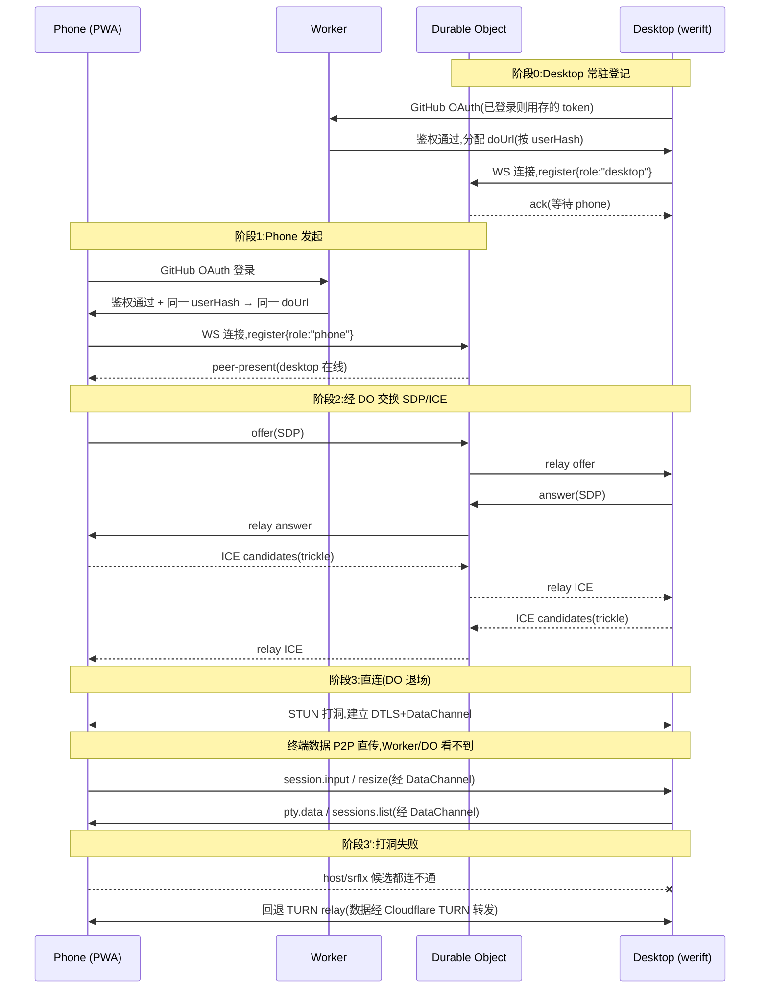

# Mobile Remote 公网直连 — Mid + Detail 设计

> High-level(三角色拓扑,冻结)见
> [`2026-05-30-mobile-remote-public-internet-highlevel.md`](./2026-05-30-mobile-remote-public-internet-highlevel.md)。
> 本文件是其下的 **mid-level + detail-level**:组件接口、信令协议、握手时序、
> 错误/回退、安全、测试。用户已授权直接设计(2026-05-30:「你自己直接设计吧」)。

---

## 0. 术语与缩写

| 词 | 含义 |
|---|---|
| **Desktop** | 桌面端 Electron 主进程,持有 PTY 会话,WebRTC 的 answerer 一侧 |
| **Phone** | 手机浏览器 PWA,WebRTC 的 offerer 一侧 |
| **Worker** | Cloudflare Worker,无状态 HTTP 入口,管 GitHub OAuth |
| **DO** | Durable Object,有状态,管一个 GitHub 用户的配对房间 + 信令中转 |
| **SDP** | WebRTC 会话描述(offer/answer),描述编解码/传输能力 |
| **ICE candidate** | 一端可被连到的候选地址(host / srflx / relay) |
| **STUN** | 帮一端发现自己公网映射地址的协议(打洞前置) |
| **TURN** | 打洞失败时的中继服务器(数据经它转发) |
| **DataChannel** | WebRTC 的可靠有序数据通道,本设计的终端数据管道 |

---

## 1. 组件分解(mid-level)

整个系统切成 5 个可独立理解/测试的单元。每个单元只有一个职责。

### 1.1 Cloudflare 侧

#### A. `signaling-worker`(无状态 HTTP 入口)
- **职责**:终止 GitHub OAuth;把已鉴权请求路由到该用户的 DO。
- **依赖**:GitHub OAuth app(client id/secret 存 Worker secret);DO 命名空间。
- **不做**:不存任何会话状态,不碰 SDP/ICE 内容(只透传给 DO)。

#### B. `pairing-do`(有状态,每个 GitHub 用户一个实例)
- **职责**:维护一个"配对房间"——同一 GitHub 用户的 Desktop 与 Phone 在这里
  交换 SDP/ICE。是一对一信令的**临时邮箱**。
- **依赖**:WebSocket(两端各连一条到 DO)。
- **生命周期**:房间在双方都断开后 TTL 过期销毁;SDP/ICE 转发完即可丢弃(不持久化)。
- **关键约束**:DO 只转发**密文之外的信令元数据**(SDP/ICE 是建链所需,本就要明文
  交换;真正的终端数据走 DataChannel 的 DTLS 加密,DO 永远看不到)。

### 1.2 Desktop 侧(`electron/remote/` 重构)

#### C. `signalingClient`(桌面信令客户端)
- **职责**:登录后用 GitHub token 连到 DO 的 WebSocket,注册为"Desktop 在线",
  接收 Phone 的 offer,回 answer,交换 ICE。
- **依赖**:`ws`(已有)或 Electron 主进程的 WebSocket;GitHub token(见 §4)。
- **接口**:
  ```ts
  startSignalingClient(opts: {
    githubToken: string;
    doUrl: string;               // wss://<worker>/do/<userHash>
    onOffer: (offer: RTCSessionDescription, peerId: string) => void;
    onRemoteIce: (cand: RTCIceCandidate, peerId: string) => void;
  }): {
    sendAnswer(answer, peerId): void;
    sendIce(cand, peerId): void;
    close(): void;
  }
  ```

#### D. `desktopPeer`(桌面 WebRTC peer,werift)
- **职责**:用 werift 建 `RTCPeerConnection`,接受 Phone 的 offer,生成 answer,
  建立 DataChannel,把 DataChannel 接到现有上层协议处理器。
- **依赖**:werift;`signalingClient`(C);现有 `remoteMessages.ts`(复用)。
- **接口**:
  ```ts
  createDesktopPeer(opts: {
    iceServers: RTCIceServer[];      // STUN + TURN(凭据见 §3.4)
    signaling: SignalingClientHandle;
  }): { close(): void };
  ```
- **数据流接线**:DataChannel `onmessage` → `handleClientMessage(client, raw)`
  (复用 `remoteMessages.ts`,只是 `client.send` 从"WS 写帧"改成
  "DataChannel.send(JSON)")。`onPtyData` 扇出同理改成往 DataChannel 写。

#### E. `mobileRemoteController`(替代旧 `mobileRemoteServer.ts`)
- **职责**:总装配。被 `main.ts:302` 调用,取代
  `startMobileRemoteServer()`。负责:读 GitHub 登录态 → 起 `signalingClient` →
  起 `desktopPeer` → 在多 Phone 连入时管理多个 peer。
- **接口**(保持 main.ts 接线最小改动):
  ```ts
  startMobileRemote(): { close(): void } | null   // 返回 null = 未登录/未启用
  ```
- **main.ts 改动**:`mobileRemoteServer = startMobileRemoteServer()` →
  `mobileRemote = startMobileRemote()`。`close()` 语义不变,disposer 不动。

### 1.3 Phone 侧(`src/` 下新建,推翻旧 WS 客户端)

#### F. `phonePeer` + `phoneSignaling`(浏览器端)
- **职责**:GitHub 登录 → 连 DO → 作为 offerer 发起 WebRTC → 建 DataChannel →
  把 DataChannel 接到 xterm UI(复用现有 mobile page 的渲染层)。
- **依赖**:浏览器原生 `RTCPeerConnection` / `fetch` / `WebSocket`。
- **注意**:`src/` 不得 import `electron/`(CLAUDE.md 铁律)。Phone 端是纯浏览器
  代码,本就独立,天然满足。

---

## 2. 握手时序(detail-level)



**要点:**
- DO 在阶段 2 之后**不再参与**;DataChannel 一旦 open,信令 WS 可关(留着只为
  断线重连时重新 trickle ICE,见 §5.3)。
- Trickle ICE:候选边发现边发,不等收集完,缩短建链时间。
- TURN 回退对上层透明:DataChannel 的 API 不变,只是底层路径变成中继。

---

## 3. 信令协议(detail-level)

DO ↔ 两端的 WebSocket 消息(JSON)。这是**新协议**,与终端数据协议(§6)分离。

| type | 方向 | 字段 | 含义 |
|---|---|---|---|
| `register` | 端→DO | `role: "desktop"\|"phone"`, `peerId` | 进房登记 |
| `peer-present` | DO→端 | `role`, `peerId` | 对端已在房 |
| `peer-gone` | DO→端 | `role`, `peerId` | 对端离房 |
| `offer` | phone→DO→desktop | `sdp`, `from` | WebRTC offer |
| `answer` | desktop→DO→phone | `sdp`, `from` | WebRTC answer |
| `ice` | 双向 | `candidate`, `from` | trickle ICE 候选 |
| `error` | DO→端 | `code`, `message` | 鉴权失败/房满等 |

### 3.4 ICE servers 配置
- STUN:Cloudflare STUN(`stun.cloudflare.com:3478`)或公共 STUN。
- TURN:Cloudflare TURN,**短期凭据**由 Worker 用 TURN key 现签发(不硬编码长期
  密钥到客户端)。Phone/Desktop 在 register 成功后向 Worker 拉一次性 TURN cred。

---

## 4. GitHub 鉴权(detail-level)

**模型:同一 GitHub 账号登录两端即配对(high-level 已定)。**

### 4.1 流程
1. 两端各走标准 GitHub OAuth web flow(Worker 是 callback 接收方,持 client secret)。
2. Worker 拿 code 换 access token → 调 `GET /user` 取 `id`(数字,稳定不随改名变)。
3. `userHash = HMAC(serverSecret, githubUserId)` → 决定 DO 实例名。**同一 GitHub
   用户 → 同一 userHash → 同一 DO 房间 → 自动配对。**
4. Worker 给端发一个**短期 session JWT**(含 userHash,15 min 过期),端用它连 DO
   和拉 TURN cred。GitHub access token 不下发到 Phone(最小权限)。

### 4.2 Desktop 的登录态
- Desktop 是常驻进程,首次登录后把 refresh 能力存在主进程安全存储
  (Electron `safeStorage`)。后续重启静默续期,无需每次手动登录。
- 若未登录:`startMobileRemote()` 返回 null(等价旧的"未启用"),桌面 UI 显示
  "登录 GitHub 以启用手机远程"。

### 4.3 为什么 userId 不是 username
GitHub 用户可改名,但数字 `id` 永不变。用 id 防止改名后两端 hash 对不上。

---

## 5. 错误处理与回退(detail-level)

| 场景 | 行为 |
|---|---|
| **5.1 GitHub 未登录** | `startMobileRemote()`→null;UI 引导登录。 |
| **5.2 两端不同 GitHub 账号** | userHash 不同 → 落在不同 DO → 永远 `peer-present` 不触发 → Phone 显示"桌面端未在线/账号不匹配"。 |
| **5.3 信令 WS 断线** | 指数退避重连 DO;DataChannel 已建立则不影响数据流(信令仅建链用)。 |
| **5.4 打洞失败** | werift/浏览器自动尝试 relay 候选 → 走 TURN。对上层透明。 |
| **5.5 TURN 也失败** | Phone 显示"无法建立连接,请检查网络";不静默假装连上。 |
| **5.6 DataChannel 中途断** | Phone 显示重连中;触发 §5.3 重新走信令 renegotiate。 |
| **5.7 多 Phone 连入** | Desktop 端为每个 phone peerId 建独立 peer + 独立 `WsClient`-like 上下文(复用现有 per-client `subscribedSid` 隔离逻辑)。 |
| **5.8 TURN cred 过期** | 短期 cred 过期前 Worker 续签;renegotiate 时重拉。 |

---

## 6. 终端数据协议(复用,detail-level)

**不变。** DataChannel 上跑的就是现有 `remoteMessages.ts` 的消息:

| type | 方向 | 现状复用 |
|---|---|---|
| `sessions.list` | D→P | 原样 |
| `session.snapshot` | P→D 请求 / D→P 回 | 原样(含 `getBufferSnapshot` seq 去重) |
| `session.input` | P→D | 原样 → `inputPtySession` |
| `session.resize` | P→D | 原样 → `resizePtySession`(共享 `normalizeResizeDims`) |
| `pty.data` | D→P | 原样,`subscribedSid` 网络层隔离保留 |
| `auth.ok` | D→P | **删除**(鉴权前移到 GitHub/信令层,DataChannel 建好即已鉴权) |

**唯一改动点**:`WsClient.send`(写 WS 帧)抽象成 `PeerClient.send`(写
DataChannel)。`handleClientMessage` / `onPtyData` 扇出 / list 轮询逻辑一行不改,
靠依赖注入换 `send`。这就是 high-level 说的"只换管道不换协议"。

---

## 7. 安全边界(detail-level)

1. **鉴权**:GitHub OAuth(同账号)取代旧 bearer token。撮合权 = GitHub 身份。
2. **传输加密**:WebRTC DataChannel 强制 DTLS;终端数据端到端加密,Cloudflare
   (Worker/DO/TURN)都看不到明文。TURN 中继转发的也是 DTLS 密文。
3. **信令最小化**:DO 只转发 SDP/ICE(建链必需的元数据),不持久化,房间 TTL 销毁。
4. **TURN 凭据**:短期、按需签发,不硬编码长期密钥到浏览器。
5. **Worker secret**:GitHub client secret、TURN key、HMAC serverSecret 全部存
   Cloudflare Worker secret,不进仓库、不下发客户端。
6. **CSP**:Phone PWA 需放行 `RTCPeerConnection` 到 STUN/TURN 的连接;沿用现有
   `electron/window/` CSP 模式(Phone 端是独立 origin,不受 Electron CSP 约束,
   但 Worker 返回的页面应设严格 CSP)。

---

## 8. 测试策略(detail-level)

| 层 | 怎么测 | 不依赖 |
|---|---|---|
| **信令协议** | DO 单测:mock 两个 WS,断言 offer/answer/ice 正确转发、房间隔离、TTL。 | 不需要真 WebRTC |
| **GitHub 鉴权** | Worker 单测:mock GitHub OAuth 响应,断言 userHash 推导、JWT 签发、跨账号隔离。 | 不需要真 GitHub |
| **Desktop peer 接线** | werift 在 Node 里可直接跑:两个 werift peer 本地建 DataChannel,断言 `session.input`→`inputPtySession` 被调、`pty.data` 扇出、`subscribedSid` 隔离。复用现有 `vi.mock('../ptyHost')` 模式。 | 不需要 Cloudflare |
| **端到端 loopback** | werift(扮 desktop)↔ headless Chromium 的 RTCPeerConnection(扮 phone),本机回环建 DataChannel 跑完整协议。证明管道通,但**不是公网证据**。 | 本机 |
| **公网真机** | 用户最终在 4G 下用手机连一次(打洞 + TURN 回退都验)。**唯一的公网证据。** | — |

**证据纪律**(沿用项目 memory):loopback 只证明协议链路;公网可达必须真机
4G 验证,headless 不能替代。

---

## 9. 实施切片(给后续 writing-plans 用)

建议拆成可独立 PR 的纵切:

1. **PR-1 Cloudflare 骨架**:Worker + DO + GitHub OAuth + 信令转发,纯 Cloudflare
   侧,单测覆盖。无桌面/手机改动。
2. **PR-2 Desktop peer**:引入 werift,`signalingClient` + `desktopPeer` +
   `mobileRemoteController`,接现有 `remoteMessages.ts`。werift↔werift 单测。
3. **PR-3 Phone PWA**:推翻旧 WS 客户端,`phonePeer` + `phoneSignaling`,接 xterm。
4. **PR-4 联调 + loopback e2e**:werift↔headless Chromium 回环。
5. **PR-5 TURN 回退 + 真机验证**:短期 TURN cred 签发;用户 4G 真机验。

每片独立可测;PR-1 与 PR-2/3 可并行(信令协议先冻结)。

---

## 10. 待实现时再定的小事(不阻塞设计)

- werift 在 Electron 主进程的具体打包路径(纯 TS,预期无原生重建,实测确认)。
- DO 的 TTL 具体值(初定双方断开后 60s)。
- TURN cred 有效期(初定 10 min)。
- 桌面 UI 的 GitHub 登录入口放哪(设置页 vs 托盘)。
