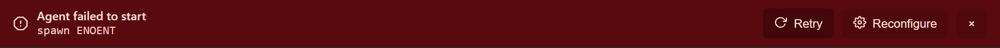
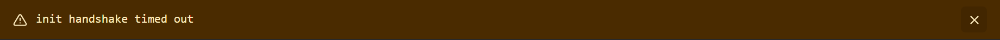
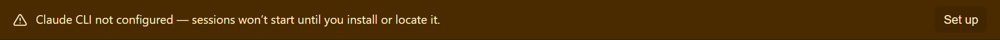
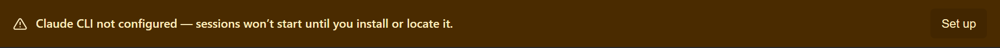

# Banner trio refactor (#237) — visual diff

Generated by `scripts/probe-render-banners.mjs`.

| Banner | Before | After |
| --- | --- | --- |
| AgentInitFailedBanner |  |  |
| AgentDiagnosticBanner |  |  |
| ClaudeCliMissingBanner |  |  |

The probe renders a static HTML approximation that mirrors the exact
classnames + design tokens used by the live components (`src/styles/global.css`),
so visuals match what the user sees in the running Electron app without
needing the full app boot for screenshots.
