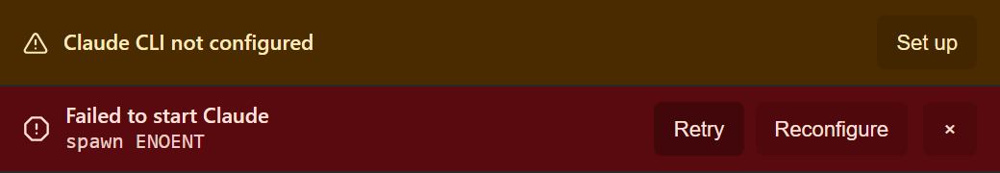
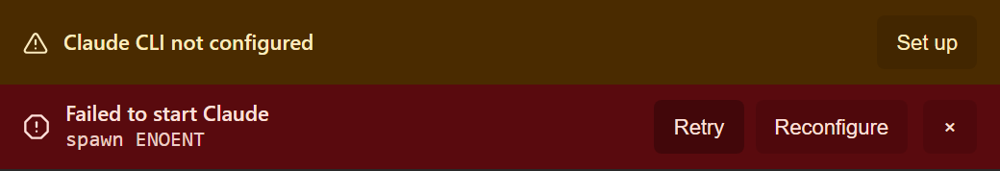
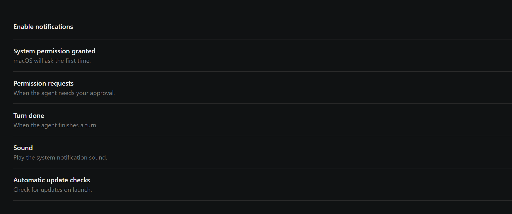
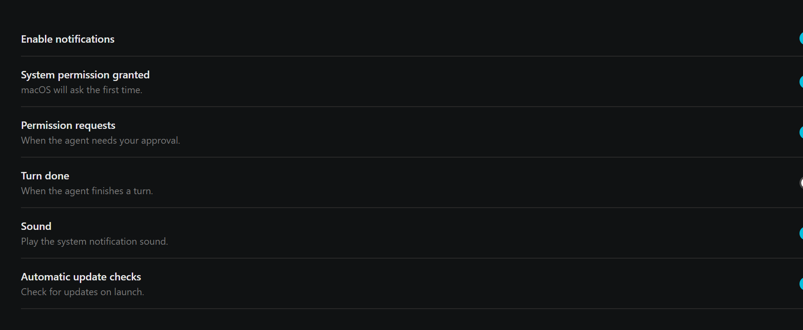
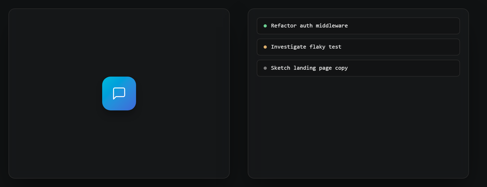

# Banner stack + Switch + Tutorial tokens (#287 #288 #293)

Generated by `scripts/probe-render-banner-switch-tutorial-287.mjs`.

## #287 — TopBanner stack double-border

Two banners stacked (CLI missing + agent init failed). Before: each banner
draws its own `border-b`, producing a doubled hairline between them. After:
the `<TopBannerStack>` wrapper nullifies `border-b` on every non-last
banner, leaving a single separator below the whole stack.

| Before | After |
| --- | --- |
|  |  |

## #288 — Settings Switch primitive

Notification + auto-update toggles previously rendered as native
`<input type="checkbox">`, which cannot be styled consistently and is
announced as "checkbox" by screen readers. After: Radix-based `<Switch>`
primitive with track + thumb, announced as "switch".

| Before | After |
| --- | --- |
|  |  |

## #293 — Tutorial raw oklch -> tokens

Tutorial visuals previously hard-coded raw `oklch()` color literals (welcome
gradient, session-row state dots, drop shadow). After: state dots ride the
existing `--color-state-running` / `--color-state-waiting` tokens; the
welcome icon's accent gradient and the visual-card drop shadow now resolve
through two new ornamental tokens — `--gradient-tutorial-welcome` and
`--shadow-tutorial-card` — defined in both the dark and light `@theme`
blocks of `src/styles/global.css`. Visual parity with the pre-PR baseline
is preserved (gradient cyan -> indigo, deep card shadow), and light-theme
overrides flow through automatically.

| Before | After |
| --- | --- |
|  |  |
