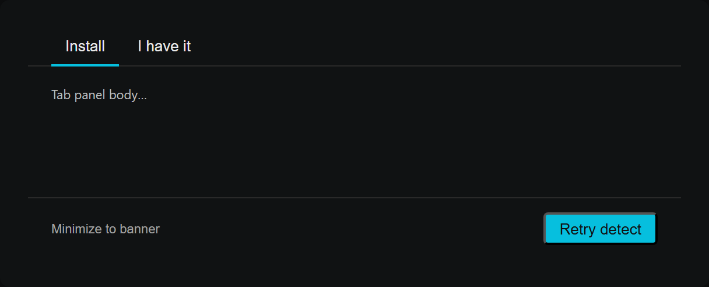
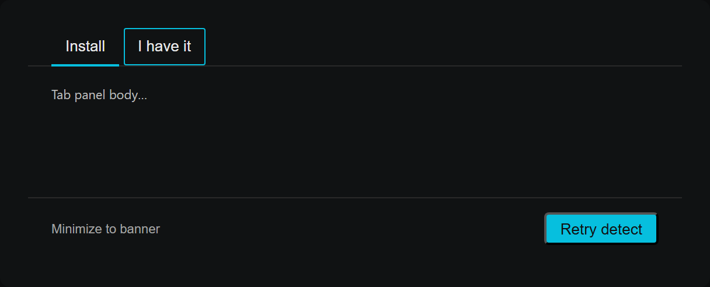
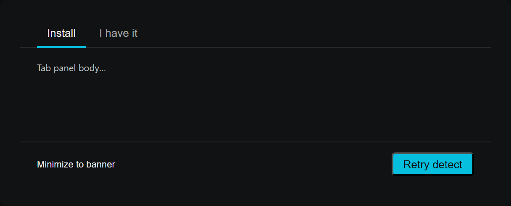
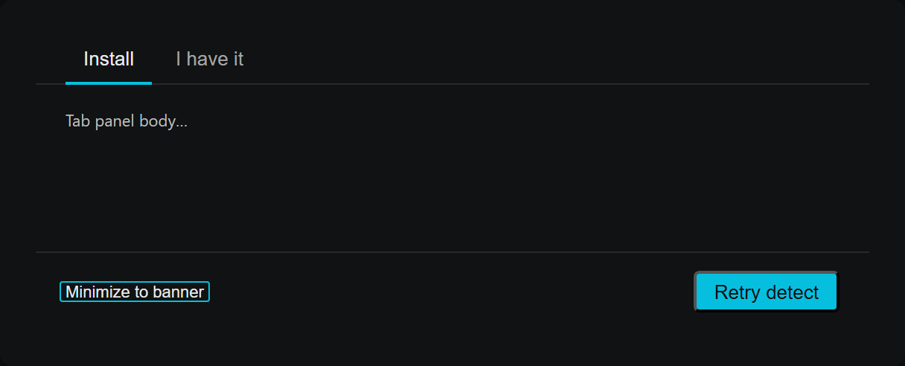

# ClaudeCliMissingDialog focus-ring (#260) — visual diff

Generated by `scripts/probe-render-cli-missing-focus-ring-260.mjs`.

| Surface | Before | After |
| --- | --- | --- |
| Tab strip (focused, inactive tab) |  |  |
| "Minimize to banner" footer link (focused) |  |  |

Audit CMD3 / CMD4 flagged that both surfaces relied on color-only focus
indicators (`focus-visible:text-fg-primary`), inconsistent with the
`.focus-ring` utility used by SettingsDialog tabs and the rest of the app.
Keyboard users had no halo to anchor focus on — a faint text-color shift on
small chrome elements is essentially invisible, and the inactive tab in
particular sits next to identical untinted siblings.

Fix: add the canonical `.focus-ring` utility (1px inset accent) on both
the tab buttons and the footer link, matching the SettingsDialog tab
pattern (`'outline-none focus-ring'`).
