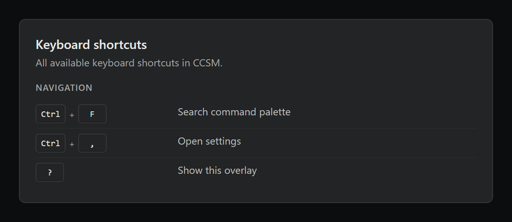
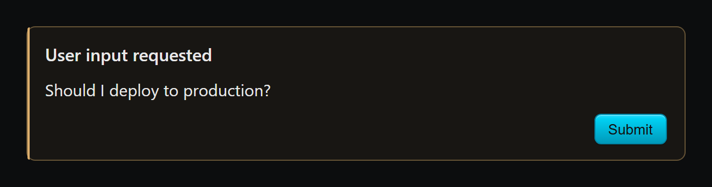
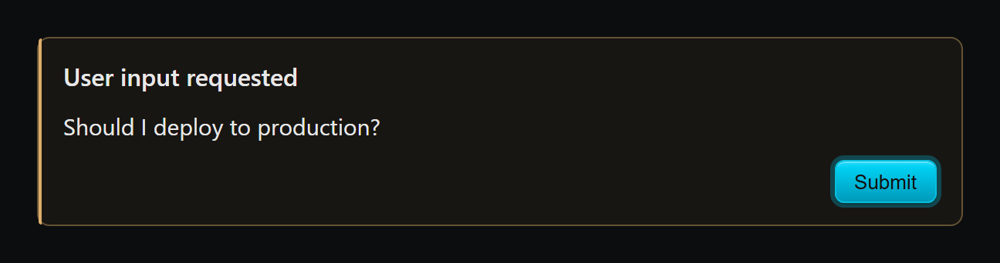

# Focus-ring + meta bundle (#281 #283 #291 #297) — visual diff

Generated by `scripts/probe-render-focus-ring-meta-281.mjs`.

| Surface | Before | After |
| --- | --- | --- |
| ShortcutOverlay (typography — #283) |  |  |
| QuestionBlock Submit (focus ring — #291) |  |  |
| ChatStream jump-to-latest (focus ring — #291) |  |  |

#281 (Button primary halo → `var(--color-focus-ring)` token) and #297
(locale key removal) have no meaningful visual change in dark mode and are
not screenshotted.
