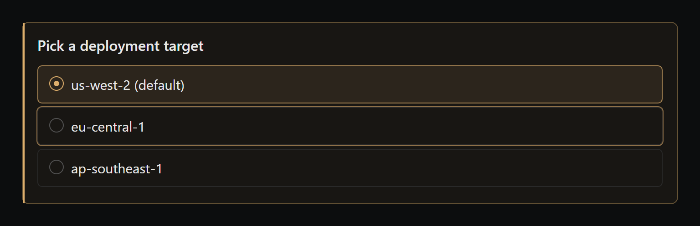
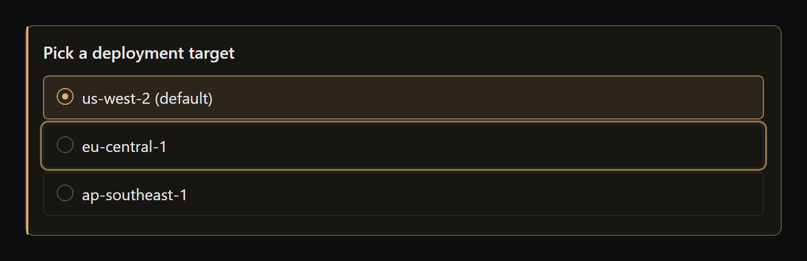
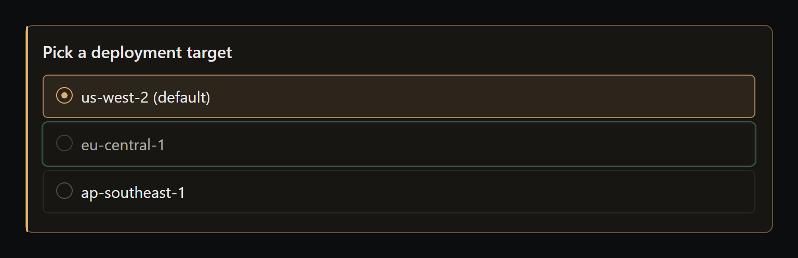
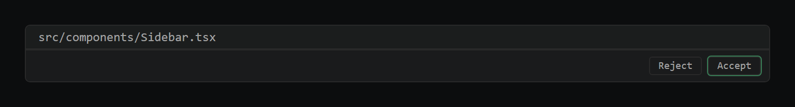
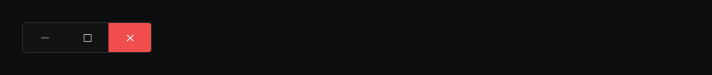
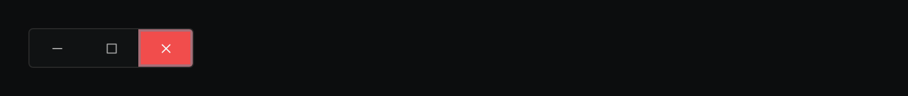

# Focus-ring U2 (#240) — visual diff

Generated by `scripts/probe-render-focus-ring-u2.mjs`.

| Surface | Before | After |
| --- | --- | --- |
| QuestionBlock option (waiting state) |  |  |
| QuestionBlock option (confirmed / answered) |  |  |
| DiffView Accept button |  |  |
| WindowControls close button (focused) |  |  |

The probe renders a static HTML approximation that mirrors the exact class
names + design-token values used by the live components (`src/styles/global.css`),
so visuals match what the user sees in the running Electron app without
needing the full app boot for screenshots.

**Key fix on the WindowControls close button:** in BEFORE, focus background
= hover background = saturated state-error. Keyboard users couldn't tell
hover from focus. AFTER adds an inset `var(--color-focus-ring)` halo on
focus only.
