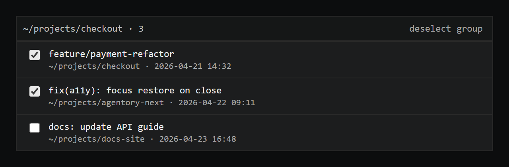
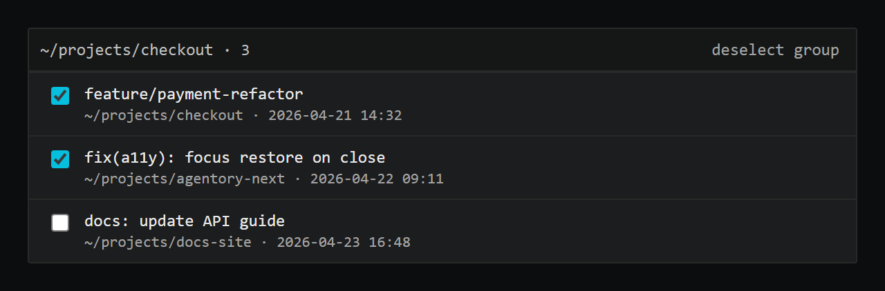
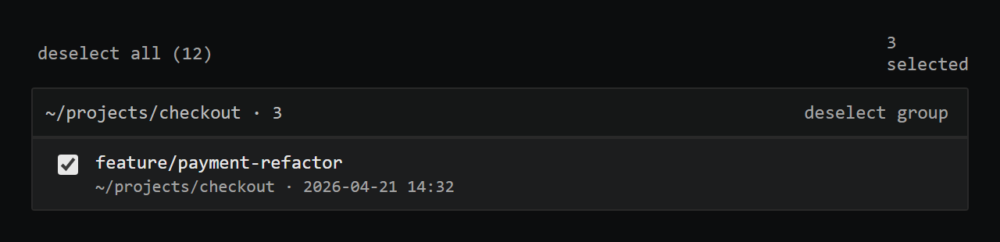
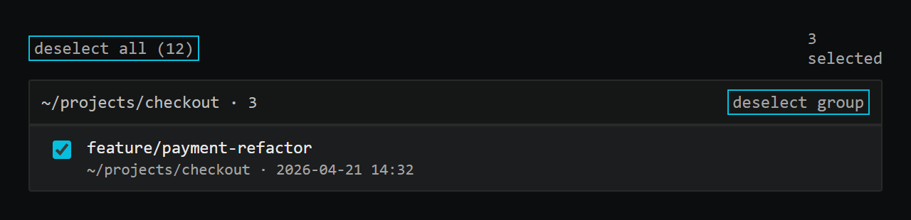

# ImportDialog brand consistency (#243) — visual diff

Generated by `scripts/probe-render-import-dialog-243.mjs`.

| Surface | Before | After |
| --- | --- | --- |
| Checkbox accent color (ID2) |  |  |
| Bare-button focus ring (ID3) |  |  |

**ID2 (checkbox):** before used `accent-fg-primary` (near-white) which looks
like a generic browser checkbox; after uses the brand cyan `accent-accent`,
matching every other checkbox in the app (`SettingsDialog.tsx`).

**ID3 (bare buttons):** the select-all and per-bucket select-group/deselect-group
buttons had no visible focus indicator. After adds the existing `.focus-ring`
utility from `global.css` (1px inset accent outline), matching the focus-ring
kit pattern from #240.
