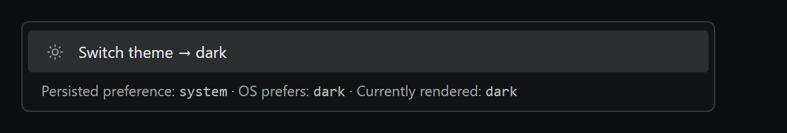
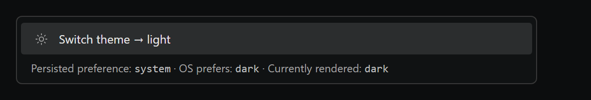
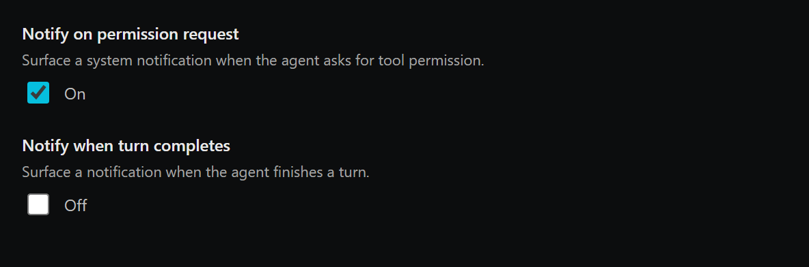
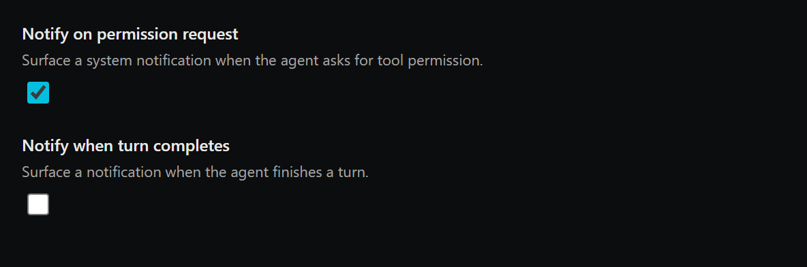
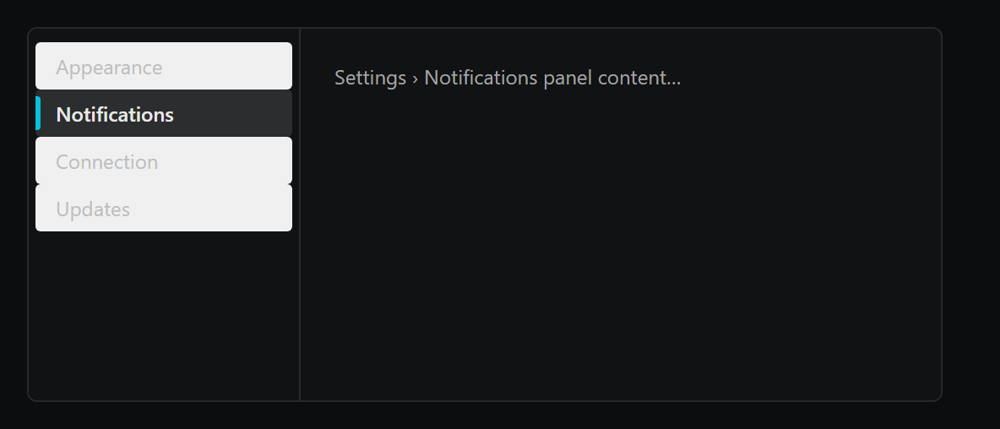
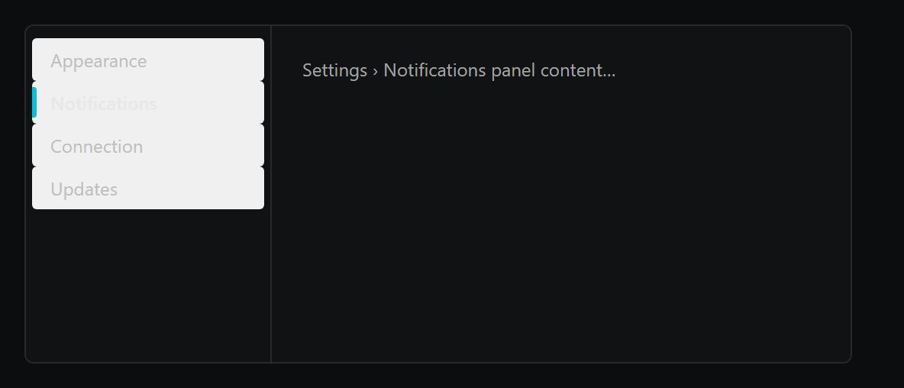

# Small UI bundle (#278 #279 #280) — visual diff

Generated by `scripts/probe-render-small-ui-bundle-278.mjs`.

| Surface | Before | After |
| --- | --- | --- |
| #278 CommandPalette theme row label (persisted=system, OS=dark) |  |  |
| #279 NotificationsPane toggle rows (no inner On/Off label) |  |  |
| #280 Settings tab indicator (single accent-rail cue) |  |  |

**#278.** Persisted preference cycles through `dark -> light -> system -> dark`,
so when the user is on `system` and the OS is dark, the BEFORE label reads
"Switch theme -> dark" — confusing because it is already dark. AFTER derives
the next theme from the resolved theme (`resolveEffectiveTheme`), so the
label always reflects the actually rendered theme. The row stagger entrance
(`staggerChildren: 0.015`) is animation-only and respects
`prefers-reduced-motion` via `useReducedMotion` from framer-motion; not
captured as a static PNG.

**#279.** The trailing "On" / "Off" word duplicates information the checkbox
state already carries. Removed from `NotificationsPane.Toggle`; checkbox
keeps an `aria-label` from the field title for screen readers.

**#280.** Active tab no longer combines a filled `bg-bg-hover` background
with the accent rail. The rail (and `text-fg-primary` + `font-medium`) is
sufficient. Quieter pane, single-cue selection.
