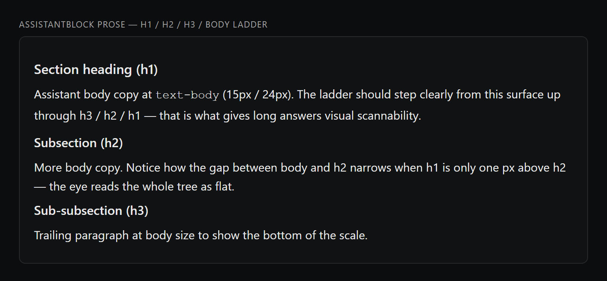
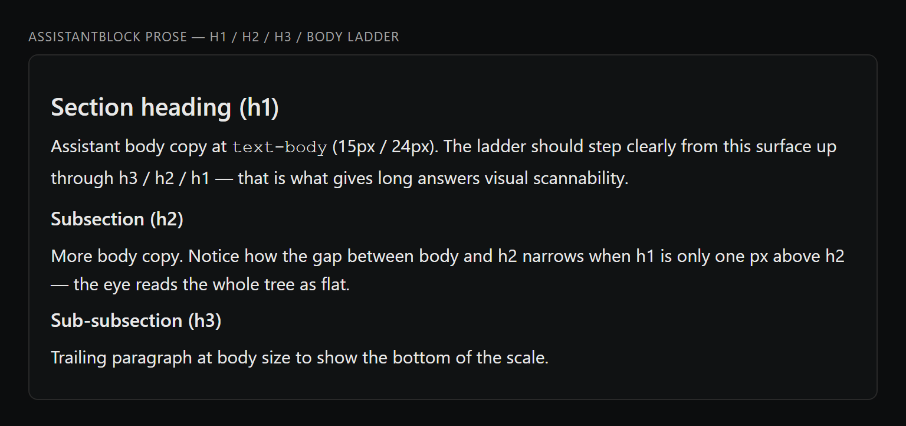
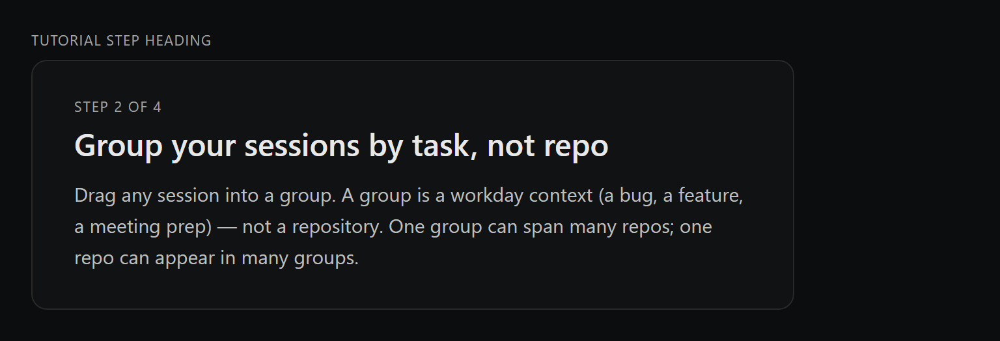
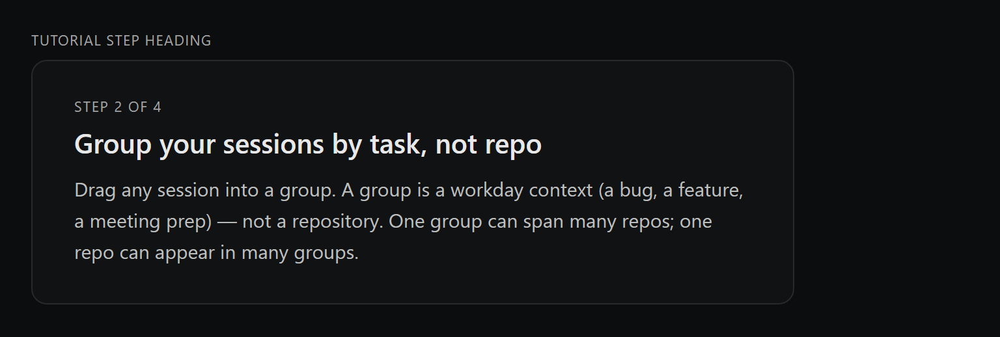

# text-display tier (#256, audit AB2) — visual diff

Generated by `scripts/probe-render-text-display-256.mjs`.

Adds a 5th `text-display` tier (21px / 28px line-height) above the
existing 4-step semantic ladder (`text-meta` 11 / `text-chrome` 13 /
`text-body` 15 / `text-heading` 16). Applied to AssistantBlock markdown
h1 (was `text-lg` 17px) and Tutorial step heading (was `text-2xl` 24px).

| Surface | Before | After |
| --- | --- | --- |
| AssistantBlock prose h1 (text-lg 17px -> text-display 21px) |  |  |
| Tutorial step heading (text-2xl 24px -> text-display 21px) |  |  |

**Why 21px / 28px line-height?** `text-heading` is 16/22 — a 17px h1
(BEFORE) is only +1px, so the eye reads h1 and h2 as the same tier. 21px
is a clean major-third up from 16, lands on the 4px grid, and stays
inside Inter's hinting comfort zone — it draws the eye without shouting
the way 24-26px does inside compact chat panels. Tutorial drops 3px from
its previous 24px but joins the semantic scale instead of a one-off
Tailwind escape.

Default (dark) theme only — per #218 caveat, light-mode visuals can be
verified separately if the token-driven values render unexpectedly there.
