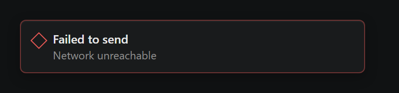
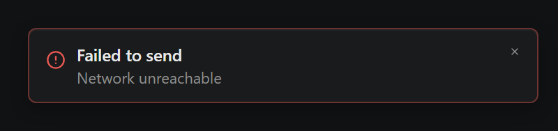
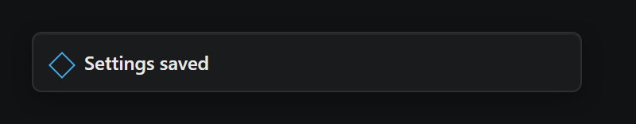
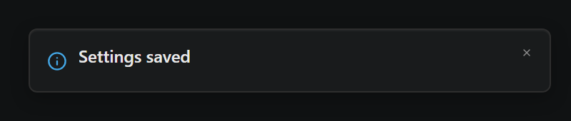
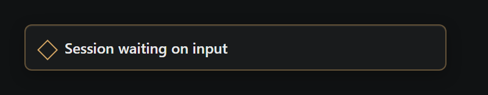
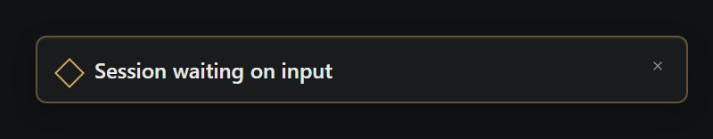

# Toast a11y rework (#275) — visual diff

Generated by `scripts/probe-render-toast-a11y-275.mjs`.

| Variant | Before | After |
| --- | --- | --- |
| Error (color-only diamond → AlertCircle glyph + close X) |  |  |
| Info (diamond → Info glyph + close X) |  |  |
| Waiting (kept diamond, gained close X) |  |  |

**What changed visually**

- Error and info variants now use distinctive lucide glyphs (AlertCircle, Info)
  in addition to color, satisfying WCAG 1.4.1 (Use of Color).
- Every toast now shows an explicit close X in the top-right. Dismiss is
  restricted to that button (or the Esc key) so a stray click on the toast
  body — or on a link/action button inside it — no longer hides the toast.
- The waiting variant kept the diamond (StateGlyph) because it doubles as
  the global "agent is waiting" state-machine signal elsewhere in the UI;
  collapsing it to a generic icon would erase that meaning.
