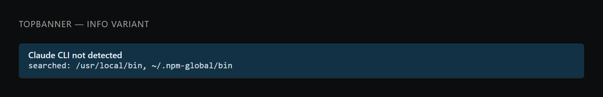
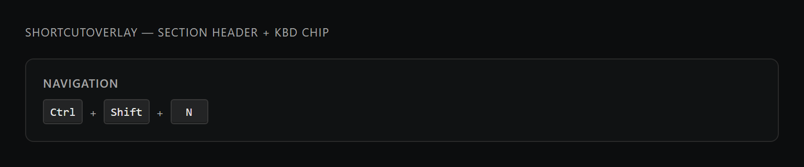
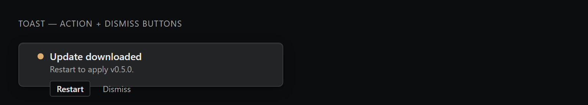
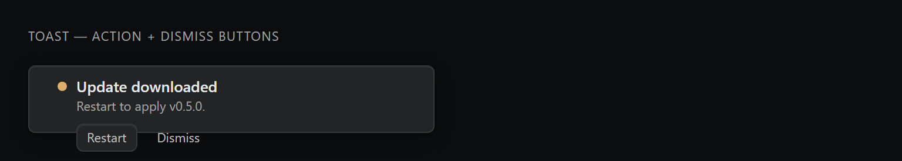
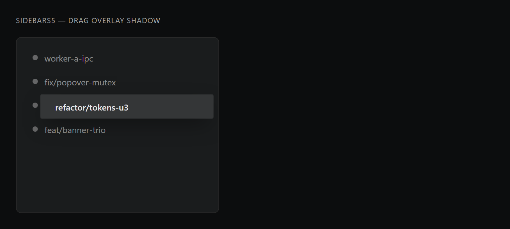

# Tokens U3 (#255) — visual diff

Generated by `scripts/probe-render-tokens-u3.mjs`.

| Surface | Before | After |
| --- | --- | --- |
| TopBanner body line (text-[11px] -> text-meta) |  |  |
| ShortcutOverlay header + kbd chip (text-[11px] -> text-meta) |  |  |
| Toast action + dismiss buttons (bespoke -> Button primitive) |  |  |
| SidebarS5 drag overlay shadow (inline -> --shadow-drag-overlay) |  |  |

The probe renders a static HTML approximation that mirrors the exact class
names + design-token values used by the live components (`src/styles/global.css`),
so visuals match what users see in the running Electron app without
needing the full app boot.

**A. text-meta sweep:** the bespoke `text-[11px]` tuples were already at
the canonical 11px size, so the rendered glyphs are pixel-identical. The
win is single-source-of-truth: appearance-slider scaling and any future
type-tier nudge land on these surfaces automatically.

**B. Toast buttons:** AFTER picks up the Apple-tier hover/active/focus
treatment from the shared Button primitive (inset highlight, spring tap,
focus halo) instead of the hand-rolled hover-only styling.

**C. Drag-overlay shadow:** dark-mode visual is unchanged (the token holds
the same values that were inline). The win is the LIGHT-mode override
in `src/styles/global.css` — a warmer, lower-alpha shadow tuned for the
near-white sidebar so the dragged tile reads as lift rather than a hole.
