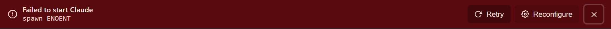

# TopBannerAction extraction (#273) — visual diff

Generated by `scripts/probe-render-topbanner-action-273.mjs`.

| Surface | Before | After |
| --- | --- | --- |
| AgentInitFailedBanner (error + Retry/Reconfigure/dismiss) |  |  |
| ClaudeCliMissingBanner (warning + Set up) |  |  |
| TopBanner dismiss on info variant |  |  |
| Dismiss button :focus-visible halo |  |  |

This is a **structural refactor with zero intended visual change** — the
`bannerActionVariants` cva produces the same class strings the four
inline impls used. The before/after pairs above must be pixel-identical;
any diff is a regression.

The dismiss-focus row applies the focus halo class manually (Playwright
`:focus-visible` is finicky inside `page.setContent`) so the load-bearing
`focus-visible:shadow-[0_0_0_2px_oklch(1_0_0_/_0.18)]` ring is visible in
the screenshot.
