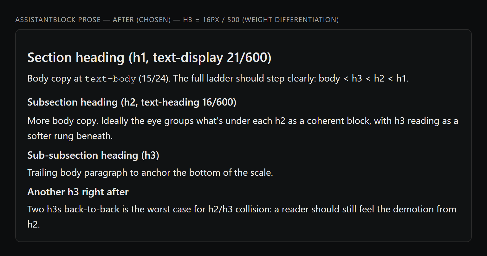
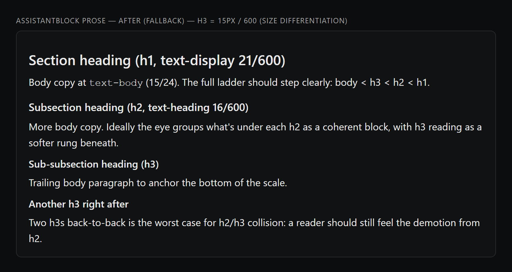

# h2 / h3 type-ladder differentiation (#272, Wave 2 P0 W2-08) — visual diff

Generated by `scripts/probe-render-type-ladder-h2h3-272.mjs`.

After #256 added `text-display` (21px) for prose h1, h2 and h3 still both
render at `text-heading` 16px `font-semibold`, differing only by a half
pixel of bottom margin. They visually collide inside chat prose.

| Variant | Screenshot | h2 | h3 |
| --- | --- | --- | --- |
| BEFORE (current main) |  | 16px / 600 | 16px / 600 |
| AFTER — chosen (weight) |  | 16px / 600 | 16px / **500** |
| AFTER — fallback (size) |  | 16px / 600 | **15px** / 600 |

**Decision: weight differentiation (h3 = font-medium 500).**

Reasoning: shrinking h3 to text-body (15px) makes it almost indistinguishable
from a bold body paragraph; introducing a new "subhead" tier (e.g. 15.5px)
just to wedge h3 in adds a 6th step the rest of the system doesn't need.
Dropping h3 from semibold (600) to medium (500) keeps h3 at heading size but
reads visibly lighter than h2, which is exactly what the rung should
communicate ("still a heading, but a level down").

If the weight-only signal turns out too subtle once the change lands in the
running app (Inter at 16px is forgiving on weight), the fallback is to flip
h3 to `text-body` (15px) `font-semibold` — same component, one-line
change.

Default (dark) theme only — per #218 caveat, light-mode visuals can be
verified separately if token-driven values render unexpectedly there.
